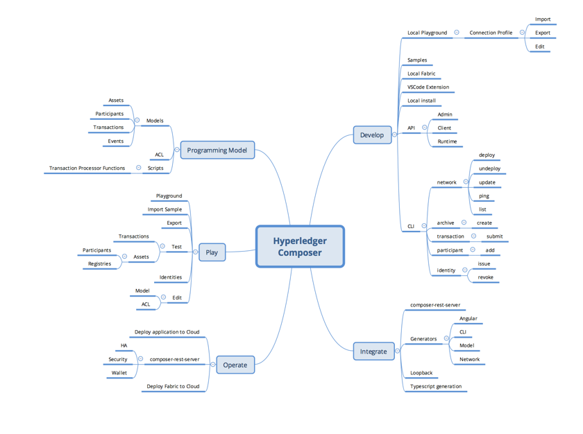

# Contributing to Hyperledger Composer

We welcome contributions to the code base. There is a contributors [RocketChat channel](https://chat.hyperledger.org/channel/composer-dev) that we would encourage you to join and introduce yourself on.

There are multiple components within Composer, which can be conceptually viewed using the mindmap.

These components are split across multiple Composer repositories within the Hyperledger project. The repositories are:

- [hyperledger/composer](https://github.com/hyperledger/composer) All the code, cli and documentation
- [hyperledger/composer-sample-models](https://github.com/hyperledger/composer-sample-models) Sample Business Models
- [hyperledger/composer-sample-networks](https://github.com/hyperledger/composer-sample-networks) Sample Business Networks
- [hyperledger/composer-sample-applications](https://github.com/hyperledger/composer-sample-applications) Sample Applications using the Composer API
- [hyperledger/composer-atom-plugin](https://github.com/hyperledger/composer-atom-plugin) Plugin for the Atom editor
- [hyperledger/composer-vscode-plugin](https://github.com/hyperledger/composer-vscode-plugin) Plugin for the VS Code editor
- [hyperledger/composer-tools](https://github.com/hyperledger/composer-tools) Additional tools to help working with Composer

## Raising an Issue

If you have a question or problem that relates to general support, please ask the question on either [RocketChat](https://chat.hyperledger.org/channel/composer) or [Stack Overflow](http://stackoverflow.com/questions/tagged/hyperledger-composer), where the question should be tagged with 'hyperledger-composer'. We would like to exclusively use GitHub issues for bug reports and feature requests.

If you find a bug in the source code, an error in any documentation, or would like a new feature, you can help us by [raising an issue](./contrib-notes/raising-issues.md) to our GitHub Repository or delivering a fix via a [pull request](./contrib-notes/submitting-pull-request.md).

## Raising a Composer Improvement Proposal

If you have a suggestion for a Composer Improvement Proposal (CIP), for a feature that is not yet present and you would like to have, please raise an issue using a [CIP template](./contrib-notes/cip-template.md) and tag the issue with the label `improvement proposal`. We endevour to have all CIP items discussed on community calls, so expect to have an invite once raised!

## Getting Started

In order to assist anybody starting from scratch, we have produced guides on setting up a development environment.

* [Step-by-step development environment setup](./contrib-notes/getting-started.md)
* [Suggested IDE setup](./contrib-notes/ide-setup.md)
* [Coding Guidelines](./contrib-notes/coding-guidelines.md)
* [Pull Request Guidelines](./contrib-notes/submitting-pull-request.md)

Start with the [Step-by-step development environment setup](./contrib-notes/getting-started.md)

Everything installed and ready code? Great! Issues are tracked in GitHub, if you are looking for a place to start with the code then it might be worth tackling a [bug](https://github.com/hyperledger/composer/issues?q=is%3Aissue+is%3Aopen+label%3Abug) or look for those issues tagged with [*help wanted*](https://github.com/hyperledger/composer/issues?q=is%3Aissue+label%3A%22help+wanted%22) or [*good first issue*](https://github.com/hyperledger/composer/issues?q=is%3Aopen+is%3Aissue+label%3A%22good+first+issue%22) - the latter being a good issue for first-time contributors.

## License 
Hyperledger Project source code files are made available under the Apache License, Version 2.0 (Apache-2.0), located in the LICENSE file. Hyperledger Project documentation files are made available under the Creative Commons Attribution 4.0 International License (CC-BY-4.0), available at http://creativecommons.org/licenses/by/4.0/.
