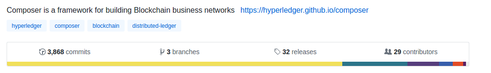

# The Release Process

The release is cut directly from the [Hyperledger Composer GitHub pages](https://github.com/hyperledger/composer), and the release section is accessed directly from the main banner of the Hyperledger Composer page.



Firstly a new release should be drafted, this outlines the items within a release, such as:
 - Features
 - Bug Fixes
 - Known Issues
 - Breaking changes
 - Shout outs to new contributors

 Make sure that the target is set to "master".

 Once drafted, via the "edit" option (or within the draft if you are doing it all in one shot), at the bottom there is a "publish release" button .... PRESS IT!

 This will trigger the release process, which involves a Travis build followed by pushes to composer playground on Bluemix, and Docker Hub, and a version bump through the composer project to increment to the next unstable level. At present there is a permissions issue within GitHub that is preventing this automated version bump and consequently it is necessary to perform this manually.

### Manual Version Bump
The versions of all components within the project should only ever be updated *after* the release has been cut and using the package bump command. To update the version, perform the following:
 - Navigate to the root folder of the project
 - Ensure the git repsoitory is up to date with the master build.
 - Create a new branch "version-bump"
 - Run ``` npm run pkgbump ``` 
 - Commit version changes, deliver to your branch, and create a pull request.