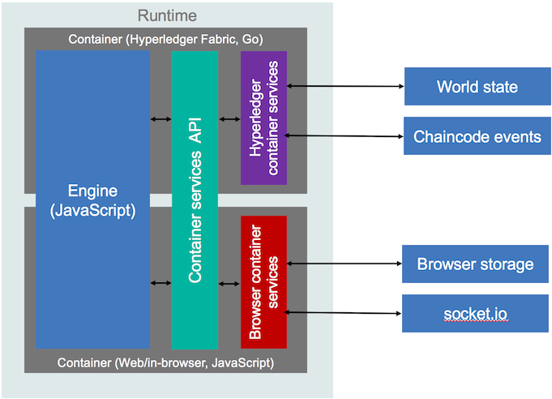

# Composer-Runtime

`npm install composer-runtime --save`

## Introduction

This repository contains the core runtime code for Fabric Composer.
The runtime code is deployed to the Blockchain, and provides the support for managing
business networks, registries and resources, and execution of transaction processor
functions.

The runtime code is designed so that it can be executed on both a real Blockchain
implementation (Hyperledger Fabric) and also standalone in a web browser for rapid
development and testing purposes. To ensure that this is possible, the code in
this repository must be kept isolated from the underlying Blockchain technology.

## Runtime Components

The Fabric Composer runtime is split into several components to allow
the runtime code to execute in multiple environments. Those components are as follows:

### Container

The runtime code in this repository is hosted in a **Container**. The **Container**
is responsible for starting the **Engine**, routing calls from the client and
administrative APIs into the **Engine**, and exposing the Blockchain to the **Engine**
via a set of **Services**.

Two **Container** implementations currently exist:

* Hyperledger Fabric (Go): [Composer-Runtime-Hyperledger-Fabric](https://github.com/hyperledger/composer/tree/develop/packages/composer-runtime-hlf)
* Web/in-browser (JavaScript): [Composer-Runtime-Web](https://github.com/hyperledger/composer/tree/develop/packages/composer-runtime-web)

The **Container** interface is defined in [lib/container.js](./lib/container.js).

### Engine

The **Engine** provides all of the core code for managing business networks,
registries and resources, and execution of transaction processor functions. Calls
from the client and administrative APIs are handled by the generic `Engine.init`, `Engine.invoke`, or `Engine.query` functions in [lib/engine.js](./lib/engine.js)
which then forward the call onto the specific handler functions.

The specific handler functions are organised into separate files:

* Business Network management: [lib/engine.businessnetworks.js](./lib/engine.businessnetworks.js)
* Registry management: [lib/engine.registries.js](./lib/engine.registries.js)
* Resource management: [lib/engine.resources.js](./lib/engine.resources.js)
* Transaction execution: [lib/engine.transactions.js](./lib/engine.transactions.js)

The **Container** will start a single instance of the **Engine** and make multiple
calls to it. The **Engine** code must also support multiple *in-flight* requests, and this is made possible by the **Context** which is passed into the **Engine** by the **Container**.

### Services

A set of **Services** are provided by the **Container** for use by the **Engine**.
The current set of **Services** that must be provided by the **Container** are:

* The *logging service*, for writing log entries: [lib/loggingservice.js](./lib/loggingservice.js)
* The *data service*, for interacting with the world state: [lib/dataservice.js](./lib/dataservice.js)

There are two different types of **Services**:

* **Container** level services, available from the **Container** interface.
* **Context** level services, available from the **Context** interface.

The **Container** level services are not linked to the request, such as the logging
service. The **Context** level services are linked to the request, such as the data service.

## License 
Hyperledger Project source code files are made available under the Apache License, Version 2.0 (Apache-2.0), located in the LICENSE file. Hyperledger Project documentation files are made available under the Creative Commons Attribution 4.0 International License (CC-BY-4.0), available at http://creativecommons.org/licenses/by/4.0/.