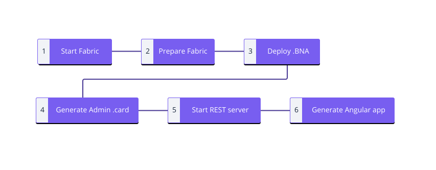

# Writing Web Applications

To interact with a deployed business network, web applications should make REST API calls. To create a custom REST API for a business network, use the `composer-rest-server` command.

To create a skeleton Angular application that can interact with the REST API, use the `yo hyperledger-composer` command.

Please follow the [Developer Tutorial](../tutorials/developer-tutorial.html) for an example of how to use the `composer-rest-server` and the Angular generator.


## Generating an Angular application from a Business Network Archive (.BNA)

The flow for building an Angular application is as follows:



If you already have a Business Network Archive and would like to build a skeleton Angular application (see note below), use the following reference instructions, if you would like to fully understand how to develop a BNA from scratch and build an application from there please see the [Developer Tutorial](../tutorials/developer-tutorial.html).

Note:

The Yo Angular application generator only supports simple, basic business network model definitions - it is a simple application generator. The generated application (including the web forms it produces) will not support more complex types or field expressions - eg. concepts do not work, and other more complex modeled types or expressions too - you should check errors upon generation, or when using the skeleton app (eg. internal errors posted in the Angular application), and check for exceptions/validation errors in the REST server logging where the REST server was started. Note that concepts (an abstract class in the modeling language) if defined, are ignored if present in your model file, so as to complete generation of the skeleton application. It applies whether you connect to an existing business network, or generate an Angular skeleton from a business network archive (BNA) file. Complex field definitions (concepts is an example) or expressions will not appear in the generated HTML forms, and won't do,  unless you choose to go on and customise the skeleton web application yourself.

**Prerequisites**

- You will need the {{site.data.conrefs.composer_full}} [development tools](../installing/development-tools.html) in order to run the Angular generator.
- A Business Network Archive (.BNA) you would like to deploy.

### 1. Start {{site.data.conrefs.hlf_full}} running on your local machine

If you have already installed the development tools you will have {{site.data.conrefs.hlf_full}} already installed.

Head to the `fabric-dev-servers` directory and start {{site.data.conrefs.hlf_full}}. The following code is an example if you have used our development tools install guide:

```bash
cd ~/fabric-dev-servers
{{site.data.conrefs.export_fabric_version_command}}
./startFabric.sh
./createPeerAdminCard.sh
```

This will also create a `PeerAdmin` .card file which is needed to modify code running on the peers of your deployment.

You can list all of the cards you have installed at any time by running the following command:

```bash
composer card list
```

### 2. Prepare the {{site.data.conrefs.hlf_full}} peers

In order to install the Business Network Archive onto the {{site.data.conrefs.hlf_full}} network you need to install the business network onto the peers. It is recommended you start with a clean directory. Move your BNA into that directory and change your terminal directory to it.

You will need to have the Business Network archive to do this, below you can see an example with `tutorial-network` along with the 'PeerAdmin' card for your deployment.

```
composer network install --card PeerAdmin@hlfv1 --archiveFile tutorial-network@0.0.1.bna
```

### 3. Start your Business Network on your {{site.data.conrefs.hlf_full}}

We will use the `composer network start` command to start the business network, we will need to use our `PeerAdmin` card to do this. We will also need to create a user on our network, we will use an "Admin" username and password to get started.

Below is an example using a `tutorial-network` BNA.

```bash
composer network start --networkName tutorial-network --networkVersion 0.0.1 --networkAdmin admin --networkAdminEnrollSecret adminpw --card PeerAdmin@hlfv1
```

This will create an 'admin' card for the business network, which for the previous example is `admin@tutorial-network.card`

*Please note: The `admin` username and `adminpw` secret are for a specific {{site.data.conrefs.hlf_full}} identity configured for the instance of {{site.data.conrefs.hlf_full}} deployed in the Developer Tutorial. If you have configured a {{site.data.conrefs.hlf_full}} instance from scratch these identity details will be different.*

### 4. Install the 'admin' card ready for use

We will next take the admin card we have just made and import it for use with your business network.

```bash
composer card import --file admin@tutorial-network.card
```

### 5. Start the REST server & generate the Swagger API documentation

Navigate to your directory and run the `composer-rest-server` command.

```bash
composer-rest-server
```

  - Enter admin@tutorial-network as the card name. Make sure not to add the `.card` extension.
  - Select never use namespaces when asked whether to use namespaces in the generated API.
  - Select No when asked whether to secure the generated API.
  - Select Yes when asked whether to enable event publication.
  - Select No when asked whether to enable TLS security.

The rest server will then be generated and available on http://localhost:3000/explorer

### 6. Generate the Angular application

The Angular application requires the rest server to be running to connect to the Fabric instance. Make sure you have the REST server running in the background when doing this. You will also need to be in the same directory as your .BNA file when running the Yeoman generator.

```bash
yo hyperledger-composer
```

Follow the below so your output matches.

```
Welcome to the Hyperledger Composer project generator
? Please select the type of project: Angular
You can run this generator using: 'yo hyperledger-composer:angular'
Welcome to the Hyperledger Composer Angular project generator
? Do you want to connect to a running Business Network? Yes
? Project name: [insert]
? Description: Hyperledger Composer Angular project
? Author name: [insert]
? Author email: [insert]
? License: Apache-2.0
? Name of the Business Network card: admin@tutorial-network
? Do you want to generate a new REST API or connect to an existing REST API?  Connect to an existing REST
 API
? REST server address: http://localhost
? REST server port: 3000
? Should namespaces be used in the generated REST API? Namespaces are not used
Created application!
```

The generated application will be within a sub directory named after the `Project name` entered above.

Finally enter this directory and to get the application running, run:

```bash
npm start
```

It will be available on http://localhost:4200


## References

* [**Developer Tutorial**](../tutorials/developer-tutorial.html)
* [**Composer REST Server**](../integrating/getting-started-rest-api.html)
