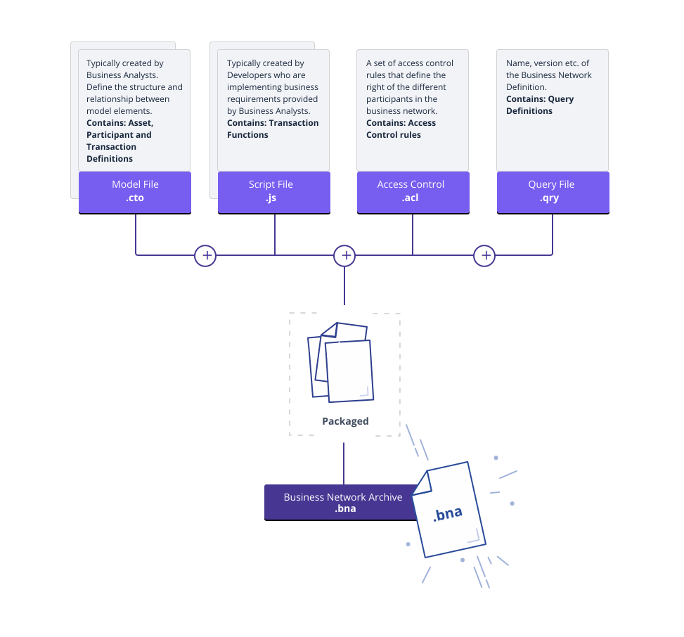

# Business Network Definition

The Business Network Definition is a key concept of the {{site.data.conrefs.composer_full}} programming model. They are represented by the `BusinessNetworkDefinition` class, defined in the `composer-common` module and exported by both `composer-admin` and `composer-client`.

Business Network Definitions are composed of:

* a set of model files
* a set of JavaScript files
* an Access Control file

The model files defined the business domain for a business network, while the JavaScript files contain transaction processor functions. The transaction processor functions run on a Hyperledger Fabric and have access to the asset registries that are stored in the world state of the Hyperledger Fabric blockchain.

The model files are typically created by business analysts, as they define the structure and relationships between model elements: assets, participants and transactions.

The JavaScript files are typically created by developers who are implementing business requirements provided by business analysts.

The Access Control file contains a set of access control rules that define the rights of the different participants in the business network.

Once defined, a Business Network Definition can be packaged into an archive using the `composer` command line interface. These archives can then be deployed, undeployed or updated on a Fabric, using the `AdminConnection` class from the `composer-admin` module.

## References

* [**Modeling Language**](../reference/cto_language.html)
* [**Access Control Language**](../reference/acl_language.html)
* [**Transaction Processor Functions**](../reference/js_scripts.html)
