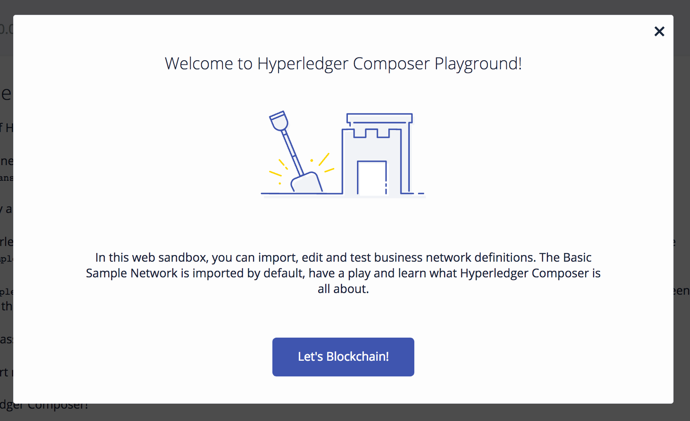

# Try {{site.data.conrefs.composer_full}} Playground online

---

The {{site.data.conrefs.composer_short}} Playground is a tool which provides a simple UI for quickly editing and testing a business network. The hosted version (Online Playground) runs your business network in browser memory.  If you install Playground locally (Local Playground) you can deploy to {{site.data.conrefs.hlf_full}} instances.

**Note:** There is no install necessary to use the Online Playground.  If you'd like to install a local version, skip to the [Install Local Playground](./using-playground-locally.html) instructions.

---

## Before you begin

Before beginning, you will need:

* A GitHub account (if you want to import sample business network from GitHub)
* A supported browser i.e. any modern version of Chrome, Firefox or Safari

---

The Online Playground can be accessed here: <a href="https://composer-playground.mybluemix.net" target="blank">composer-playground.mybluemix.net</a>

Simply click "Let's Blockchain" to begin using Online Playground!  Play around with any of the available samples however you like - clearing your browser storage will effectively "reset" the Online Playground.  If you're looking for a more guided example of what Playground can do, try the [Playground Tutorial](../tutorials/playground-guide.html).

---

## Where do I go from here?

---

* For a more guided example of using Playground, see [Playground Tutorial](../tutorials/playground-guide.html)
* To install Playground locally, see [Installing Playground Locally](./using-playground-locally.html)
