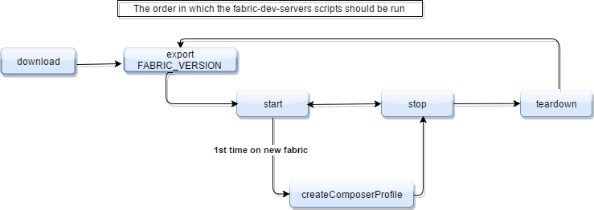

# Installing and developing with {{site.data.conrefs.composer_full}}

Follow the instructions below to get the required {{site.data.conrefs.composer_full}} development tools and stand up a {{site.data.conrefs.hlf_full}}.


## Before you begin

To run {{site.data.conrefs.composer_full}} and {{site.data.conrefs.hlf_full}}, we recommend you have at least 4Gb of memory.

The following are prerequisites for installing the required development tools:

- Operating Systems: Ubuntu Linux 14.04 / 16.04 LTS (both 64-bit), or Mac OS 10.12
- Docker Engine: Version 17.03 or higher
- Docker-Compose: Version 1.8 or higher
- Node: 8.9 or higher (note version 9 is not supported)
- npm: v5.x
- git: 2.9.x or higher
- Python: 2.7.x
- A code editor of your choice, we recommend VSCode.

**Please do not install {{site.data.conrefs.composer_full}} as a superuser - or use 'sudo' or the 'root' user, if on Linux (doing will cause issues installation errors). {{site.data.conrefs.composer_full}} should be installed as non-privileged user.**

If you're running on Ubuntu, you can download the prerequisites using the following commands:

```bash
curl -O https://hyperledger.github.io/composer/prereqs-ubuntu.sh

chmod u+x prereqs-ubuntu.sh
```

Next run the script - as this briefly uses sudo during its execution, you will be prompted for your password.

```
./prereqs-ubuntu.sh
```

If you're running Mac OS X, you can follow the [installation guide for Mac OS X pre-requisites](../installing/prereqs-mac.html).

---

## Step 1: Installing {{site.data.conrefs.composer_full}} development tools

The development tools you'll need can all be installed (as a non-privileged user eg non-root) with `npm install -g`.

1. To install `composer-cli` run the following command:

        npm install -g composer-cli
    The `composer-cli` contains all the command line operations for developing business networks.

2. To install `generator-hyperledger-composer` run the following command:

        npm install -g generator-hyperledger-composer
    The `generator-hyperledger-composer` is a Yeoman plugin that creates bespoke applications for your business network.

3. To install `composer-rest-server` run the following command:

        npm install -g composer-rest-server
    The `composer-rest-server` uses the {{site.data.conrefs.composer_full}} LoopBack Connector to connect to a business network, extract the models and then present a page containing the REST APIs that have been generated for the model.

4. To install `Yeoman` run the following command:

        npm install -g yo
    Yeoman is a tool for generating applications. When combined with the `generator-hyperledger-composer` component, it can interpret business networks and generate applications based on them.

### Optional development tools

1. If you use VSCode, install the {{site.data.conrefs.composer_full}} VSCode plugin from the VSCode marketplace.

2. If you want to run the Playground locally, install the `composer-playground` using the following command.

        npm install -g composer-playground


## Step 2: Starting {{site.data.conrefs.hlf_full}}

If you've [installed the {{site.data.conrefs.composer_full}} Playground locally](../installing/using-playground-locally.html) you'll need to close the containers by using the following scripts.

>_Please note: These commands will kill and remove all running containers, and should remove all previously created {{site.data.conrefs.hlf_full}} chaincode images._

```
docker kill $(docker ps -q)
docker rm $(docker ps -aq)
docker rmi $(docker images dev-* -q)
```


1. In a directory of your choice (will assume `~/fabric-tools`) get the zip file that contains the tools to install {{site.data.conrefs.hlf_full}} v1.0.

        mkdir ~/fabric-tools && cd ~/fabric-tools

        curl -O https://raw.githubusercontent.com/hyperledger/composer-tools/master/packages/fabric-dev-servers/fabric-dev-servers.zip
        unzip fabric-dev-servers.zip

    A `tar.gz` file is also available

        mkdir ~/fabric-tools && cd ~/fabric-tools
        curl -O https://raw.githubusercontent.com/hyperledger/composer-tools/master/packages/fabric-dev-servers/fabric-dev-servers.tar.gz

        tar xvzf fabric-dev-servers.tar.gz


2. If this is the first time, you'll need to download the fabric runtime first. If you have already downloaded it, then start the fabric environment, and create a {{site.data.conrefs.composer_full}} profile. After that you can then choose to stop the fabric, and start it again later. Alternatively to completely clean up you can teardown the {{site.data.conrefs.hlf_full}} and the {{site.data.conrefs.composer_full}} profile.

    All the scripts will be in the directory `~/fabric-tools`  A typical sequence for {{site.data.conrefs.composer_full}} use would be

        cd ~/fabric-tools
        ./downloadFabric.sh
        ./startFabric.sh
        ./createPeerAdminCard.sh

    Then at the end of your development session

        cd ~/fabric-tools
        ./stopFabric.sh
        ./teardownFabric.sh


> Please note: The development environment created will include a `PeerAdmin` identity including the cryptographic material necessary for deploying business networks.


## Script details

.

This diagram explains the order in which the scripts can be run.

**Downloading Fabric**

Issue from the `fabric-tools` directory
```
./downloadFabric.sh
```

**Starting Fabric**

Issue  from the `fabric-tools` directory
```
./startFabric.sh
```

**Stop Fabric**

Issue from the `fabric-tools` directory
```
./stopFabric.sh
```

**Create PeerAdmin Card**

Create a business network card for the peer administrator specific to the {{site.data.conrefs.hlfv1}} instance running.
```
./createPeerAdminCard.sh
```

Note: this creates and imports a business network card to connect to the development fabric you've already started.

**Teardown Fabric**

Issue from the `fabric-tools` directory
```
./teardownFabric.sh
```


## What next?

* Begin [**writing a business network definition**](../business-network/business-network-index.html).
* If you're looking for a tutorial on using the developer tools, see the [**developer guide**](../tutorials/developer-guide.html) to run through a sample with the developer tools.
