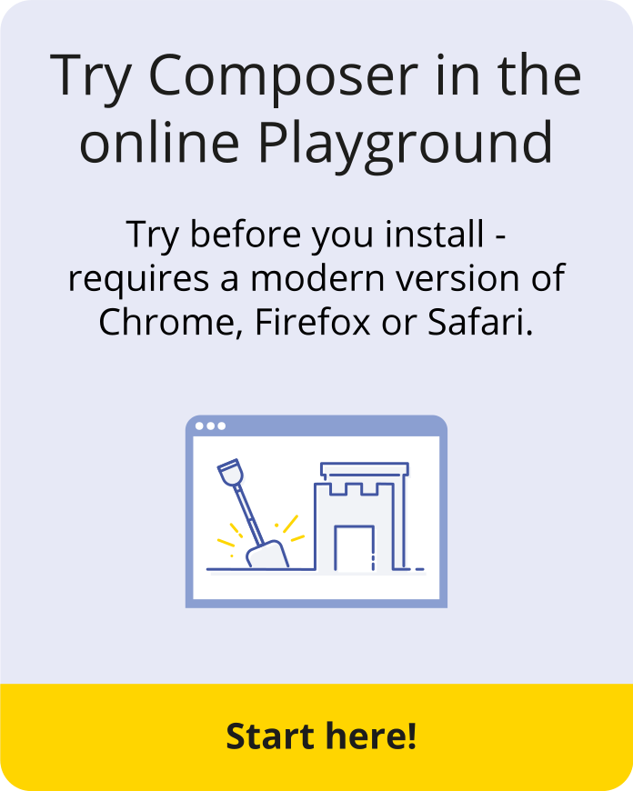
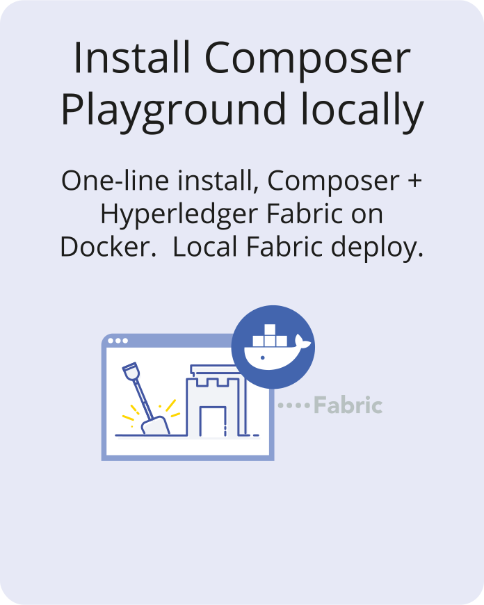

# Installing {{site.data.conrefs.composer_full}}

  




### {{ page.title }}
{{ page.excerpt }}



## What next?

* [**Learn about key concepts**](../introduction/key-concepts.html)
* [**View solution architecture**](../introduction/solution-architecture.html)
