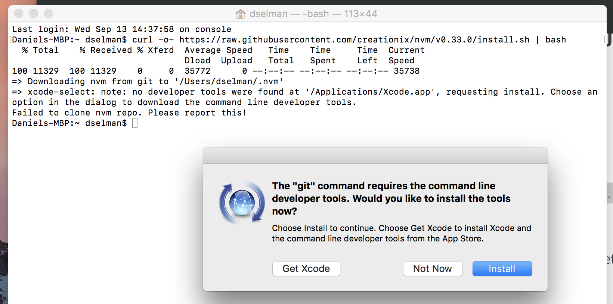

# Installing pre-requisites

The {{site.data.conrefs.composer_full}} pre-requisites can be installed on Ubuntu or MacOS.  Choose your operating system to jump to the appropriate section, or scroll down to find the instructions:

<a href=#ubuntu><button class="secondary">Ubuntu</button></a> <a href=#macos><button class="secondary">Mac OS</button></a>

<a name="ubuntu"></a>
# Ubuntu

To run {{site.data.conrefs.composer_full}} and {{site.data.conrefs.hlf_full}}, we recommend you have at least 4Gb of memory.

The following are prerequisites for installing the required development tools:

- Operating Systems: Ubuntu Linux 14.04 / 16.04 LTS (both 64-bit), or Mac OS 10.12
- Docker Engine: Version 17.03 or higher
- Docker-Compose: Version 1.8 or higher
- Node: 8.9 or higher (note version 9 is not supported)
- npm: v5.x
- git: 2.9.x or higher
- Python: 2.7.x
- A code editor of your choice, we recommend VSCode.

**If installing {{site.data.conrefs.composer_full}} using Linux, be aware of the following advice:

- Login as a normal user, rather than root.
- Do not `su` to root.
- When installing prerequisites, use curl, then unzip using sudo.
- Run prereqs-ubuntu.sh as a normal user. It may prompt for root password as some of it's actions are required to be run as root.
- Do not use npm with `sudo` or `su` to root to use it.
- Avoid installing node globally as root.**

If you're running on Ubuntu, you can download the prerequisites using the following commands:

```bash
curl -O https://hyperledger.github.io/composer/prereqs-ubuntu.sh

chmod u+x prereqs-ubuntu.sh
```

Next run the script - as this briefly uses sudo during its execution, you will be prompted for your password.

```
./prereqs-ubuntu.sh
```

## What next?

> Congratulations, the installation of the pre-requisites for {{site.data.conrefs.composer_full}} is complete! You can now proceed with [Installing the development environment](../installing/development-tools.html).

<a name="macos"></a>
# Mac OS

Follow these instructions to install the pre-requsities for installing {{site.data.conrefs.composer_full}} on a local Mac OS X machine. You need to install these tools *before* you attempt to install {{site.data.conrefs.composer_full}}.

> Note Mac OS X version `10.12.6` was used for these instructions.

## Install nvm and Apple Xcode

First install nvm (the Node version manager). nvm is a tool that allows you to easily install, update and switch between versions of Node.js.

Open the terminal (command line) by clicking on the magnifier in the menu bar at the top right of your screen. Type `terminal` and press enter.

In the terminal window paste the text below and press enter:

```
curl -o- https://raw.githubusercontent.com/creationix/nvm/v0.33.0/install.sh | bash
```

More information on this script and the Node install process is available [here](https://nodesource.com/blog/installing-node-js-tutorial-using-nvm-on-mac-os-x-and-ubuntu/).

When you hit enter you should see the pop-up below, prompting you to install `git`. Press the `Get Xcode` button to install the full Apple Xcode IDE, including a C++ compiler, used to install native Node.js modules.



The download and install process for Xcode may take 20 minutes or more. Be patient!

After the installation of Xcode has completed launch Xcode. Accept the license agreement. It will prompt you for your username and password and will install additional components.

After Xcode finishes installing additional components and launches, simply quit Xcode.

Switch back to the terminal and create your bash profile (stores user preferences for bash):

```
touch .bash_profile
```

Then rerun the original curl command:

```
curl -o- https://raw.githubusercontent.com/creationix/nvm/v0.33.0/install.sh | bash
```

Close the terminal and reopen it.

Check that nvm is installed and is accessible:

```
nvm —-version
```

## Install Node

Install the latest (long term support) version of Node:

```
nvm install --lts
```

Switch to the LTS version of Node:

```
nvm use --lts
```

Check that Node is installed:

```
node --version
```

## Install Docker

Follow the instructions here to install Docker for Max (stable):
https://docs.docker.com/docker-for-mac/install/

After running the installed Docker application you should have the whale icon in your menu bar, with a green “Docker is running” status.

## Install VSCode

Install VSCode by visiting:
https://code.visualstudio.com

Press the “Download for Mac” button and copy the downloaded application into your Applications folder.

## Install the Hyperledger Composer Extension for VSCode

Launch VSCode and then press the “Extensions” button on the vertical left toolbar.

Type `composer` into the search bar and then press the `Install` button next to the `Hyperleger Composer` extension. Once the install completes you need to press the `Reload` button to activate the extension.

## What next?

> Congratulations, the installation of the pre-requisites for {{site.data.conrefs.composer_full}} is complete! You can now proceed with [Installing the development environment](../installing/development-tools.html).
