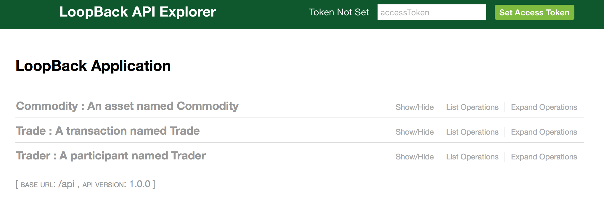

# Generating a REST API

## Running the REST server
{{site.data.conrefs.composer_full}} includes a standalone Node.js process that exposes a business network as a REST API. The LoopBack framework is used to generate an Open API, described by a Swagger document.

To launch the REST Server simply type:

```bash
composer-rest-server
```

You will then be asked to enter a few simple details about your business network. An example of consuming a deployed business network is shown below.

```bash
? Enter the name of the business network card to use: admin@basic-sample-network
? Specify if you want namespaces in the generated REST API: always use namespaces
? Specify if you want to enable authentication for the REST API using Passport: No
? Specify if you want to enable event publication over WebSockets: Yes
? Specify if you want to enable TLS security for the REST API: No

To restart the REST server using the same options, issue the following command:
   composer-rest-server -c admin@basic-sample-network -n always -w true

Discovering types from business network definition ...
Discovered types from business network definition
Generating schemas for all types in business network definition ...
Generated schemas for all types in business network definition
Adding schemas for all types to Loopback ...
Added schemas for all types to Loopback
Web server listening at: http://localhost:3000
Browse your REST API at http://localhost:3000/explorer
```

## Looking at the generated APIs

Launch your browser and go to the URL given (http://0.0.0.0:3000/explorer).  You'll see a screen similar to this.



#Summary
Using the Loopback framework on top of the {{site.data.conrefs.composer_full}} runtime has allowed us to generate a business domain specific REST api based on the deployed business network model!
