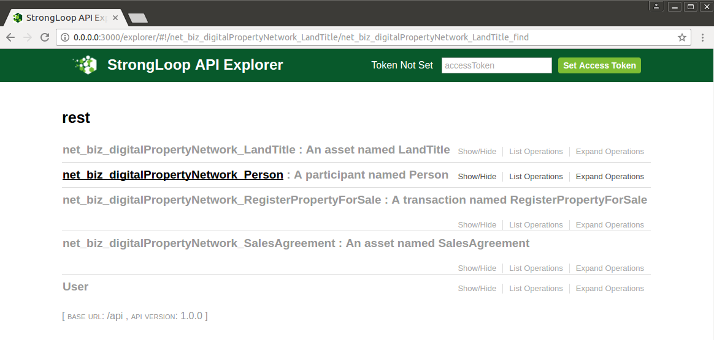

# Generating a REST API

---

## Running the REST server
{{site.data.conrefs.composer_full}} includes a standalone Node.js process that exposes a business network as a REST API. The LoopBack framework is used to generate an Open API, described by a Swagger document.

To launch the REST Server simply type:

```bash
composer-rest-server
```

You will then be asked to enter a few simple details about your business network.

```bash

 _   _                       _          _                 
| | | |_   _ _ __   ___ _ __| | ___  __| | __ _  ___ _ __
| |_| | | | | '_ \ / _ \ '__| |/ _ \/ _` |/ _` |/ _ \ '__|
|  _  | |_| | |_) |  __/ |  | |  __/ (_| | (_| |  __/ |   
|_| |_|\__, | .__/ \___|_|  |_|\___|\__,_|\__, |\___|_|   
       |___/|_|                           |___/           
  ____                                          
 / ___|___  _ __ ___  _ __   ___  ___  ___ _ __
| |   / _ \| '_ ` _ \| '_ \ / _ \/ __|/ _ \ '__|
| |__| (_) | | | | | | |_) | (_) \__ \  __/ |   
 \____\___/|_| |_| |_| .__/ \___/|___/\___|_|   
                     |_|                                                     
? Enter your Fabric Connection Profile Name: defaultProfile
? Enter your Business Network Identifier : digitalproperty-network
? Enter your Fabric username : WebAppAdmin
? Enter your secret: DJY27pEnl16d
Loopback Connector for Hyperledger Composer
Models Loaded Now
Browse your REST API at http://0.0.0.0:3000/explorer
```

## Looking at the generated APIs

Launch your browser and go to the URL given (http://0.0.0.0:3000/explorer).  You'll see a screen similar to this.



#Summary
Using the Loopback framework on top of the {{site.data.conrefs.composer_full}} runtime has allowed us to generate a business domain specific REST api based on the deployed business network model!
