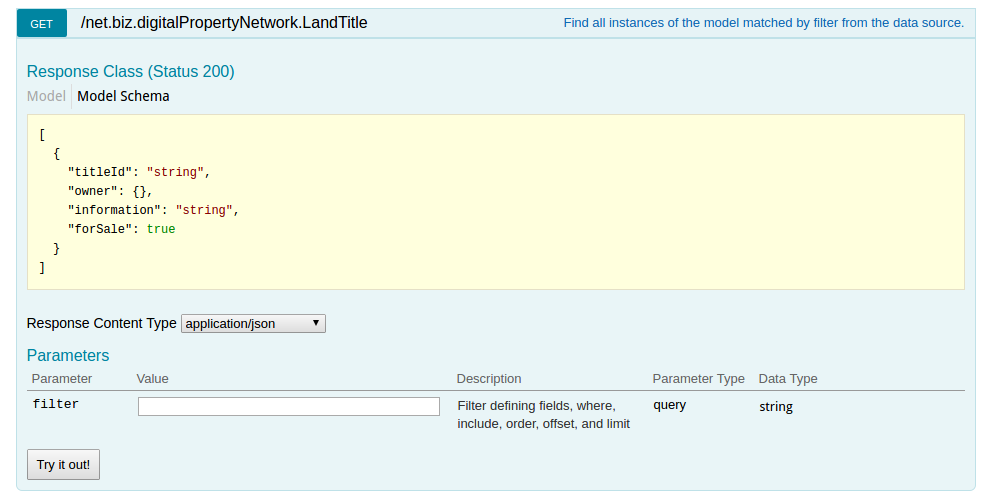
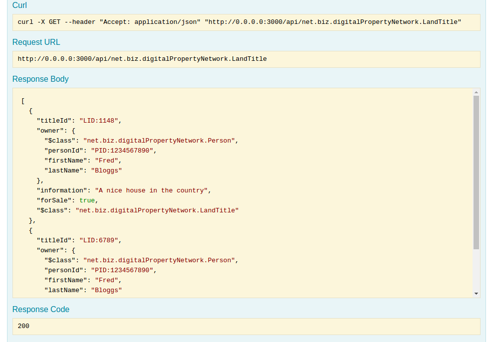
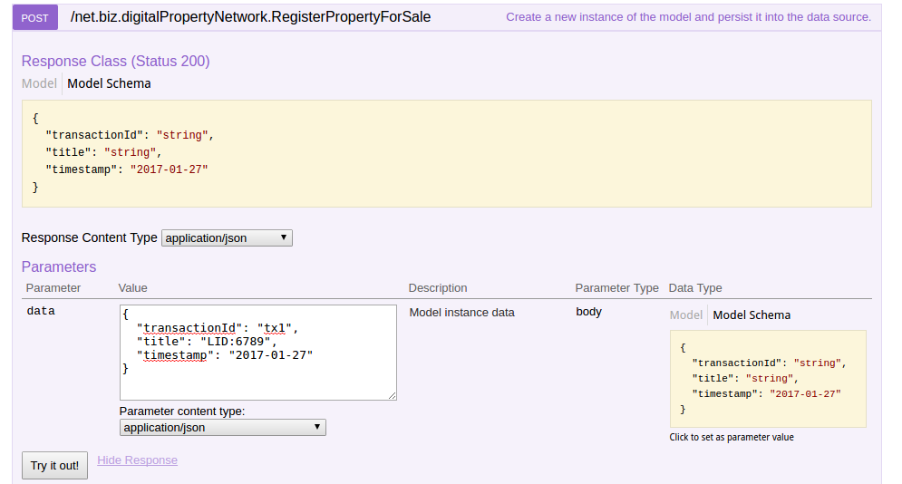

# Generating a REST API

---

This guide will show how to generate a REST API for the Digital Property sample business network. This api will be dynamically generated by using [LoopBack](https://loopback.io/doc/index.html) from the specified Business Network Model. What is generated is not a generic API, but is specifically configured to let you interact with the assets you have specified.

To get started with using this to create a REST interface to a Business Network, follow the steps below.  If you've not followed the [Getting Started](../installing/quickstart.md) guide yet, it's worth following that first so you have {{site.data.conrefs.composer_full}} up and running on Hyperledger.

# Check that the Digital Land Title Network is up and running

Let's check the assets that are in the Digital Land Title registries. From your existing getting started directory issue

```bash
$ npm run listAssets

> getting-started@1.0.0 listAssets /home/matthew/github_lenny/sample-applications/packages/getting-started
> node cli.js landregistry list

info: [Composer-GettingStarted] Hyperledger Composer: Getting Started appliation
info: [Composer-GettingStarted] LandRegistry:<init> businessNetworkDefinition obtained digitalproperty-network@0.0.22
info: [Composer-GettingStarted] listTitles Getting the asset registry
info: [Composer-GettingStarted] listTitles Getting all assest from the registry.
info: [Composer-GettingStarted] listTitles Current Land Titles
info: [Composer-GettingStarted] Titles listed
info: [Composer-GettingStarted]
┌──────────┬────────────────┬────────────┬─────────┬──────────────────────────────────────────────────────────┬─────────┐
│ TitleID  │ OwnerID        │ First Name │ Surname │ Description                                              │ ForSale │
├──────────┼────────────────┼────────────┼─────────┼──────────────────────────────────────────────────────────┼─────────┤
│ LID:1148 │ PID:1234567890 │ Fred       │ Bloggs  │ A nice house in the country Updated at: Thu, 02 Mar 2017 │ Yes     │
├──────────┼────────────────┼────────────┼─────────┼──────────────────────────────────────────────────────────┼─────────┤
│ LID:6789 │ PID:1234567890 │ Fred       │ Bloggs  │ A small flat in the city                                 │ No      │
└──────────┴────────────────┴────────────┴─────────┴──────────────────────────────────────────────────────────┴─────────┘
info: [Composer-GettingStarted] Command completed successfully.


```

We can see the two sample land titles listed.

## Install the general purpose Composer REST Server

We need to install the {{site.data.conrefs.composer_full}} REST server; this is an npm module named `composer-rest-server``.

>You might need to issue this command using sudo.

```bash
npm install -g composer-rest-server
```

## Running the REST server
You should now be able to run the {{site.data.conrefs.composer_full}} REST server.

```bash
composer-rest-server
```

You will then be asked to enter a few simple details about your business network.

```bash

 _   _                       _          _                 
| | | |_   _ _ __   ___ _ __| | ___  __| | __ _  ___ _ __
| |_| | | | | '_ \ / _ \ '__| |/ _ \/ _` |/ _` |/ _ \ '__|
|  _  | |_| | |_) |  __/ |  | |  __/ (_| | (_| |  __/ |   
|_| |_|\__, | .__/ \___|_|  |_|\___|\__,_|\__, |\___|_|   
       |___/|_|                           |___/           
  ____                                          
 / ___|___  _ __ ___  _ __   ___  ___  ___ _ __
| |   / _ \| '_ ` _ \| '_ \ / _ \/ __|/ _ \ '__|
| |__| (_) | | | | | | |_) | (_) \__ \  __/ |   
 \____\___/|_| |_| |_| .__/ \___/|___/\___|_|   
                     |_|                                                     
? Enter your Fabric Connection Profile Name: defaultProfile
? Enter your Business Network Identifier : digitalproperty-network
? Enter your Fabric username : WebAppAdmin
? Enter your secret: DJY27pEnl16d
Loopback Connector for Hyperledger Composer
Models Loaded Now
Browse your REST API at http://0.0.0.0:3000/explorer
```

## Looking at the generated APIs

Launch your browser and go to the URL given (http://0.0.0.0:3000/explorer).  You'll see a screen similar to this.


Select the Land Title asset, and you can see all the REST APIs that have generated for this asset. At present get and put are fully implemented, with transactions  - so lets try and get a list of all the land titles.;


Expand the get and click on *Try it Out* to try it out.



You'll see a list of land titles presented as a set of JSON



Similarly it's quite easy to issue the curl command from a terminal prompt. This can be copied from the LoopBack web page. To help format the JSON ouptut so it's easier to read install the *prettyjson* package.

```bash
$ npm install -g prettyjson
```

Then issue the curl command.


```bash
$ curl -X GET --header "Accept: application/json" "http://0.0.0.0:3000/api/net.biz.digitalPropertyNetwork.LandTitle" | prettyjson
  % Total    % Received % Xferd  Average Speed   Time    Time     Time  Current
                                 Dload  Upload   Total   Spent    Left  Speed
100   518  100   518    0     0    549      0 --:--:-- --:--:-- --:--:--   548
-
  titleId:     LID:1148
  owner:
    $class:    net.biz.digitalPropertyNetwork.Person
    personId:  PID:1234567890
    firstName: Fred
    lastName:  Bloggs
  information: A nice house in the country Updated at: Thu, 02 Mar 2017
  forSale:     true
  $class:      net.biz.digitalPropertyNetwork.LandTitle
-
  titleId:     LID:6789
  owner:
    $class:    net.biz.digitalPropertyNetwork.Person
    personId:  PID:1234567890
    firstName: Fred
    lastName:  Bloggs
  information: A small flat in the city
  forSale:     true
  $class:      net.biz.digitalPropertyNetwork.LandTitle
```
## Submitting a transaction via REST

If you go back to the main page and search down to the register property for sale, we can mark the other property for sale.
In this example, we've specified the other landtitle in the data box, we've also had to specify the transaction id and the timestamp (the last two will change shortly).



Click on the *Try it out!* button to submit the transaction. You'll see a succesful return code, but if you now return to your terminal prompt in the Getting Started directory, you can run the list assets command again.

You'll see now that the other land title has been marked for sale.

```bash
$ npm run listAssets

> getting-started@1.0.0 listAssets /home/matthew/github_lenny/sample-applications/packages/getting-started
> node cli.js landregistry list

info: [Composer-GettingStarted] Hyperledger Composer: Getting Started appliation
info: [Composer-GettingStarted] LandRegistry:<init> businessNetworkDefinition obtained digitalproperty-network@0.0.22
info: [Composer-GettingStarted] listTitles Getting the asset registry
info: [Composer-GettingStarted] listTitles Getting all assest from the registry.
info: [Composer-GettingStarted] listTitles Current Land Titles
info: [Composer-GettingStarted] Titles listed
info: [Composer-GettingStarted]
┌──────────┬────────────────┬────────────┬─────────┬──────────────────────────────────────────────────────────┬─────────┐
│ TitleID  │ OwnerID        │ First Name │ Surname │ Description                                              │ ForSale │
├──────────┼────────────────┼────────────┼─────────┼──────────────────────────────────────────────────────────┼─────────┤
│ LID:1148 │ PID:1234567890 │ Fred       │ Bloggs  │ A nice house in the country Updated at: Thu, 02 Mar 2017 │ Yes     │
├──────────┼────────────────┼────────────┼─────────┼──────────────────────────────────────────────────────────┼─────────┤
│ LID:6789 │ PID:1234567890 │ Fred       │ Bloggs  │ A small flat in the city Updated at: Thu, 02 Mar 2017    │ Yes     │
└──────────┴────────────────┴────────────┴─────────┴──────────────────────────────────────────────────────────┴─────────┘
info: [Composer-GettingStarted] Command completed successfully.
```

#Summary
Using the Loopback framework on top of the {{site.data.conrefs.composer_full}} runtime has allowed us to generate a business domain specific REST api based on the deployed business network model!
