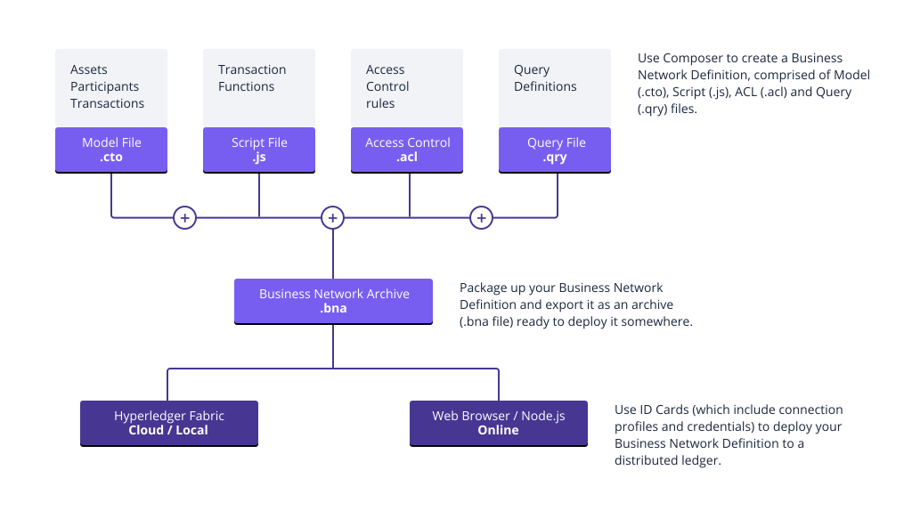

# Welcome to {{site.data.conrefs.composer_full}}

{{site.data.conrefs.composer_full}} is an extensive, open development toolset and framework to make developing blockchain applications easier. Our primary goal is to accelerate time to value, and make it easier to integrate your blockchain applications with the existing business systems. You can use {{site.data.conrefs.composer_short}} to rapidly develop use cases and deploy a blockchain solution in weeks rather than months. {{site.data.conrefs.composer_short}} allows you to model your business network and integrate existing systems and data with your blockchain applications.

{{site.data.conrefs.composer_full}} supports the existing [Hyperledger Fabric blockchain](https://hyperledger.org) infrastructure and runtime, which supports pluggable blockchain consensus protocols to ensure that transactions are validated according to policy by the designated business network participants.

Everyday applications can consume the data from business networks, providing end users with simple and controlled access points.

You can use {{site.data.conrefs.composer_full}} to quickly model your current business network, containing your existing assets and the transactions related to them; assets are tangible or intangible goods, services, or property. As part of your business network model, you define the transactions which can interact with assets. Business networks also include the participants who interact with them, each of which can be associated with a unique identity, across multiple business networks.

---

## How does {{site.data.conrefs.composer_full}} work in practice?

For an example of a business network in action; a realtor can quickly model their business network as such:

* **Assets:** houses and listings
* **Participants:** buyers and homeowners
* **Transactions:** buying or selling houses, and creating and closing listings

Participants can have their access to transactions restricted based on their role as either a buyer, seller, or realtor. The realtor can then create an application to present buyers and sellers with a simple user interface for viewing open listings and making offers. This business network could also be integrated with existing inventory system, adding new houses as assets and removing sold properties. Relevant other parties can be registered as participants, for example a land registry might interact with a buyer to transfer ownership of the land.

---

## Where do I go from here?

---

* To try {{site.data.conrefs.composer_full}} right away, see the [Online Playground](../installing/getting-started-with-playground.html)
* For an introduction to {{site.data.conrefs.composer_short}} components and concepts, see [Key Concepts](./key-concepts.html)
* For an architectural overview of a typical solution built with {{site.data.conrefs.composer_short}}, see [Typical Solution Architecture](./solution-architecture.html)
