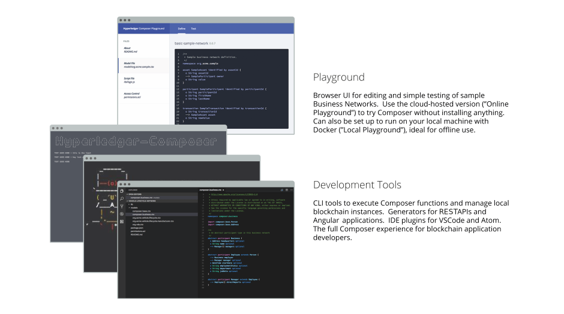

# Features and Concepts in {{site.data.conrefs.composer_full}}

---

{{site.data.conrefs.composer_full}} is a programming model containing a modeling language, and a set of APIs to quickly define and deploy business networks and applications that allow **participants** to send **transactions** that exchange **assets**.

---

## {{site.data.conrefs.composer_full}} Components

{{site.data.conrefs.composer_full}} can be experienced through a browser-based UI called {{site.data.conrefs.composer_full}} Playground.  This can be used via a hosted version (no install necessary) or a local install (good for editing and testing sample Business Networks offline).

Developers who want to use {{site.data.conrefs.composer_full}}'s full application development capabilities can install the Developer Tools.

---

## Key Concepts in {{site.data.conrefs.composer_full}}

### Blockchain State Storage

The current state of assets and participants are stored on the blockchain (ledger), for example, as administered by {{site.data.conrefs.hlf_full}}. {{site.data.conrefs.hlf_full}} distributes the ledger across a set of peers and ensures that updates to the ledger are consistent across all peers (consensus).

---

### Connection Profiles

{{site.data.conrefs.composer_full}} uses _Connection Profiles_ to connect to a runtime. A Connection Profile is a JSON document that lives in the user's home directory (or may come from an environment variable) and is referenced by name when using the {{site.data.conrefs.composer_short}} APIs or the Command Line tools. Using connection profiles ensures that code and scripts are easily portable from one runtime instance to another. You can read more about Connection Profiles in the reference section.

---

### Assets

Assets are tangible or intangible goods, services, or property, and are stored in registries. Assets can represent almost anything in a business network, for example, a house for sale, the sale listing, the land registry certificate for that house, and the insurance documents for that house may all be assets in one or more business networks.

Assets must have a unique identifier, but other than that, they can contain whatever properties you define. Assets may be _related to_ other assets or participants.

---

### Participants

Participants are members of a business network. They may own assets and submit transactions. Participant types are modelled, and like assets, must have an identifier and can have any other properties as required.

---

### Transactions

Transactions are the mechanism by which participants interact with assets. This could be as simple as a participant placing a bid on a asset in an auction, or an auctioneer marking an auction closed, automatically transferring ownership of the asset to the highest bidder.

---

### Events

Events are defined in the business network definition in the same way as assets or participants. Once events have been defined, they can be emitted by transaction processor functions to indicate to external systems that something of importance has happened to the ledger. Applications can subscribe to emitted events through the `composer-client` API.

---

### Access Control

Business networks may contain a set of access control rules. Access control rules allow fine-grained control over what participants have access to what assets in the business network and under what conditions. The access control language is rich enough to capture sophisticated conditions declaratively, such as "only the owner of a vehicle can transfer ownership of the vehicle". Externalizing access control from transaction processor function logic makes it easier to inspect, debug, develop and maintain.

---

## Where do I go from here?

---

* To try {{site.data.conrefs.composer_full}} right away, see the [Online Playground](../getting-started/getting-started-with-playground.html)
* For an architectural overview of a typical solution built with {{site.data.conrefs.composer_short}}, see [Typical Solution Architecture](./solution-architecture.html)
* To install the Development Tools, see [Getting setup with development tools](../getting-started/getting-started-cmd-line.html)
