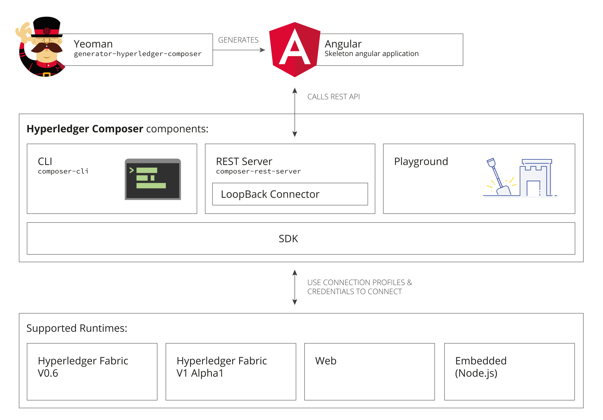

# Typical {{site.data.conrefs.composer_full}} Solution Architecture

{{site.data.conrefs.composer_full}} enables architects and developers to quickly create "full-stack" blockchain solutions. I.e. business logic that runs on the blockchain, REST APIs that expose the blockchain logic to web or mobile applications, as well as integrating the blockchain with existing enterprise systems of record.

---

{{site.data.conrefs.composer_full}} is composed of the following high-level components:

* Execution Runtimes (four are currently supported!)
* JavaScript SDK
* Command Line Interface
* REST Server
* LoopBack Connector
* Playground Web User Interface
* Yeoman code generator
* VSCode and Atom editor plugins

## Execution Runtimes

{{site.data.conrefs.composer_full}} has been designed to support different pluggable runtimes, and currently has three runtime implementations:
.
* {{site.data.conrefs.hlf_full}} version 1.0. State is stored on the distributed ledger.
* Web, which executes within a web page, and is used by Playground. State is stored in browser local storage.
* Embedded, which executes within a Node.js process, and is used primarily for unit testing business logic. State is stored in an in-memory key-value store.

### Connection Profiles

Connection Profiles are used across {{site.data.conrefs.composer_full}} to specify how to connect to an execution runtime. There are different configuration options for each _type_ of execution runtime. For example, the connection profile for an {{site.data.conrefs.hlf_full}} version 1.0 runtime will contain the TCP/IP addresses and ports for the Fabric peers, as well as cryptographic certificates etc.

Connection Profiles are referred to by name (in both code and on the command line) and the connection profile documents (in JSON format) are resolved from the user's home directory.

## JavaScript SDK

The {{site.data.conrefs.composer_full}} JavaScript SDK is a set of Node.js APIs the enables developers to create applications to manage and interact with deployed business networks.

The APIs are split between two npm modules:

1. `composer-client` used to submit transactions to a business network or to perform Create, Read, Update, Delete operations on assets and participants
2. `composer-admin` used to manage business networks (deploy, undeploy)

Details of all the APIs are available as JSDocs (see reference).

### composer-client
This module would usually be installed as a local dependency of an application. It provides the API that is used by business applications to connect to a business network to access __assets__, __participants__ and submitting __transactions__. When in production this is only module that needs to be added as a direct dependency of the application.

### composer-admin
This module would usually be installed as a local dependency of **administrative** applications. This API permits the creation of and deployment of __business network definitions__.

## Command Line Interface

The `composer` command line tool enables developers and administrators to deploy and managed business network definitions.

## REST Server

The {{site.data.conrefs.composer_full}} REST Server automatically generates a Open API (Swagger) REST API for a business network. The REST Server (based on LoopBack technology) converts the {{site.data.conrefs.composer_short}} model for a business network into an Open API definition, and at runtime implements Create, Read, Update and Delete support for assets and participants and allows transactions to be submitted for processing or retrieved.

## LoopBack Connector

The {{site.data.conrefs.composer_full}} LoopBack Connector is used by the {{site.data.conrefs.composer_short}} REST Server, however it may also be used standalone by integration tools that support LoopBack natively. Alternatively it may be used with the LoopBack tools to create more sophisticated customizations of the REST APIs.

## Playground Web User Interface

{{site.data.conrefs.composer_full}} Playground is a web user interface to define and test business networks. It allows a business analyst to quickly import samples and prototype business logic that executes on the Web or {{site.data.conrefs.hlf_full}} runtime.

## Yeoman Code Generators

{{site.data.conrefs.composer_full}} uses the Open Source Yeoman code generator framework to create skeleton projects:

* Angular web application
* Node.js application
* Skeleton business network

## VSCode and Atom Editor Extensions

{{site.data.conrefs.composer_full}} has community contributed editor extensions for VSCode and Atom. The VSCode extension is very powerful and validates {{site.data.conrefs.composer_short}} model and ACL files, providing syntax highlighting, error detection and snippets support. The Atom plugin is much more rudimentary and only has basic syntax highlighting.
