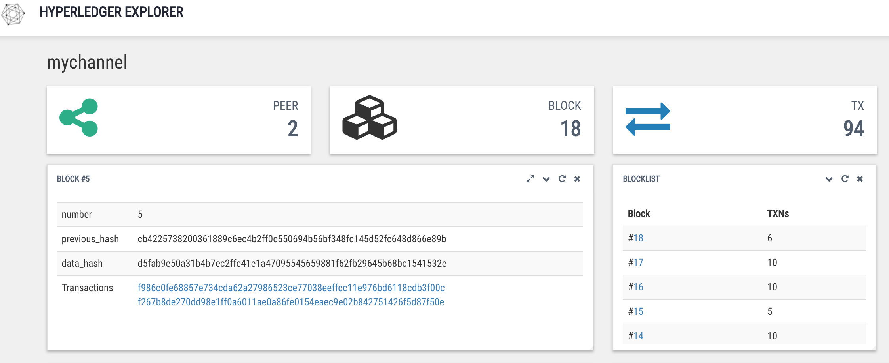

# {{site.data.conrefs.composer_full}} Tuning

---

## Business Network Considerations
In order to obtain the maximum transaction rate for your business network, you must review the following areas in your solution:

- Transaction Processor Function (TPF) design: a single TPF can perform a wide range of operations and interactions with the underlying blockchain platform. Care should be taken when using the available Composer APIs and utilise recommended practice for performance javascript coding. Points to note are:
  - Aim to reduce the number of interactions with asset registries, for instance, when updating assets perform an `updateAll()` operation whenever possible instead of updating each asset in turn.
  - Favour the use of factories over serialisation

- Log Level: when a business network is deployed, unless otherwise specified it will be in debug mode. This will result in large ammounts of data being written to log files and will consequently slow the operation of the business network. During standard operation, the debug mode for the business network should be set to `Error` or `Info`.

- CouchDB indexing: in order for any CouchDB queries to be performant, it is important that CouchDB has been indexed for the anticipated set of queries. Without indexing, an unnecessary period of time will be spent within the CouchDB search phase; introducing latency in all rich query operations and globally impacting CouchDB performance.

## Hyperledger Fabric Considerations
Blockchain platform topology and configuration has a significant impact on the performance of a business network. Within our reports we repeat the same performance tests against multiple topologies so that the resulting topological impacts are observable. Note that within all tests the possible tuning parameters for the underlying blockchain platform are unchanged.

### Fabric Topology
We can consider a Fabric topology to consist of:

 - Organisations - a participating entity within a Hyperledger Fabric network that may or may not maintain peers.
 - Channels - an independant partition that contains a seperate ledger to which which member peers may access.
 - Peers - commits transactions, maintains the ledger and state (may or may not be an endorsing peer)
 - Orderer - approves the inclusion of transaction blocks into the ledger and communicates with peer nodes

In considering topological impacts upon performance, it is necessary to understand the underlying transaction processes that occur. A single (Hyperledger Fabric) transaction can be broken into eight stages:

 - Transaction proposal - a client submits a trnasaction proposal to endorsing peers
 - Proposal execution - each endorsing peer executes the proposed transaction, capturing read-write sets, but not updating the ledger
 - Proposal response - all read-write sets are signed and returned to the client
 - Transaction ordering - client submits the responses as a transaction to be ordered based upon a chosen algorithm
 - Transaction delivery - ordering collects transactions into blocks for distribution to committing peers
 - Transaction validation - all committing peers validate against the endorsement policy and ensure that the read-write sets are still valid agains the current world state
 - Transaction application - committing peers update the ledger with the block and apply all validated transactions to the world state
 - Transaction notification - comitting peers notify registered listeners

 From the above, there is an evident impact on the performance of a deployed business network as a result of the number of peers that take part and the ordering mechanism that is in place. More peers will result in a greater number of read-write sets that must be generated, moved through the system, validated, and conditionally applied. The available bandwidth for network I/O will clearly have an impact on the speed at which the read-write sets may be distributed through the system, and this may be exaccerbated by geographic distribution of client applications and peers. 

### Fabric Configuration
Optimum Hyperledger Fabric settings are heavily dependent on the business network deployed within the network; it is impossible to provide an optimum set that works the best for all business networks. When deployed, a business network exists as chaincode, which has its own memory and CPU computation requirements, and set of policies (number of endorsers and signatures for various transactions). 

Knowing the transaction sizes and the expected transaction rate in the network will assist in tuning the network, which is done through modification of the [`configtx.yaml`](https://github.com/hyperledger/fabric/blob/release/sampleconfig/configtx.yaml) file. Note that if you change the `configtx.yaml`, in order for the changes to be applied it will be required to regenerate the crypto-material prior to deploying the Hyperledger Fabric network, or update the existing network using the `configtxlator`.

The main target for Hyperledger fabric tuning is the `Orderer`, with focus on the BatchTimeout and Batchsize. The BatchTimeout determines the amount of time to wait before creating a batch, and the BatchSize controls the number of messages batched into a block, taking into account the maximum permissible message count, absolute maximum bytes and preferred maximum bytes for each batch. By way of example, considering a `maxmessagecount` of 500 and a `batchtimeout` of 10s, if each transactions was 1MB, then the orderer system would deliver blocks with 1 transaction because the TX exceeds the PreferredMaxBytes size of 512K.

In tuning the network, it is important to understand where any potential bottlenecks for the deployed chaincode may reside: it may be CPU, network, or disc bound.

 - CPU binding occurs in the peers and ordering service. Due to the CPU intensive nature of validation and ordering, if inbound transaction are small then the using a larger `maxmessagecount` may optimise the ordering service, however bottlenecks in the committing peers may still exist due to the need to commit larger numbers of transactions to the ledger.
 - Network binding occurs when the bandwith of messages flowing between components of the Hyperledger Fabric system is saturated. Colocation of components where possible will assist the reduction of network latency, and at this point the message size will also be of relevance in order to assist the network as a whole.
 - Disc binding may occur at the update stage of the transaction cycle. It is here where the `batchsize` is of importance: since each block header could be 2KB - 4KB then writing fewer blocks will cumulatively save a large ammount of data writing. In considering the transactions within each block, we must consider the endorsement policy and the working data within each transaction. Since endorser signitures are included in the writing of each transaction within each block, the endorsement policy in place will also impact the resulting disc I/O; updating large blocks of information is clearly disc I/O intensive and may allude to an inefficient business network asset definition. 

## Transactions Per Block

Multiple factors impact the size of each Hyperledger Fabric transaction, including:
 - The endorsement policies used in the channels - which affect the number of endorser signatures attached to each transaction;
 - The average size of each signature attached by each requested endorser peer and by the orderer that delivers the transaction block (an estimate for one signature with identity and root cert is 1KB size);
 - The average size of data stored for each transaction of the specific chaincode, which will range depending what is processed by the deployed chaincode and can vary from a few KB updwards.
 - The batch size; a larger batchsize for the orderer service would mean fewer blocks, which disc I/O overhead since a simple block header could be 2KB - 4KB.

 ## Determining Transactions Per Block

 The easiest way to determine the number of transactions per block within Hyperledger Fabric is through use of the [Hyperledger Explorer](https://github.com/hyperledger/blockchain-explorer).

 The Hyperledger Explorer, once connected, provides a UI to view the artifacts within the underlying blockchain network; in particular it gives easy access to the blocks, and the transactions within them.

