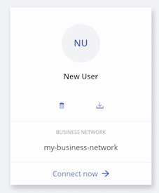

# ID Cards

An ID Card provides all of the information needed to connect to a blockchain business network. It is only possible to access a blockchain Business Network through a valid ID Card. An ID Card contains and Identity for a single Participant within a deployed business network. ID Cards are used in the {{site.data.conrefs.composer_full}} Playground to connect to deployed Business Networks. You can have multiple ID Cards for a single deployed Business Network, where those ID Cards belong to multiple Participants.

ID Cards are grouped under a Connection Profile, and each card shows the business network that may be accessed using the displayed Identity via the _Connect now_ option. An ID Card may be deleted or exported using the icons present on the card.

Here is an ID Card that may be used to connect to the business network named 'my-business-network' using the Identity 'New User'



An ID Card can be created when an Identity is issued within the Playground. This ID Card can then be exported and shared with others, allowing them to connect to the business network using the issued identity. If a user is provided with a Enrollment ID and Secret by an administrator, which corresponds to a valid Identity within a business network, then an ID Card may be directly created in the Playground. It is also possible to manually create an ID Card.

---


## <a name="provide"></a>Providing Access To Your Business Network With an ID Card 

Access to your Business Network is granted to another user through the provision of an ID Card. Once created, the ID Card may be exported and provided to the user for whom the card was created.

There must be a Participant existing in the business network in order to bind an Identity required to create the ID Card.

When an identity is issued within Playground, there is an option to add the Identity to your Wallet. By selecting this option an ID Card is created for the issued identity that is valid for the current business network. The ID Card will appear in your wallet once you log out of the current business network, and it is from this location where it may be exported to share with another user.


### Creating an ID Card 

1. From the **My Wallet** page, select an identity to use to connect to your business network. Click **Connect Now**. _Please note:_ You must use an identity that has permission to create new identities.

2. If required, create the participant to which you intend to assign the identity:
   - Click the **Test** tab, and click **Create New Participant**.
   - Complete the Participant defintion and click **Create New**.

3. Click the name of your identity in the upper right, and click **ID Registry** within the drop down.

4. Click **+Issue New ID**.

5. Choose an **ID Name**, and input an existing **Participant** to associate the new identity with. A look-ahead service is provided to auto-complete on known Participants.

6. Click **Create New**.

7. Click **Add to My Wallet**. Adding the ID Card to your wallet allows you to use it to connect to the business network, or export it for someone else to use.

The **My Wallet** page should now show the new ID Card.


### Exporting an ID Card

ID Cards are exported from the **My Wallet** page in Playground, through interaction with the ID Card that you wish to export and is a one-step process.

- On the **My Wallet** page, click the **Export** icon on the ID Card you wish to export. The ID card should download as a `.card` file.

_Please note_: If you export an ID Card that has never been used, for example to send to a new participant, it will contain the enrollment ID and enrollment secret required to obtain the certificate and private key which are then used to identify Participants. Alternatively, if you export an ID card that has been used before, it will already contain the certificate and private key. For more information on Participants and Identities, please see our [main documentation](../managing/participantsandidentities.html).

**Important**: Exported identity cards should be handled with care since they contain unprotected credentials. We recommend that you only send identity cards that have been encrypted.


### Creating ID Card Credentials

It is possible to provide credentials to a user to enable them to create an ID Card and then use it to connect to the business network for which the credentials are valid. 
1. From the **My Wallet** page, select an identity to use to connect to your business network. Click **Connect Now**. _Please note:_ You must use an identity that has permission to create new identities.

2. If required, create the participant to which you intend to assign the identity:
 - click the **Test** tab, and click **Create New Participant**.
 - complete the Participant defintion and click **Create New**.

3. Click the name of your identity in the upper right, and click **ID Registry** within the drop down.

4. Click **+Issue New ID**.

5. Choose an **ID Name**, and input an existing **Participant** to associate the new identity with. A look-ahead service is provided to auto-complete on known Participants.

6. Click **Create New**.

7. Take note of the Enrollment ID and Secret that is displayed. It is essential to record this information before proceeding as it is this information that must be provided to a user to enable them to create their ID Card. Once you have recorded the Enrollment ID and Secret, click **OK**.

8. Provide the Enrollment ID and Secret to the user that you wish to connect via the generated Enrollment ID. In addition to the Enrollment ID and Secret, they will need to know the name of the business network for which their identity is valid and the Connection Profile that enables conection to the runtime on which the target business network is deployed.

---

## <a name="gain"></a>Gaining Access To A Business Network

### Importing an ID Card

Importing an ID Card allows you to connect to a deployed business network. 

1. On the **My Wallet** page, click **Import ID card** in the upper right.

2. Drag and drop, or browse, to select an ID Card (`.card`) file to import. Click **Import**.

The ID Card should now be visible in your wallet; you can now connect to the deployed Business Network.

### Connecting with Credentials

An ID Card can be created from the **My Wallet** page, through knowledge of four items: a _Enrollment ID_ and _Enrollment Secret_, generated by an admin of a business network; the _Business network name_ for which the credentials are valid; the _Connection Profile_ details for the runtime on which the target business network is deployed.

To create an ID Card from the **My Wallet** page using credentials:

1. After receiving all required credentials, click the **Create ID Card** button in the upper right of the **My Wallet** page.

2. If you have previously connected to the deployed runtime, select it from the displayed list, click **Next** and proceed to step 4; otherwise select the radio option to connect to a new Blockchain and click **Next**.

3. Specify the Connecntion Profile details that were provided to you and click **Save**.

4. Enter the _Enrollment ID_, _Enrollment Secret_ and _Business Network Name_, and click **Create**.

The ID Card should now be displayed in the **My Wallet** page.


### Manually Creating an ID Card

ID Cards are archive (`.zip`) files containing up to three elements:

- A Connection Profile. (`.json`)
- A metadata file containing the data for the Identity to use to connect to the Business Network. (`metadata.json`)
- An optional credentials directory containing a certificate and private key.

_Please note_: If there is no credentials directory, the metadata file must contain the _Enrollment Secret_ property with the property name _enrollmentSecret_. If an _enrollmentSecret_ is specified, a credentials directory with certificates will be created and populated if the ID Card is exported.

The metadata file should take the following format:

```
{
    "name": "PeerAdmin",
    "description": "A valid ID card",
    "businessNetwork": "basic-sample-network",
    "enrollmentId": "UserID",
    "enrollmentSecret": "UserSecret",
    "image": "images/conga.png",
    "roles": [

    ]
}
```

The _businessNetworkName_, _image_, _enrollmentSecret_, and _roles_ properties are optional. The available _roles_ are `PeerAdmin` and `ChannelAdmin`.

To create the ID Card file, compress the Connection Profile, metadata file, and optionally a credentials directory, then modify the file type to `.card`.

This ID Card can now be imported using the {{site.data.conrefs.composer_full}} Playground.
