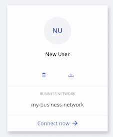

# Business Network Cards

A Business Network Card provides all of the information needed to connect to a blockchain business network. It is only possible to access a blockchain Business Network through a valid Business Network Card. A Business Network Card contains and Identity for a single Participant within a deployed business network. Business Network Cards are used in the {{site.data.conrefs.composer_full}} Playground to connect to deployed Business Networks. You can have multiple Business Network Cards for a single deployed Business Network, where those Business Network Cards belong to multiple Participants.

Business Network Cards are grouped under a Connection Profile, and each card shows the business network that may be accessed using the displayed Identity via the _Connect now_ option. A Business Network Card may be deleted or exported using the icons present on the card.

Here is a Business Network Card that may be used to connect to the business network named 'my-business-network' using the Identity 'New User'



A Business Network Card can be created when an Identity is issued within the Playground. This Business Network Card can then be exported and shared with others, allowing them to connect to the business network using the issued identity. If a user is provided with a Enrollment ID and Secret by an administrator, which corresponds to a valid Identity within a business network, then a Business Network Card may be directly created in the Playground. It is also possible to manually create a Business Network Card.

---


## <a name="provide"></a>Providing Access To Your Business Network With a Business Network Card

Access to your Business Network is granted to another user through the provision of a Business Network Card. Once created, the Business Network Card may be exported and provided to the user for whom the card was created.

There must be a Participant existing in the business network in order to bind an Identity required to create the Business Network Card.

When an identity is issued within Playground, there is an option to save the identity for use in your Business Networks page. By selecting this option a Business Network Card is created for the issued identity that is valid for the current business network. The Business Network Card will appear on your Business Networks page once you log out of the current business network, and it is from this location where it may be exported to share with another user.


### Creating a Business Network Card

1. From the **Business Networks** page, select an identity to use to connect to your business network. Click **Connect Now**. _Please note:_ You must use an identity that has permission to create new identities.

2. If required, create the participant to which you intend to assign the identity:
   - Click the **Test** tab, and click **Create New Participant**.
   - Complete the Participant defintion and click **Create New**.

    <video autoplay "autoplay=autoplay" style="display:block; width:100%; height:auto;" loop="loop">
        <source src="{{ site.baseurl }}/assets/img/tutorials/playground/vs_code_11.mp4" type="video/mp4" />
        </video>

3. Click the name of your identity in the upper right, and click **ID Registry** within the drop down.

4. Click **+Issue New ID**.

5. Choose an **ID Name**, and input an existing **Participant** to associate the new identity with. A look-ahead service is provided to auto-complete on known Participants.

6. Click **Create New**.

7. Click **Add to My Wallet**. Adding the Business Network Card to your Business Networks page allows you to use it to connect to the business network, or export it for someone else to use.

The **Business Networks** page should now show the new Business Network Card.

<video autoplay "autoplay=autoplay" style="display:block; width:100%; height:auto;" loop="loop">
<source src="{{ site.baseurl }}/assets/img/tutorials/playground/vs_code_22.mp4" type="video/mp4" />
</video>

### Exporting a Business Network Card

Business Network Cards are exported from the **Business Networks** page in Playground, through interaction with the Business Network Card that you wish to export and is a one-step process.

- On the **Business Networks** page, click the **Export** icon on the Business Network Card you wish to export. The Business Network Card should download as a `.card` file.

_Please note_: If you export a Business Network Card that has never been used, for example to send to a new participant, it will contain the enrollment ID and enrollment secret required to obtain the certificate and private key which are then used to identify Participants. Alternatively, if you export a Business Network Card that has been used before, it will already contain the certificate and private key. For more information on Participants and Identities, please see our [main documentation](../managing/participantsandidentities.html).

**Important**: Exported identity cards should be handled with care since they contain unprotected credentials. We recommend that you only send identity cards that have been encrypted.


### Creating Business Network Card Credentials

It is possible to provide credentials to a user to enable them to create a Business Network Card and then use it to connect to the business network for which the credentials are valid.
1. From the **Business Networks** page, select an identity to use to connect to your business network. Click **Connect Now**. _Please note:_ You must use an identity that has permission to create new identities.

2. If required, create the participant to which you intend to assign the identity:
 - click the **Test** tab, and click **Create New Participant**.
 - complete the Participant defintion and click **Create New**.

    <video autoplay "autoplay=autoplay" style="display:block; width:100%; height:auto;" loop="loop">
    <source src="{{ site.baseurl }}/assets/img/tutorials/playground/vs_code_3.mp4" type="video/mp4" />
    </video>

3. Click the name of your identity in the upper right, and click **ID Registry** within the drop down.

4. Click **+Issue New ID**.

5. Choose an **ID Name**, and input an existing **Participant** to associate the new identity with. A look-ahead service is provided to auto-complete on known Participants.

6. Click **Create New**.

7. Take note of the Enrollment ID and Secret that is displayed. It is essential to record this information before proceeding as it is this information that must be provided to a user to enable them to create their Business Network Card. Once you have recorded the Enrollment ID and Secret, click **OK**.

    <video autoplay "autoplay=autoplay" style="display:block; width:100%; height:auto;" loop="loop">
    <source src="{{ site.baseurl }}/assets/img/tutorials/playground/vs_code_4.mp4" type="video/mp4" />
    </video>

8. Provide the Enrollment ID and Secret to the user that you wish to connect via the generated Enrollment ID. In addition to the Enrollment ID and Secret, they will need to know the name of the business network for which their identity is valid and the Connection Profile that enables conection to the runtime on which the target business network is deployed.

---

## <a name="gain"></a>Gaining Access To A Business Network

### Importing a Business Network Card

Importing a Business Network Card allows you to connect to a deployed business network.

1. On the **Business Networks** page, click **Import Business Network Card** in the upper right.

2. Drag and drop, or browse, to select a Business Network Card (`.card`) file to import. Click **Import**.

The Business Network Card should now be visible in your Business Networks page; you can now connect to the deployed Business Network.

### Connecting using Credentials

There are two ways a Business Network Card can be created from the **Business Networks** page.

A Business Network Card can be created using certificates, which requires the following: a _certificate_ and _private key_, provided by an admin of a business network; a _name_ for the Business Network Card; the _business network name_ for which the credentials are valid; the _Connection Profile_ details for the runtime on which the target business network is deployed.

To create a Business Network Card from the **Business Networks** page using _certificates_:

1. After receiving a certificate and private key, click the **Connect using credentials** button in the upper right of the **Business Networks** page.

2. If you have previously connected to the deployed runtime, select it from the displayed list, click **Next** and proceed to step 4; otherwise select the radio option to connect to a new Blockchain and click **Next**.

3. Specify the Connection Profile details that were provided to you and click **Save**.

4. Enter the _certificate_, _private key_, an _Business Network Card name_ and _business network name_, and click **Create**.

The Business Network Card should now be displayed in the **Business Networks** page.

A Business Network Card can be created using an ID and secret, through knowledge of the following: a _Enrollment ID_ and _Enrollment Secret_, generated by an admin of a business network; the _Business network name_ for which the credentials are valid; the _Connection Profile_ details for the runtime on which the target business network is deployed.

To create a Business Network Card from the **Business Networks** page using an _enrollment ID_ and _enrollment secret_:

1. After receiving an enrollment ID and enrollment secret, click the **Connect using credentials** button in the upper right of the **Business Networks** page.

2. If you have previously connected to the deployed runtime, select it from the displayed list, click **Next** and proceed to step 4; otherwise select the radio option to connect to a new Blockchain and click **Next**.

3. Specify the Connection Profile details that were provided to you and click **Save**.

4. Enter the _enrollment ID_, _enrollment secret_ and _business network name_, and click **Create**.

The Business Network Card should now be displayed in the **Business Networks** page.


### Manually Creating a Business Network Card

Business Network Cards are archive (`.zip`) files containing up to three elements:

- A Connection Profile. (`.json`)
- A metadata file containing the data for the Identity to use to connect to the Business Network. (`metadata.json`)
- An optional credentials directory containing a certificate and private key.

_Please note_: If there is no credentials directory, the metadata file must contain the _Enrollment Secret_ property with the property name _enrollmentSecret_. If an _enrollmentSecret_ is specified, a credentials directory with certificates will be created and populated if the Business Network Card is exported.

The metadata file should take the following format:

```
{
    "name": "PeerAdmin",
    "description": "A valid Business Network Card",
    "businessNetwork": "basic-sample-network",
    "enrollmentId": "UserID",
    "enrollmentSecret": "UserSecret",
    "image": "images/conga.png",
    "roles": [

    ]
}
```

The _businessNetworkName_, _image_, _enrollmentSecret_, and _roles_ properties are optional. The available _roles_ are `PeerAdmin` and `ChannelAdmin`.

To create the Business Network Card file, compress the Connection Profile, metadata file, and optionally a credentials directory, then modify the file type to `.card`.

This Business Network Card can now be imported using the {{site.data.conrefs.composer_full}} Playground.
