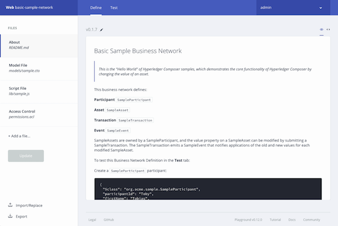
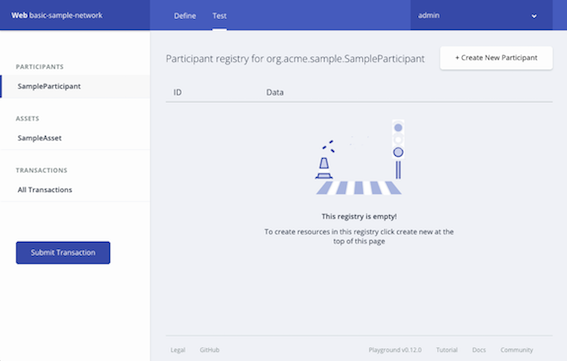

# Using Playground
The {{site.data.conrefs.composer_full}} Playground provides a user interface for the configuration, deployment and testing of a business network. Advanced Playground features permit users to manage the security of the business network, invite participants to business networks and connect to multiple blockchain business networks.

If you are new to the Playground, we recommend that you follow the [Playground Tutorial](../tutorials/playground-guide.html) that will guide you through the process of creating, deploying and testing a new blockchain business network before you start interacting with ID cards.

---

# Navigating Playground

## Landing Page
The Wallet page is the default Playground landing page. Here you can see all the ID Cards in your Wallet. Each ID Card provides all of the information needed to connect to a blockchain business networks. It is only possible to access a blockchain Business Network through a valid ID Card. Once connected to a deployed Business Network, you will be taken to the Define page within the Editor.

The page options comprise:

- Deploy new business network ‘card’. If this is your first time using Playground, or you wish to start a new network, you should press this button. When you press the button, you will begin the process of creating a new Business Network from scratch, or by using one of our provided samples as a base.
- ID Cards. An ID Card is what is used to connect to a blockchain Business Network. The card contains the identity, connection profile and the name of the target business network. The card provides options to delete the identity/card, export the card, and to connect to the corresponding business network.
- Import ID Card. It is possible to import an ID Card from a .card file on your computer. To do so, simply browse to the file using your file explorer, or drag-and-drop the file into the designated area.
- Connect using credentials. If you have been provided with some credentials by an administrator, you can use this button to connect to the business network.
- Tutorial. By pressing this link you will be navigated to the Playground tutorial.

## Editor Global Options
The Editor define and test pages contain a header that shares interaction options.

From left to right, the header contains:

- The name of the connection profile in use, and the Busines Network to which you are connected. In the above, it is Web and basic-sample-network respectively.
- Tabs that enable you to move between the Define and Test pages.
- A drop-down that is labelled with the current Identity, which enables you to work with the Identity Registry (for issuing identities) and to log out of the Business Network.

## Editor - Define
The Editor Define page is the page that is used to create, edit and update your Business Network.

The left hand side of the page contains:

- The Navigator, which displays all the files within your Business Network. By selecting a file within the list, it will be displayed in the central editor panel.
- Add File button, which enables you to add a new file to your Business Network definition.
- Update button, which updates the deployed Business Network to match that shown within the Editor.
- Import/Replace button, which enables you to replace the complete Business Network definition within the editor. You may chose to import a Business Network based on a set of samples, or Business Network Archive file from disc.
- Export button, which will export the Business Network definition within the Editor as a Business Network Archive (.bna) file.

The central editor panel will display the currently selected file from the navigator. Using the editor, you can develop all aspects of your blockchain Business Network.

## Editor - Test
The Editor Test page is used to test the deployed Business Network through the creation of Participants, Assets and the submission of Transactions.

The left hand side of the page contains:

- Participant registry, which shows all Participants within the Business Network. Within this view it is possible to add a new Participant through the Create New Participant button shown on the upper menu, and update or remove existing Participants.
- Asset registry, which shows all Assets within the Business Network. Within this view it is possible to add a new Asset through the Create New Asset button shown on the upper menu, and update or remove existing Assets.
- Transaction registry, which shows Historian Records of Transactions that have occurred within the Business Network.
- Submit Transaction button, which enables the sumbission of a Transaction that is described within a script file of the Business Network definition.

---
# Playground Tasks

###ID Cards
* [Provide Access To Your Business Network With an ID Card](./id-cards-playground.html#provide)
* [Gain Access To A Business Network with an ID Card](./id-cards-playground.html#gain)

---
