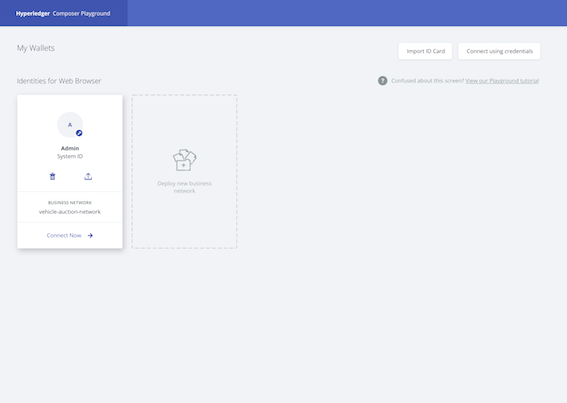
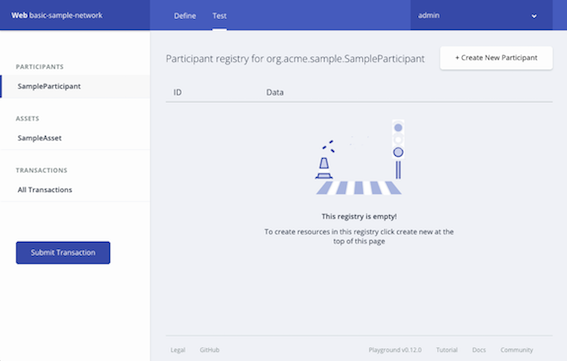

# Using Playground
The {{site.data.conrefs.composer_full}} Playground provides a user interface for the configuration, deployment and testing of a business network. Advanced Playground features permit users to manage the security of the business network, invite participants to business networks and connect to multiple blockchain business networks.

If you are new to the Playground, we recommend that you follow the [Playground Tutorial](../tutorials/playground-guide.html) that will guide you through the process of creating, deploying and testing a new blockchain business network before you start interacting with Business Network Cards.

**Please note**: If two or more users are using {{site.data.conrefs.composer_full}} Playground to connect to the same instance of {{site.data.conrefs.hlf_full}}, ensure that each user refreshes their browser after the business network definition is updated by another user. Refreshing the browser accepts the changes to the business network definition made by other users. If the the business network is changed without accepting the changes of other users the changes will be lost.

---

# Navigating Playground

## The Business Networks page

The **Business Networks**  page is the default Playground landing page. Here you can see all the Business Network Cards you have available for use. Each Business Network Card provides all of the information needed to connect to a blockchain business network. It is only possible to access a blockchain business network by using a valid Business Network Card. Once connected to a deployed Business Network, you will be taken to the **Define** page.

From this page you can:

- Connect to a business network. If you already have a deployed business network and a Business Network Card created for it, you can click **Connect now** to connect to the business network.
- Deploy a new business network. If this is your first time using Playground, or you wish to start a new network, deploying your own network is a great place to start. When creating a new business network, you can choose to base your business network definition on a sample network, or create your own network from scratch.
- Interact with Business Network Cards. Business Network Cards are used to connect to business networks which already exist, and are a combination of connection profile and identity. The card provides options to delete the identity/card, export the card, and to connect to the corresponding business network.
- Import Business Network Cards. Importing an existing `.card` file from your computer is the simplest way to add a Business Network Card to your Business Networks page.
- Connect using a user ID and user secret. If you have been provided with a user ID and user secret by your network administrator, click **Connect using credentials** to enter them and generate a Business Network Card.
- Run through the Playground tutorial. If you don't know where to start, the Playground tutorial runs through creating a business network from scratch, and performing some basic operations.

## Business network options

Once connected to a business network using a Business Network Card, there are a number of options available whether you're looking at the **Define** tab, or the **Test** tab.

- In the upper-left is the name of the connection profile you're using and the business network you're connected to. In the example above, the connection profile is called _Web_ and the business network name is _basic-sample-network_.
- Links to the **Define** and **Test** tabs. In the **Define** tab, you can add, modify and delete the content of your business network, and in the **Test** tab you can create assets and participants that were defined in the **Define** tab, and test the functionality of your business network.
- On the upper-right is a dropdown menu displaying the identity which is being used to connect to the business network. The dropdown contains a link to the **Identity Registry**, and the ability to log out of the business network, returning to the **Business Networks** page.

## The Define tab

The Define tab is used to create, edit and update your business network.

On the left of the **Define** tab, you can see a list of all the files in your current business network definition. To examine the contents of a file, click on it, and it will appear in the editor view. New files can be added to your business network with the **Add a file** button. Model files, script files, access control files, and query files can be added to your business network.

Once you've added and modified the files for your business network definition, you can deploy the changes to your network with the **Update** button. After clicking **Update** you can experiment with your changes in the **Test** tab. The **Import/Replace** button allows you to import a business network, either from your own computer, or import a business network from our samples. Conversely, the **Export** button downloads your current business network as a `.bna` file.

**Please note**: If two or more users are using {{site.data.conrefs.composer_full}} Playground to connect to the same instance of {{site.data.conrefs.hlf_full}}, ensure that each user refreshes their browser after the business network definition is updated by another user. Refreshing the browser accepts the changes to the business network definition made by other users. If the the business network is changed without accepting the changes of other users the changes will be lost.

## The Test tab

The **Test** tab is used to test the deployed business network by using the asset types, participant types, and transactions which you defined in the **Define** tab.

On the left of the **Test** tab, each participant type and asset type is listed. Clicking on a participant type, asset type, or **All transactions** will display a registry, showing all active instances of that type. For example, by clicking **SampleParticipant**, you can see a registry showing all _SampleParticipants_ that have been created. If it's the first time you've looked at the **Test** tab, your registries will be empty!

From within each registry, you can create the corresponding asset, participant, or submit the corresponding transaction.

In the **All transactions** registry, also known as the Historian, you can see a record of each transaction that has taken place in your business network, including some transactions which are caused by system events, such as creating participants or assets. In the transaction registry, you can submit transactions, and then check that their effects have occurred by checking the resources that were changed.

---
# Playground Tasks

### Business Network Cards
* [Provide Access To Your Business Network With a Business Network Card](./id-cards-playground.html#provide)
* [Gain Access To A Business Network with a Business Network Card](./id-cards-playground.html#gain)

---
