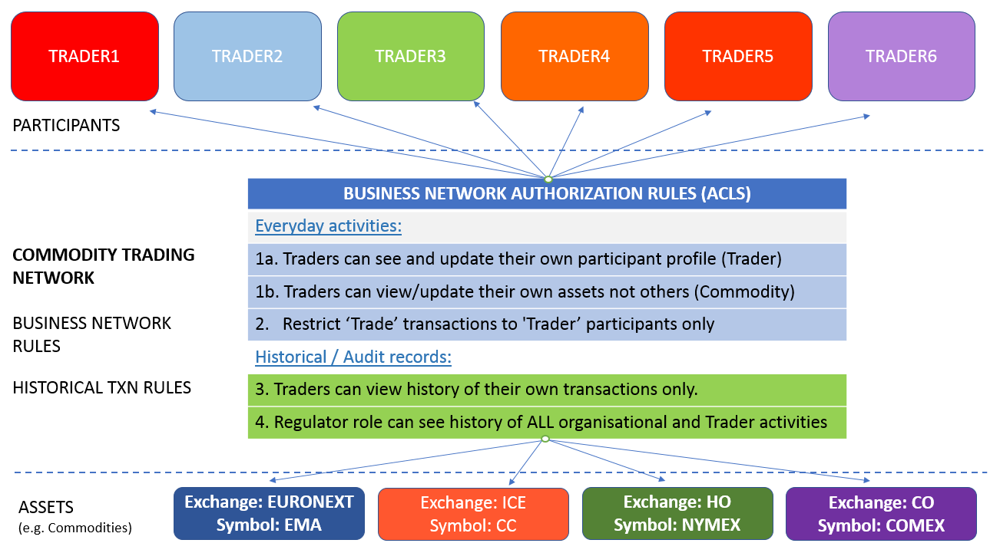
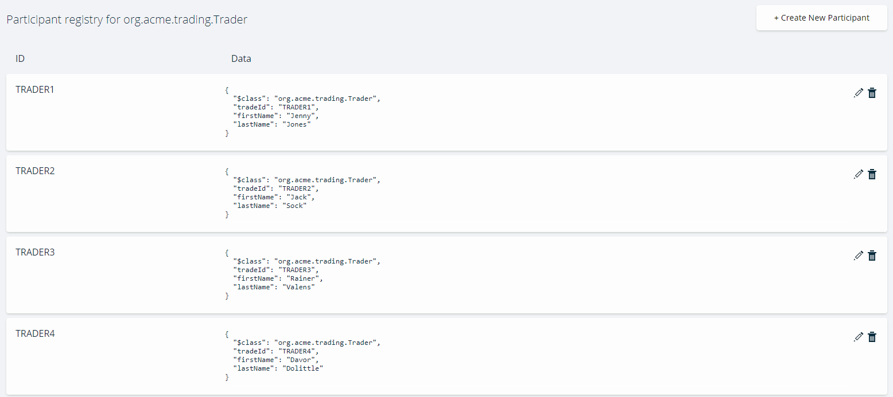
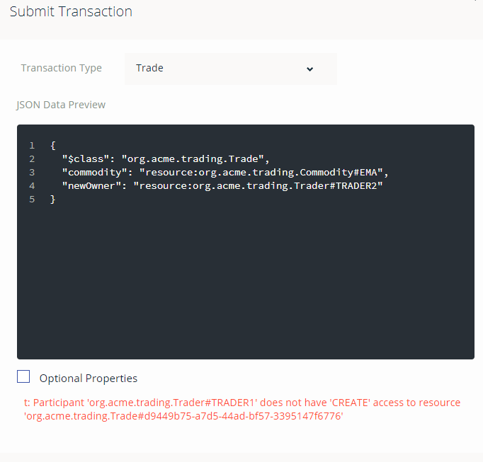

# Access Control in {{site.data.conrefs.composer_full}}  - Tutorial

Access control and authorization are a very important part of {{site.data.conrefs.composer_full}} and the security architecture of a business network shared by member organisations on the blockchain. {{site.data.conrefs.composer_full}} enables an administrator control what resources or data a participant, or indeed participant role - is authorized to see or do, in a business network. These participants will typically operate or transact from inside their respective member organisations and each will have their own access control requirements on the ledger, whilst at the same time allowing controlled access to shared data or data that may be common to all member organisations - or specific members interacting on the same business network.  

This tutorial explores one such business network - the Commodity Trading network - seen elsewhere in our tutorials and [sample networks](https://github.com/hyperledger/composer-sample-networks/tree/master/packages/trade-network) and shows examples of ACLs in action in this sample network.

Access control rules (the language that defines ACLs) fall into two main areas:

- authority to access system, network or administrative resources and operations in the System namespace (governing Network and System operations) ;  and
- authority to access resources or perform operations **within** a given business network itself (like Create, Read, Update assets),  via domain specific business network ACLs.

The tutorial uses the online Playground to try out some simple and conditional access rules. In doing so, you will interact with the sample network as various identities - ultimately,  it is the users of the blockchain that we want to apply access control to. We'll also see how a Participant role can be used to control access, where multiple identities can be mapped to a designated Participant role (such as a Regulator). Its important to note that in a real blockchain network, all operations, whether from a Node JS application, CLI or indeed REST operations are subject to and controlled by the ACLs that govern a business network. Accountability is seen at an identity level.

If you wish, you can also apply the rules in this tutorial against an existing {{site.data.conrefs.composer_full}} you've deployed. You just need to grab and deploy the sample Commodity Trading business network used in the [Developer Tutorial](../tutorials/developer-tutorial.html) - remembering to remove the global trading network ACL rule mentioned earlier - and you're ready to start working with that environment.

## Prerequisites

None - just an internet connection, which you have right now :-)

## Step One: Access the Online Playground and select your business network

We'll use the sample business network (`trade-network`) sourced from the Composer sample networks repository.

1. Go to the [Online Playground](https://composer-playground.mybluemix.net/login) and if necessary clear local storage when prompted. Accept the Welcome logo, you are ready to start.

2. Click on the `Deploy a new business network` modal / icon.

3. Scroll down and click on the `trade-network` sample - when you scroll back up,  it should populate name, description and network admin card fields for you.

4. With the Deploy button active (confirm that the name is `trade-network`) - click on **Deploy** to deploy the business network.

5. Lastly, click on 'Connect Now' to connect to the deployed business network (the default id - its shown top right).

6. The 'Trade Network' README file should be active and you can see the components of the business network listed in the left column - one of these is the ACLs file `permissions.acl` which controls the access to resources. Out of the box, the sample business networks have 'all access' turned on, which would of course, ultimately be different to that for a production style environment.

### Create Trader Participants

1. Click on the 'Test' tab near the top of the screen. This is where we create sample Trader participants.

2. Click on `Trader` on the left - Create New Participant (top right) as follows - the example below is 'TRADER1':

1st record:

    {
          "$class": "org.example.trading.Trader",
          "tradeId": "TRADER1",
          "firstName": "Jenny",
          "lastName": "Jones"
    }

3. Repeat step 2 and create 5 additional `Trader` participants ('TRADER2' through 'TRADER6') using the sample data above (change the names as appropriate). We have provided 'TRADER2', and 'TRADER3' as an example below.

2nd record:

    {
        "$class": "org.example.trading.Trader",
        "tradeId": "TRADER2",
        "firstName": "Jack",
        "lastName": "Sock"
    }

3rd record:

    {
      "$class": "org.example.trading.Trader",
      "tradeId": "TRADER3",
      "firstName": "Rainer",
      "lastName": "Valens"
    }

4th record:

    {
      "$class": "org.example.trading.Trader",
      "tradeId": "TRADER4",
      "firstName": "Davor",
      "lastName": "Dolittle"
    }

5th record:

    {
      "$class": "org.example.trading.Trader",
      "tradeId": "TRADER5",
      "firstName": "Steve",
      "lastName": "Alonso"
    }

6th record:

    {
      "$class": "org.example.trading.Trader",
      "tradeId": "TRADER6",
      "firstName": "Lars",
      "lastName": "Graf"
    }

### Create Commodity Assets

1. Still in the 'Test' panel, create some Commodity records by selecting 'Commodity' on the left - the ownership (`owner` field) relates back to the 'Trader' participant for the purposes of this tutorial. Note that owner is a relationship field.

1st record:

    {
      "$class": "org.example.trading.Commodity",
      "tradingSymbol": "EMA",
      "description": "Corn",
      "mainExchange": "EURONEXT",
      "quantity": 10,
      "owner": "resource:org.example.trading.Trader#TRADER1"
    }

2nd record:

    {
      "$class": "org.example.trading.Commodity",
      "tradingSymbol": "CC",
      "description": "Cocoa",
      "mainExchange": "ICE",
      "quantity": 80,
      "owner": "resource:org.example.trading.Trader#TRADER2"
    }

3rd record:

    {
      "$class": "org.example.trading.Commodity",
      "tradingSymbol": "HO",
      "description": "Heating Oil",
      "mainExchange": "NYMEX",
      "quantity": 40,
      "owner": "resource:org.example.trading.Trader#TRADER3"
    }

4th record:

    {
      "$class": "org.example.trading.Commodity",
      "tradingSymbol": "HG",
      "description": "Copper",
      "mainExchange": "COMEX",
      "quantity": 100,
      "owner": "resource:org.example.trading.Trader#TRADER4"
    }

5th record:

    {
      "$class": "org.example.trading.Commodity",
      "tradingSymbol": "SM",
      "description": "Soybean Meal",
      "mainExchange": "CBOT",
      "quantity": 70,
      "owner": "resource:org.example.trading.Trader#TRADER5"
    }

6th record:

    {
      "$class": "org.example.trading.Commodity",
      "tradingSymbol": "AG",
      "description": "Silver",
      "mainExchange": "CBOT",
      "quantity": 60,
      "owner": "resource:org.example.trading.Trader#TRADER6"
    }

### Create Identities to test ACLs

Next, let's create some trader identities - we need to issue identities for the Traders (TRADER1 - 6) so that we can test those identities' access (each being mapped to their respective Trader participant record)

1. Click on `admin` (top right) and select 'ID Registry' from the drop-down
2. Click 'Issue new ID' top right and it will present an 'Issue New Identity' dialog
3. In the ID Name field - enter `tid1` as the identity we'll use for TRADER1
4. In the Participant field - enter `TRADER1` to search for the Participant - and select the fully-qualified participant name
5. Click on 'Create New'  to continue.

Repeat the 'Issue new ID' sequence (step 2 through 5 above) for identities `tid2`, `tid3`, `tid4`, `tid5` and `tid6` respectively, mapping these to their respective TRADER participants.

 Now we're ready to start creating our access control rules.

**Important**: if you are issuing new identities for a {{site.data.conrefs.composer_full}} based environment (as opposed to the online environment), be sure to add each issued identity to your wallet using the 'Add to Wallet' option.

### Add Commodity Trading network access control rules

The standard 'Commodity Trade network' sample network you deployed comes with standard System and Network ACL rules, that govern the participants of the business network to enable accessing registries like asset registries or ability to reviewing historical records in the ledger.

But we want to add some Trading-specific access control rules - let's start by defining what we want to achieve first ! The golden rule with ACLs is that access to resources inside a business network are by default implicitly 'DENIED' to Participants, unless explicitly ALLOWED.

You will note from reviewing the current ACLs in `permissions.acl` that certain 'system' or 'administrator' type rules are defined in the ACLs file - this is to allow participants to be able to use Composer system operations such as being able to write to the Composer system Historian registry.

Before we begin, we will need to remove one 'global' rule in `permissions.acl` for our trading network which, because its ordinarily used as a sample network, must now be removed. This is the rule to REMOVE (up to - and including - the final curly bracket):

    rule Default {
        description: "Allow all participants access to all resources"
        participant: "ANY"
        operation: ALL
        resource: "org.example.trading.*"
        action: ALLOW
    }

Having removed this from the `permissions.acl` file (leaving the 'system' or 'administrator' rules behind, click on the **UPDATE** button (bottom left) for the changes to take effect.

In terms of our rule objectives - these are the policies we want to apply:

#### Everyday activities - rule objectives:

1a. Traders can see and update their own profile only (participant record)

1b. Allow Traders access to all operations on their own assets (Commodities)

2. Restrict Participants of type 'Trader' such that only they can submit `Trade` transactions (as there may be several transactions defined in the model, over time, in an 'live'/operational business network)

#### Historical records  - rule objectives:

3. Ensure Traders can only see the history of transactions they have created.
4. Allow a Participant of type REG (Regulator) the authority to see the history of all historical transactions committed by Traders (as well as working with their own participant profile) - there are two rule subsets for this - 4a and 4b.

It is important to note at this point that the namespace `org.example.trading` (our Commodity Trading business network) has no business network ACLS defined (just has system ones) and therefore access to resources inside that business network are implicity 'denied' by default.

#### Rule 1a - Trader profile restriction rule

First up - rule to restrict Traders to only see and update their own record.

1. Switch identity to `tid1` (click the current identity top right and choose ID Registry, select to 'use now' for `tid1`) - and click on the 'Test' tab
2. Confirm that you do not see any Trader records.
3. Switch identity to the 'admin' user (top right, 'ID Registry'), then go to the 'Define'  tab and click on 'Access Control' (`permissions.acl`) on the left.
4. Paste the following rule into the top of your edit session, after the comment lines and ensure you have pasted above, the existing 3 'System' and 'Network' system rules:

Rule:

    rule R1a_TraderSeeUpdateThemselvesOnly {
      description: "Trader can see and update their own record only"
      participant(t): "org.example.trading.Trader"
      operation: READ, UPDATE
      resource(v): "org.example.trading.Trader"
      condition: (v.getIdentifier() == t.getIdentifier())
      action: ALLOW
    }

Then click on the **UPDATE** button on the bottom left to update the business network.

This rule will allow the `current` Trader Participant (mapped to the `current` identity whether in playground (here) or indeed in your application) to READ and UPDATE their own target Trader record.

5. **TEST THE ACL**: Switch user to identity `tid1` (top right, 'ID Registry') and click on the 'Test' tab - check that TRADER1 record only, is visible to this identity.

#### Rule 1b - Trader Asset Ownership - allow update by owners only

By default, a Trader cannot see or update any of the Commodities created earlier.

We need a rule to enable a Trader access Commodities for which they are the designated 'owner'.

1. Switch identity to `tid1` (click the current identity top right and choose ID Registry, select to 'use now' for `tid1`) - and click on the 'Test' tab
2. Confirm that you do not see any Commodity records.
3. Switch identity back to the 'admin' user (top right, 'ID Registry'), then go to the 'Define'  tab and click on 'Access Control' (`permissions.acl`) on the left.
4. Paste the following rule in line 1 in your edit session, pasted above the existing rules:

Rule:

    rule R1b_TraderSeeTheirCommodities {
      description: "Trader can see/work with their own Commodities"
      participant(t): "org.example.trading.Trader"
      operation: ALL
      resource(c): "org.example.trading.Commodity"
      condition: (c.owner.getIdentifier() == t.getIdentifier())
      action: ALLOW
    }

Then click on the **UPDATE** button on the bottom left to update the business network.

This rule will allow the `current` Trader Participant all operations on target Commodity resources that it 'owns'.

5. **TEST THE ACL**: Switch user to identity `tid1` (top right, 'ID Registry') and click on the 'Test' tab - confirm that there is one Commodity owned by TRADER1 participant and is visible/editable (icon) to this identity.

Implicitly, this Trader TRADER1 has no ability to see or update other Trader's assets (Commodities) at this point - we don't need a rule for this, but there may in the real world be a business policy to allow specific senior Traders to 'see' other Commodities, albeit they are not owners for same.

#### Rule 2 - Restrictive rule: Only 'Trader' participants can submit `Trade` smart contract transactions

By default, a Trader cannot submit a `Trade` transaction (defined in our model and for which we have smart contract logic written in our Script file) to update a Commodity he owns.

We need a rule to enable a Trader to submit `Trade` transactions for which they are the designated 'owner'. The `Trade` transaction enables the current owner to change the ownership of a Commodity to another Trader.

1. Switch identity to `tid1` (click the current identity top right and choose ID Registry, select to 'use now' for `tid1`) - and click on the 'Test' tab
2. Confirm that you cannot submit a `Trade` transaction ('Submit Transaction' - copy and paste the transaction below) to try change the ownership of a Commodity - you will get a message that you do not have `CREATE` ability to do submit the transaction.

JSON to copy:

    {
      "$class": "org.example.trading.Trade",
      "commodity": "resource:org.example.trading.Commodity#EMA",
      "newOwner": "resource:org.example.trading.Trader#TRADER2"
    }

3. Switch identity back to the 'admin' user (top right, 'ID Registry'), then go to the 'Define'  tab and click on 'Access Control' (`permissions.acl`) on the left.
4. Paste the following rule in line 1 in your edit session, pasted above the existing rules:

Rule:

    rule R2_EnableTradeTxn {
        description: "Enable Traders to submit transactions"
        participant: "org.example.trading.Trader"
        operation: ALL
        resource: "org.example.trading.Trade"
        action: ALLOW
    }

Then click on the **UPDATE** button on the bottom left to update the business network.

That's it. We know already that the participant can only work with their own Commodity(ies). This will allow only Trader participants to submit transactions of type `Trade` (we could have many different participant types in a business network).

5. **TEST THE ACL**: Switch user to identity `tid1` (top right, 'ID Registry') - the owner of Commodity with id `EMA`

a. Click on the 'Test' tab. Submit a `Trade` Transaction copying and pasting this transaction, replacing current contents with the transaction provided below:

JSON to copy:

    {
      "$class": "org.example.trading.Trade",
      "commodity": "resource:org.example.trading.Commodity#EMA",
      "newOwner": "resource:org.example.trading.Trader#TRADER2"
    }

b. Confirm that the transaction has now been submitted by going to 'All Transactions' (on the left) and the first record in the Historian shows a `TRADE` transaction confirms the transfer. Participant TRADER1 no longer owns the commodity. By contrast, a switch to identity `tid2` will reveal it has two Commodity records as TRADER2 was the recipient owner.

#### Rule 3 - Enabling rule: Allow Traders to see their own historical records only

By default, due to the System ACLs (a part of which is the registry for the Historian records), each Trader (eg. and related `tid1`, `tid2` etc identities) can see the history of all Transactions - an example is the `UpgradeBusinessNetwork` performed by admin.

We will lock down access to the Historian such that Traders only see transactions they submitted in Historian.

1. Switch identity to `tid3` (click the current identity top right and choose ID Registry, select to 'use now' for `tid3`) - and click on the 'Test' tab
2. Confirm that you can see transactions relating to 'system' activities, but also the other traders (TRADER1 and TRADER2).
3. Switch identity back to the 'admin' user (top right, 'ID Registry'), then go to the 'Define'  tab and click on 'Access Control' (`permissions.acl`) on the left.
4. Paste the following rule in line 1 in your edit session, pasted above the existing rules:

Rule:

    rule R3_TradersSeeOwnHistoryOnly {
      description: "Traders should be able to see the history of their own transactions only"
      participant(t): "org.example.trading.Trader"
      operation: READ
      resource(v): "org.hyperledger.composer.system.HistorianRecord"
      condition: (v.participantInvoking.getIdentifier() != t.getIdentifier())
      action: DENY
    }

This rule restricts the current Trader participant to seeing only transactions he/she invoked on the blockchain.

Then click on the **UPDATE** button on the bottom left to update the business network.

5. **TEST THE ACL**:

a. Switch user to identity `tid3` (top right, 'ID Registry') - you will only see 'Identity Activation' type entries but nothing about the history of transactions that were submitted relating to TRADER1 and TRADER2. This is what we would expect.

b. Next, switch to identity `tid1` - you will see the history of transactions (including the 'TRADE' transaction submitted earlier) relating to `tid1` only - in particular the transfer of Commodity 'CC' ownership to TRADER2 (By contrast, identity `tid2` , the transferee, will not see the historial 'TRADE' transaction submitted by `tid1` - only the Commodity asset, that was transferred).

#### Rule 4a & 4b - Enabling rule: Allow Regulators to see their own profile and all historical activity,  including Trades

It stands to reason that a regulator would want to review/audit historical transactions carried out in the business network. They won't necessarily need access to things like Participants or Assets per se (depending on the use case or policy), but rather, the activities relating to these.

We don't yet have a 'Regulator' in our 'Commodity Trading' business network model, so we will add this as a separate participant type and then proceed to define rules that allow someone that has the regulator 'role', to access historical records. Remember that one or more identities can be mapped to a participant instance, and 'Regulator' is a good example of that.

1. Switch identity to `admin` if you haven't already done so  - and then click on 'Define' (top)
2. Click on the Model file and add a new Participant type (add it below the `Trader` participant) as follows:

Model:

    participant Regulator identified by regId {
        o String regId
        o String firstName
        o String lastName
    }

3. Ensure you click on the **UPDATE** button to update the network.

4. Switch to the 'Test' tab (still as 'admin')  and create a participant Regulator as follows:

Create the record:

    {
      "$class": "org.example.trading.Regulator",
      "regId": "Reg101",
      "firstName": "Jon",
      "lastName": "Doe"
    }

5. Create an Identity in the ID registry  for an identity with ID `101` and map it to the Participant regulator 'Reg101' created above.

At this point, the Regulator can now see the history of system transactions in Composer's Historian, due to the system ACL rules defined earlier. But at this point, he cannot see his own participant profile.

6. Add the following rule:

Rule:

    rule R4a_RegulatorSeeThemselves {
      description: "Regulators can see and update their own record"
      participant: "org.example.trading.Regulator"
      operation: READ, UPDATE
      resource: "org.example.trading.Regulator"
      action: ALLOW
    }

This rule merely allows a Regulator participant to update their own profile record (should they wish to update it - you can test this out if you wish; we had done something similar earlier).

Then click on the **UPDATE** button on the bottom left to update the business network with the new rule.

7. Next, switch identity (in the Id Registry) to  the Regulator identity `101` and click 'Use Now'

8. Check you can indeed see the Historical records (which shows our previous transactions - then click on 'view record' for any system type transaction activity such as `AddAsset` or `AddParticipant` - as someone that is a Regulator, you should be able to see this activity.

9. Next click 'view record' for a **TRADE** transaction- there's an issue - nothing happens. You (regulator) currently do not have authority (via ACLs) able to view the transaction record

10. Switch identity back to 'admin' as good practice for rule changes.

11. Add the following Regulator authorisation rule (insert the rule in the `permissions.acl` file at the top ):

Rule:

    rule R4b_RegTransView {
        description: "Grant Regulator full access to Trade Transactions"
        participant: "org.example.trading.Regulator"
        operation: ALL
        resource: "org.example.trading.Trade"
        action: ALLOW
    }

Then click on the **UPDATE** button on the bottom left to update the business network.

This rule enables a Regulator to access the Trade transaction resources, such that it can view the Trade transactions from Historian's 'view record').

This rule also applies to any subsequent identity mapped to the regulator role and in the Regulator participant registry.

12. **TEST the ACL** - now go to a trade transaction again and check that you can indeed now view the record

In this tutorial, you have experimented with creating ACL rules incrementally, only permitting the requisite access controls that should be accorded to participants of this example Commodity Trading business network.  We have seen how ACL rules provide authorisation and access control to resources as applied to participants (or indeed participant roles). ACLs govern the access control to resources and transactions, whether that's the ability to create, delete or update resources or execute transactions. We have also the power of the Access Control Language and rules, in defining the conditions or criteria as to: 'who' has the ability to do 'what' on the ledger.
