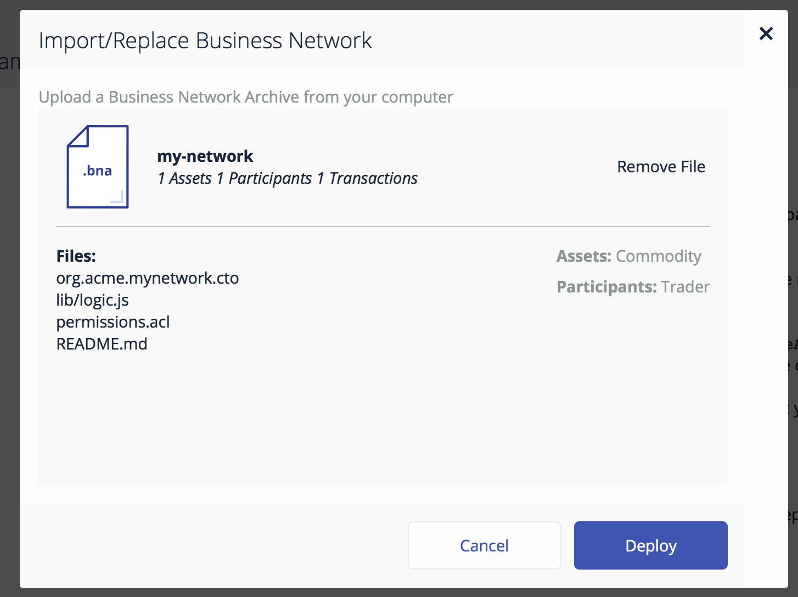

# Develop a complete {{site.data.conrefs.composer_short}} solution from scratch

---

This tutorial will walk you through the steps required to build a {{site.data.conrefs.composer_full}} blockchain solution from scratch. In the space of a day or so you should be able to go from an idea for a disruptive blockchain innovation to a complete business network, running on {{site.data.conrefs.hlf_full}}.

---

## Before you begin

Before beginning, you will need to have completed the Development Tools install: [Install Development Tools](../getting-started/development-tools.html)

---
## Clone an Existing Example

The easiest way to get started is to clone an existing sample business network.

    git clone https://github.com/hyperledger/composer-sample-networks.git
    cp -r ./composer-sample-networks/packages/basic-sample-network/ ./my-network

You should now have a folder called `my-network` that we can start to modify. Using VSCode open the `my-network` folder. You should see the file layout in the explorer.


### Update package.json

The metadata (name, version, description) for the business network definition is stored in the `package.json` file. Edit the file to change the name to `my-network` and modify the `prepublish` script to change the name of the business network archive. Remove the `deploy` script as we will not be publishing this network to the `npm` package manager.

The start of the `package.json` file should now look like this:

```
{
  "name": "my-network",
  "version": "0.0.1",
  "description": "My first hyperledger composer network",
  "scripts": {
    "prepublish": "mkdirp ./dist && composer archive create --sourceType dir --sourceName . -a ./dist/my-network.bna",
    "pretest": "npm run lint",
    "lint": "eslint .",
    "postlint": "npm run licchk",
    "licchk": "license-check",
    "postlicchk": "npm run doc",
    "doc": "jsdoc --pedantic --recurse -c jsdoc.conf",
    "test": "mocha --recursive",
    "deploy": "./scripts/deploy.sh"
  },
  ...
```

## Define Domain Model

Open the file `models/sample.cto` and inspect the contents. This is the domain model for the business network. It defines the structure (schema) for the assets, transaction and participants in the business network. You can add as many model files as convenient under the `models` folder, however each model file must have a unique namespace. You can import types from one namespace into other namespaces.

As an example, we're going to replace the contents of the file with a simplistic model to track the ownership of commodities on the blockchain:

```
/**
 * My commodity trading network
 */
namespace org.acme.mynetwork

asset Commodity identified by tradingSymbol {
  o String tradingSymbol
  o String description
  o String mainExchange
  o Double quantity
  --> Trader owner
}

participant Trader identified by tradeId {
  o String tradeId
  o String firstName
  o String lastName
}

transaction Trade identified by transactionId {
  o String transactionId
  --> Commodity commodity
  --> Trader newOwner
}
```

The domain model defines a single asset (Commodity) and single participant (Trader) and a single transaction (Trade) that is used to modify the owner of a commodity.

## Write Transaction Processor Functions

Now that the domain model has been defined we can write the business logic for the business network. Composer expresses the logic for a business network using JavaScript functions. These functions are automatically executed when a transaction is submitted for processing.

Open the file `lib/logic.js` and inspect the contents. You can create an many JavaScript files as convenient for your business network. If a JavaScript function has the `@transaction` annotation it will be automatically invokes when a transaction of the type defined by the `@param` annotation is submitted.

Replace the contents of `logic.js` with the function below:

```
/*
 * Licensed under the Apache License, Version 2.0 (the "License");
 * you may not use this file except in compliance with the License.
 * You may obtain a copy of the License at
 *
 * http://www.apache.org/licenses/LICENSE-2.0
 *
 * Unless required by applicable law or agreed to in writing, software
 * distributed under the License is distributed on an "AS IS" BASIS,
 * WITHOUT WARRANTIES OR CONDITIONS OF ANY KIND, either express or implied.
 * See the License for the specific language governing permissions and
 * limitations under the License.
 */

/**
 * Track the trade of a commodity from one trader to another
 * @param {org.acme.mynetwork.Trade} trade - the trade to be processed
 * @transaction
 */
function tradeCommodity(trade) {
    trade.commodity.owner = trade.newOwner;
    return getAssetRegistry('org.acme.mynetwork.Commodity')
      .then(function (assetRegistry) {
          return assetRegistry.update(trade.commodity);
      });
}
```

This function simply changes the `owner` property on a commodity based on the `newOwner` property on an incoming `Trade` transaction. It then persists the modified `Commodity` back into the asset registry used to store `Commodity` instances.

## Update Access Control Rules

The file `permissions.acl` defines the access control rules for the business network. Update the Default rule to use the new namespace for the network:

```
/**
 * Access control rules for mynetwork
 */
rule Default {
    description: "Allow all participants access to all resources"
    participant: "ANY"
    operation: ALL
    resource: "org.acme.mynetwork"
    action: ALLOW
}
```

## Generate Business Network Archive

To check that the structure of the files is valid you can now generate a Business Network Archive (BNA) file for your business network definition. The BNA file is the deployable unit -- a file that can be deployed to the Composer runtime for execution.

Switch back to the terminal and type:

    npm install

The `composer archive create` command (run by the npm prepublish script) has created a file called `my-network.bna` in the `dist` folder.

## Write Unit Tests

All code should have unit tests - even your business network logic! We are now going to add a simple unit test for the business network. The unit test will run against the **embedded** Composer runtime. The embedded runtime simulates Hyperledger Fabric within a Node.js process. The embedded runtime is very useful for unit testing as it allows you to focus on testing the business logic rather than configuring an entire Fabric. The later is more suited to running a system test (which is also possible, but is out of scope for this tutorial).

Open the file `tests/Sample.js` and inspect the contents.

Modify the namespace, types and logic of the unit test to that shown below.

```
/*
 * Licensed under the Apache License, Version 2.0 (the "License");
 * you may not use this file except in compliance with the License.
 * You may obtain a copy of the License at
 *
 * http://www.apache.org/licenses/LICENSE-2.0
 *
 * Unless required by applicable law or agreed to in writing, software
 * distributed under the License is distributed on an "AS IS" BASIS,
 * WITHOUT WARRANTIES OR CONDITIONS OF ANY KIND, either express or implied.
 * See the License for the specific language governing permissions and
 * limitations under the License.
 */

'use strict';

const AdminConnection = require('composer-admin').AdminConnection;
const BrowserFS = require('browserfs/dist/node/index');
const BusinessNetworkConnection = require('composer-client').BusinessNetworkConnection;
const BusinessNetworkDefinition = require('composer-common').BusinessNetworkDefinition;
const path = require('path');

require('chai').should();

const bfs_fs = BrowserFS.BFSRequire('fs');
const NS = 'org.acme.mynetwork';

describe('Commodity Trading', () => {

  // let adminConnection;
    let businessNetworkConnection;

    before(() => {
        BrowserFS.initialize(new BrowserFS.FileSystem.InMemory());
        const adminConnection = new AdminConnection({ fs: bfs_fs });
        return adminConnection.createProfile('defaultProfile', {
            type : 'embedded'
        })
        .then(() => {
            return adminConnection.connect('defaultProfile', 'admin', 'Xurw3yU9zI0l');
        })
        .then(() => {
            return BusinessNetworkDefinition.fromDirectory(path.resolve(__dirname, '..'));
        })
        .then((businessNetworkDefinition) => {
            return adminConnection.deploy(businessNetworkDefinition);
        })
        .then(() => {
            businessNetworkConnection = new BusinessNetworkConnection({ fs: bfs_fs });
            return businessNetworkConnection.connect('defaultProfile', 'my-network', 'admin', 'Xurw3yU9zI0l');
        });
    });

    describe('#tradeCommodity', () => {

        it('should be able to trade a commodity', () => {
            const factory = businessNetworkConnection.getBusinessNetwork().getFactory();

            // create the traders
            const dan = factory.newResource(NS, 'Trader', 'dan@email.com');
            dan.firstName = 'Dan';
            dan.lastName = 'Selman';

            const simon = factory.newResource(NS, 'Trader', 'simon@email.com');
            simon.firstName = 'Simon';
            simon.lastName = 'Stone';

             // create the commodity
            const commodity = factory.newResource(NS, 'Commodity', 'EMA');
            commodity.description = 'Corn';
            commodity.mainExchange = 'Euronext';
            commodity.quantity = 100;
            commodity.owner = factory.newRelationship(NS, 'Trader', dan.$identifier);

            // create the trade transaction
            const trade = factory.newTransaction(NS, 'Trade');
            trade.newOwner = factory.newRelationship(NS, 'Trader', simon.$identifier);
            trade.commodity = factory.newRelationship(NS, 'Commodity', commodity.$identifier);

            // the owner should of the commodity should be dan
            commodity.owner.$identifier.should.equal(dan.$identifier);

            // Get the asset registry.
            return businessNetworkConnection.getAssetRegistry(NS + '.Commodity')
            .then((assetRegistry) => {

                // add the commodity to the asset registry.
                return assetRegistry.add(commodity)
                .then(() => {
                    return businessNetworkConnection.getParticipantRegistry(NS + '.Trader');
                })
                .then((participantRegistry) => {
                    // add the traders
                    return participantRegistry.addAll([dan,simon]);
                })
                .then(() => {
                   // submit the transaction
                    return businessNetworkConnection.submitTransaction(trade);
                })
                .then(() => {
                    return businessNetworkConnection.getAssetRegistry(NS + '.Commodity');
                })
                .then((assetRegistry) => {
                    // re-get the commodity
                    return assetRegistry.get(commodity.$identifier);
                })
                .then((newCommodity) => {
                     // the owner of the commodity should not be simon
                    newCommodity.owner.$identifier.should.equal(simon.$identifier);
                });
            });
        });
    });
});
```

Check that the unit tests pass by typing:

    npm test

## Import into Playground and Test

Re-generate the BNA file using the command:

    npm install

You can then navigate to [https://composer-playground.mybluemix.net](https://composer-playground.mybluemix.net) and import the BNA file into the Playground using the "Import/Replace" button at the bottom left of the screen. Navigate to the `dist/my-network.bna` file and upload it, then press the "Deploy" button.



You can browse the structure of the business network by pressing the link on the left, check the contents of the model, script files and access control.

You can then press the "Test" tab at the top and create a TRADER1 and TRADER2 instances of Trader by pressing the Trader link on the left and then the "Create New Participant" button.


The trader registry should look like this:


You can then create a new instance of a Commodity by pressing the Commodity link to the left and then the "Create New Asset" button. Create the commodity and assign the owner to be TRADER1.


The commodity registry should look like this:


You can then submit a `Trade` transaction to move the commodity from TRADER1 to TRADER2.


After processing you should see the transaction in the transaction registry.


The owner of the ABC commodity should now be TRADER2.


## Deploy to Hyperledger Fabric

So, we've created our business network definition, written a unit test and interactively tested the solution in the Playground. Now it is time to deploy to a **real** blockchain! We are going to deploy the BNA file to Hyperledger Fabric v0.6, as used by the Quick Start we ran earlier to verify installation.

Switch to the terminal change to the `dist` folder containing the `my-network.bna` file and type:

    composer network deploy -a my-network.bna -i admin -s Xurw3yU9zI0l

After approximately 30 seconds the business network should have been deployed to your local Hyperledger Fabric. You should see output as follows:

```
pc52:dist dselman$ composer network deploy -a my-network.bna -i admin -s Xurw3yU9zI0l

Deploying business network from archive: my-network.bna
Business network definition:
	Identifier: my-network@0.0.1
	Description: My first hyperledger fabric composer network

✔ Deploying business network definition. This may take a minute...


Command succeeded
```

You can verify that the network has been deployed by typing:

    composer network ping -n my-network -i admin -s Xurw3yU9zI0l

Which should give the following output:

```
pc52:dist dselman$ composer network ping -n my-network -i admin -s Xurw3yU9zI0l

The connection to the network was successfully tested: my-network
	version: 0.5.10
	participant: <no participant found>

Command succeeded
```

## Generate REST API

To integrate with the deployed business network (creating assets/participants and submitting transactions) we can either use the Composer Node SDK or we can generate a REST API.

If you are creating a web application (or running in a non Node.js environment) the REST API provides a useful layer of language-neutral abstraction.

To create the REST API we need to launch the `composer-rest-server` and tell it how to connect to our deployed business network.

First install the composer-rest-server:

    npm install -g composer-rest-server

Note: if you have already installed the composer-rest-server please run `npm uninstall -g composer-rest-server` first.

Then launch the server with the command:

    composer-rest-server

Answer the questions posed at startup. These allow the composer-rest-server to connect to Hyperledger Fabric and configure how the REST API is generated.

```bash

 _   _                       _          _                 
| | | |_   _ _ __   ___ _ __| | ___  __| | __ _  ___ _ __
| |_| | | | | '_ \ / _ \ '__| |/ _ \/ _` |/ _` |/ _ \ '__|
|  _  | |_| | |_) |  __/ |  | |  __/ (_| | (_| |  __/ |   
|_| |_|\__, | .__/ \___|_|  |_|\___|\__,_|\__, |\___|_|   
       |___/|_|                           |___/           
  ____                                          
 / ___|___  _ __ ___  _ __   ___  ___  ___ _ __
| |   / _ \| '_ ` _ \| '_ \ / _ \/ __|/ _ \ '__|
| |__| (_) | | | | | | |_) | (_) \__ \  __/ |   
 \____\___/|_| |_| |_| .__/ \___/|___/\___|_|   
                     |_|                                                     
? Enter your Fabric Connection Profile Name: defaultProfile
? Enter your Business Network Identifier : digitalproperty-network
? Enter your Fabric username : WebAppAdmin
? Enter your secret: DJY27pEnl16d
Loopback Connector for Hyperledger Composer
Models Loaded Now
Browse your REST API at http://0.0.0.0:3000/explorer
```

## Test REST API

If the composer-rest-server started successfully you should see these two lines are output:

    Web server listening at: http://localhost:3000
    Browse your REST API at http://localhost:3000/explorer

Open a web browser and navigate to [http://localhost:3000/explorer]()

You should see the LoopBack API Explorer, allowing you to inspect and test the generated REST API.


First use the `POST` method on `Trader` to create a new instance of a Trader.


Enter the values and then press the "Try it Out" button to submit. You should see an HTTP 200 response indicating that the Trader was successfully created and stored on the blockchain.

Use the `GET` method on `Trader` (leave the filter parameter blank) and press the "Try it Out" button. You should see your Trader returned.


Similarly you can create/read/update/delete Commodities by using the appropriate HTTP request methods. You can submit a `Trade` transaction using an HTTP POST to the `/Trade` API endpoint.

## Generate Skeleton Web Application

You are now ready to create a skeleton Angular web application to interact with your business network.

Shut the `composer-rest-server` process down by pressing CTRL-C, and then follow the instructions to install the Yeoman generator for Hyperledger Composer:
[https://fabric-composer.github.io/applications/genapp.html](https://fabric-composer.github.io/applications/genapp.html)

Run the generator, selecting the options to generate an Angular application:

```
pc52:my-network dselman$ yo hyperledger-composer
Welcome to the Hyperledger Composer Skeleton Application Generator
? Please select the type of Application: Angular2 Application
You can run this generator using: 'yo hyperledger-composer:angular'
Welcome to the Angular2 skeleton app generator
? Do you want to connect to a running Business Network? Yes
? What is the name of the application you wish to generate?: my-app
? Description of the application: Commodities trading app
? Author name: Dan
? Author email: daniel@email.com
? What is the Business Network Identifier?: my-network
? What is the Connection Profile to use? defaultProfile
? Enrollment id: admin
? Enrollment Secret: Xurw3yU9zI0l
```

You should see that the generator has created Angular components for the asset types:

```
   create src/app/Commodity/Commodity.component.ts
   create src/app/Commodity/Commodity.service.ts
   create src/app/Commodity/Commodity.component.spec.ts
   create src/app/Commodity/Commodity.component.html
   create src/app/Commodity/Commodity.component.css
```

Wait a couple of minutes for the install of the application dependencies to complete.

The type:

    cd my-app
    npm start

You should see the `composer-rest-server` start, and then Angular webpacks the web application and serves it at: [http://localhost:4200]()

If you navigate to the page and press the "Assets" drop down at the top-right of the page you can see the instances of Commodity stored on the Hyperledger Fabric in the table. You can create new instances using the "Add Asset" button. Note that the Angular skeleton does not yet allow you to create Participants, so you will need to create a test Trader instance to act as the owner of the Commodity using the Loopback Swagger UI before you can create a Commodity.


## Congratulations!

Well done, you've now completed this tutorial and I hope you now have a much better idea how the capabilities fit together. You can start hacking on the skeleton Angular application to create the next industry defining blockchain-based application!

## Related Concepts

[Business Network Definition](../business-network/businessnetworkdefinition.html)

## Related Tasks

[Deploying a business network](../business-network/deploybusinessnetwork.html)

## Related Reference

[Network deploy command](../reference/composer.network.deploy.html)
