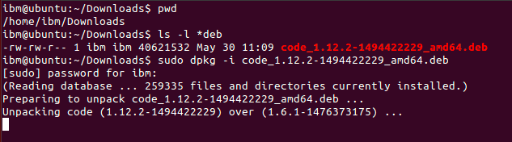
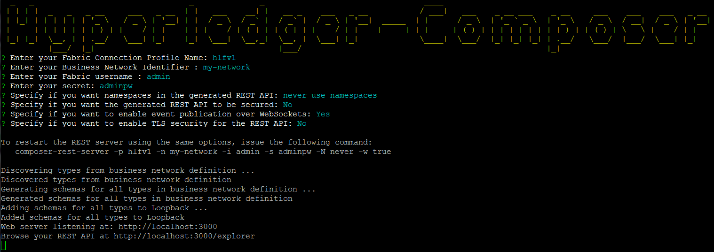

# Create an end-to-end {{site.data.conrefs.composer_full}} solution from scratch

---

*Note:* this tutorial was written against {{site.data.conrefs.composer_full}} v0.7.2 on Ubuntu Linux running with {{site.data.conrefs.hlf_full}} v1.0 where referenced below and also tested for a Mac environment. (Appropriate steps for a {{site.data.conrefs.hlf_full}} v0.6 are shown in *italics*).

This tutorial will walk you through the steps required to build a {{site.data.conrefs.composer_full}} blockchain solution from scratch. In the space of a day or probably less, you will be able to go from an idea for a disruptive blockchain innovation, to executing transactions against a real {{site.data.conrefs.hlf_full}} blockchain network, and generating/running a sample Angular 2 based application for Commodity Trading, that interacts with a blockchain network !

Here are the steps to get this running:

## Install {{site.data.conrefs.composer_full}}

First, make sure you have installed {{site.data.conrefs.composer_full}}. Follow this [Developement Env Install guide](../getting-started/development-tools.html) - As well as installing Composer, it has instructions to quickly build your {{site.data.conrefs.hlf_full}} blockchain environment (using Docker containers) which we will use later on in this guide. It includes the installation of the Yeoman app generator and some pre-requisite Angular 2 packages.

## Install an Editor (eg. VSCode - and its {{site.data.conrefs.composer_full}} Extension for Syntax Highlighting)

If you have not already installed this, install the [VSCode editor](https://code.visualstudio.com/) an Open Source code editor for your dev environment. For Linux, download the package and install using the (eg. Ubuntu use dpkg  `dpkg -i file.deb` )



After installation, launch VSCode and select `View > Command Palette...` then type `extensions` and select the `Extensions: Install Extensions` option. In the "Search Extensions in Marketplace" text field type `Composer` and install the {{site.data.conrefs.composer_full}} extension. You may have to 'Reload' the extension (if prompted) to activate it.


## Create a Business Network Definition

The key concept for Composer is the **business network definition (BND)**. It defines the data model, business (and therein transaction) logic and access control rules for your blockchain solution. It executes on {{site.data.conrefs.hlf_full}}. To create a BND,  we need to create a suitable project structure on disk.

The easiest way to get started is to clone an **existing sample business network**. Open up a command prompt and clone the Composer sample networks repo. For Linux, perform this as a non-root user.

**git clone https://github.com/hyperledger/composer-sample-networks.git**


**cp -r ./composer-sample-networks/packages/basic-sample-network/  ./my-network**

You should now have a folder called `my-network` (as the basis for our project) that we can start to modify. Using VSCode,  open the `my-network` folder using Explorer (once selected the folder, scroll down and click OK to open the folder). You should see the file layout in the explorer pane.


### Update your package.json file

The metadata (name, version, description) for the business network definition is stored in the `package.json` file. Edit the file to change the name to `my-network` and modify the `prepublish` script to change the name of the business network archive. (Note: Remove the 'deploy' line after 'test' - as we will not be publishing this network to the `npm` package manager).

Also, depending on timeouts encountered (see 'Unit Test' later on) we have added a default 'test' timeout of 4 seconds below.

The start of the `package.json` file should now look like this:

```
{
    "name": "my-network",
    "version": "0.0.1",
    "description": "My very first Hyperledger Composer Network",
    "scripts": {
        "prepublish": "mkdirp ./dist && composer archive create --sourceType dir --sourceName . -a ./dist/my-network.bna",
        "pretest": "npm run lint",
        "lint": "eslint .",
        "postlint": "npm run licchk",
        "licchk": "license-check",
        "postlicchk": "npm run doc",
        "doc": "jsdoc --pedantic --recurse -c jsdoc.conf",
        "test": "mocha --recursive -t 4000"
    },
...
}
```


## Define your Domain Model

Open the file `models/sample.cto` and inspect the contents. This is the domain model for the business network definition. It defines the structure (schema) for the assets, transaction and participants in the business network. You can add as many model files as convenient under the `models` folder, however each model file must have a unique namespace; do note that you can import types from one namespace into other namespaces.

As an example, we're going to replace the entire contents of the file 'sample.cto' with a simplistic model (below) to track the ownership of commodities on the blockchain:

```
/**
 * My commodity trading network
 */
namespace org.example.mynetwork
asset Commodity identified by tradingSymbol {
    o String tradingSymbol
    o String description
    o String mainExchange
    o Double quantity
    --> Trader owner
}
participant Trader identified by tradeId {
    o String tradeId
    o String firstName
    o String lastName
}
transaction Trade identified by transactionId {
    o String transactionId
    --> Commodity commodity
    --> Trader newOwner
}
```

The domain model defines a single asset (Commodity) and single participant (Trader) and a single transaction (Trade) that is used to modify the owner of a commodity.

## Write Transaction Processor Functions

Now that the domain model has been defined, we can write the business logic for the business network definition. Composer expresses the logic for a business network using JavaScript functions. These functions are automatically executed when a transaction is submitted for processing.

Open the file `lib/logic.js` in the left-hand pane and inspect the contents (note that you can create an many JavaScript files as convenient for your business network definition). If a JavaScript function has the `@transaction` annotation, it will be automatically invoked when a transaction of the type defined by the `@param` annotation is submitted.

Now replace the entire contents of `logic.js` with the function below (including the license header info)


```
/*
 * Licensed under the Apache License, Version 2.0 (the "License");
 * you may not use this file except in compliance with the License.
 * You may obtain a copy of the License at
 *
 * http://www.apache.org/licenses/LICENSE-2.0
 *
 * Unless required by applicable law or agreed to in writing, software
 * distributed under the License is distributed on an "AS IS" BASIS,
 * WITHOUT WARRANTIES OR CONDITIONS OF ANY KIND, either express or implied.
 * See the License for the specific language governing permissions and
 * limitations under the License.
 */

/**
 * Track the trade of a commodity from one trader to another
 * @param {org.example.mynetwork.Trade} trade - the trade to be processed
 * @transaction
 */
function tradeCommodity(trade) {
    trade.commodity.owner = trade.newOwner;
    return getAssetRegistry('org.example.mynetwork.Commodity')
        .then(function (assetRegistry) {
            return assetRegistry.update(trade.commodity);
        });
}
```

This function simply changes the `owner` property on a commodity based on the `newOwner` property on an incoming `Trade` transaction. It then persists the modified `Commodity` back into the asset registry, used to store `Commodity` instances.

## Update your Access Control Rules

The file `permissions.acl` defines the access control rules for the business network definition. Update the 'Default' rule to use the new namespace for the network (just cut and paste the entire contents from below if you prefer):

```
/**
 * Access control rules for mynetwork
 */
rule Default {
    description: "Allow all participants access to all resources"
    participant: "ANY"
    operation: ALL
    resource: "org.example.mynetwork"
    action: ALLOW
}
```

## Generate the Business Network Archive

To check that the structure of the files is valid, you can now generate a Business Network Archive (BNA) file for your business network definition. The BNA file is the deployable unit -- a file that can be deployed to the Composer runtime for execution.

Switch back to the terminal and type:

npm install

You should see the following output:

```
> my-network@0.0.1 prepublish /home/joe/dev/git/my-network
> mkdirp ./dist && composer archive create --sourceType dir --sourceName . -a ./dist/my-network.bna


Creating Business Network Archive

Looking for package.json of Business Network Definition in /home/joe/dev/git/my-network

Found:
Description:My very first Hyperledger Composer Network
Name:my-network
Identifier:my-network@0.0.1

Written Business Network Definition Archive file to ./dist/my-network.bna
Command completed successfully.

Command succeeded
```

The `composer archive create` command has created a file called `my-network.bna` in the `dist` folder.

## Write Unit Tests

All code should have unit tests - even your business network logic!

We are now going to add a simple unit test for the business network definition. The unit test will run against the **embedded** {{site.data.conrefs.hlf_short}} runtime. The embedded runtime actually stores the state of 'the blockchain' in-memory in a Node.js process. This embedded runtime is very useful for unit testing, as it allows you to focus on testing the business logic rather than configuring an entire Fabric. The latter is more suited to running a system test (which is also possible of course, but is out of scope for this E2E tutorial).

From your project working directory (my-network), open the file `test/Sample.js` and inspect the contents.

The test code below will replace the namespace, types and logic of the unit test pertaining to 'my-network' as shown below. For convenience, you can copy the entire script contents below and replace the current Sample.js file contents entirely:

```
/*
 * Licensed under the Apache License, Version 2.0 (the "License");
 * you may not use this file except in compliance with the License.
 * You may obtain a copy of the License at
 *
 * http://www.apache.org/licenses/LICENSE-2.0
 *
 * Unless required by applicable law or agreed to in writing, software
 * distributed under the License is distributed on an "AS IS" BASIS,
 * WITHOUT WARRANTIES OR CONDITIONS OF ANY KIND, either express or implied.
 * See the License for the specific language governing permissions and
 * limitations under the License.
 */

'use strict';

const AdminConnection = require('composer-admin').AdminConnection;
const BrowserFS = require('browserfs/dist/node/index');
const BusinessNetworkConnection = require('composer-client').BusinessNetworkConnection;
const BusinessNetworkDefinition = require('composer-common').BusinessNetworkDefinition;
const path = require('path');

require('chai').should();

const bfs_fs = BrowserFS.BFSRequire('fs');
const NS = 'org.example.mynetwork';

describe('Commodity Trading', () => {

    // let adminConnection;
    let businessNetworkConnection;

    before(() => {
        BrowserFS.initialize(new BrowserFS.FileSystem.InMemory());
        const adminConnection = new AdminConnection({ fs: bfs_fs });
        return adminConnection.createProfile('defaultProfile', {
            type: 'embedded'
        })
            .then(() => {
                return adminConnection.connect('defaultProfile', 'admin', 'adminpw');
            })
            .then(() => {
                return BusinessNetworkDefinition.fromDirectory(path.resolve(__dirname, '..'));
            })
            .then((businessNetworkDefinition) => {
                return adminConnection.deploy(businessNetworkDefinition);
            })
            .then(() => {
                businessNetworkConnection = new BusinessNetworkConnection({ fs: bfs_fs });
                return businessNetworkConnection.connect('defaultProfile', 'my-network', 'admin', 'adminpw');
            });
    });

    describe('#tradeCommodity', () => {

        it('should be able to trade a commodity', () => {
            const factory = businessNetworkConnection.getBusinessNetwork().getFactory();

            // create the traders
            const dan = factory.newResource(NS, 'Trader', 'dan@email.com');
            dan.firstName = 'Dan';
            dan.lastName = 'Selman';

            const simon = factory.newResource(NS, 'Trader', 'simon@email.com');
            simon.firstName = 'Simon';
            simon.lastName = 'Stone';

            // create the commodity
            const commodity = factory.newResource(NS, 'Commodity', 'EMA');
            commodity.description = 'Corn';
            commodity.mainExchange = 'Euronext';
            commodity.quantity = 100;
            commodity.owner = factory.newRelationship(NS, 'Trader', dan.$identifier);

            // create the trade transaction
            const trade = factory.newTransaction(NS, 'Trade');
            trade.newOwner = factory.newRelationship(NS, 'Trader', simon.$identifier);
            trade.commodity = factory.newRelationship(NS, 'Commodity', commodity.$identifier);

            // the owner should of the commodity should be dan
            commodity.owner.$identifier.should.equal(dan.$identifier);

            // Get the asset registry.
            return businessNetworkConnection.getAssetRegistry(NS + '.Commodity')
                .then((assetRegistry) => {

                    // add the commodity to the asset registry.
                    return assetRegistry.add(commodity)
                        .then(() => {
                            return businessNetworkConnection.getParticipantRegistry(NS + '.Trader');
                        })
                        .then((participantRegistry) => {
                            // add the traders
                            return participantRegistry.addAll([dan, simon]);
                        })
                        .then(() => {
                            // submit the transaction
                            return businessNetworkConnection.submitTransaction(trade);
                        })
                        .then(() => {
                            return businessNetworkConnection.getAssetRegistry(NS + '.Commodity');
                        })
                        .then((assetRegistry) => {
                            // re-get the commodity
                            return assetRegistry.get(commodity.$identifier);
                        })
                        .then((newCommodity) => {
                            // the owner of the commodity should not be simon
                            newCommodity.owner.$identifier.should.equal(simon.$identifier);
                        });
                });
        });
    });
});
```


Check that the unit tests pass by typing:

**npm test**

You should see output like the following:

```
~joe@ubuntu $ npm test

> my-network@0.0.1 pretest /home/joe/dev/git/my-network
> npm run lint


> my-network@0.0.1 lint /home/joe/dev/git/my-network
> eslint .


> my-network@0.0.1 postlint /home/joe/dev/git/my-network
> npm run licchk


> my-network@0.0.1 licchk /home/joe/dev/git/my-network
> license-check


> my-network@0.0.1 postlicchk /home/joe/dev/git/my-network
> npm run doc


> my-network@0.0.1 doc /home/joe/dev/git/my-network
> jsdoc --pedantic --recurse -c jsdoc.conf


> my-network@0.0.1 test /home/joe/dev/git/my-network
> mocha --recursive -t 4000


Commodity Trading
#tradeCommodity
✓ should be able to trade a commodity (62ms)


1 passing (556ms)
```

## Import into Playground and Test

Change directory to your toplevel project folder (my-network) and re-generate the BNA file (overwriting the existing dist/my-network.bna file created earlier) using the command:

```
composer archive create -a dist/my-network.bna --sourceType dir --sourceName .
```

You can now navigate to the online Bluemix Composer Playground [https://composer-playground.mybluemix.net](https://composer-playground.mybluemix.net) and import the newly-generated BNA file into the Playground using the "Import/Replace" button at the bottom left of the screen. Navigate to the `dist/my-network.bna` file and upload it, then press the "Deploy" button. Confirm to replace the current sample definition in Playground.


You can browse the structure of the Trade Commodity business network by pressing the link on the left, check the contents of the model, script files and access control.

Next,  press the "Test" tab at the top and create two 'Trader' participants (TRADER1 and TRADER2) by pressing the Trader link on the left and then the "Create New Participant" button.


The trader registry (with two entries) should look like this:

![Trader Participant Registry]../assets/img/tutorials/developer/trader_registry.png)

Next, create a new instance of a Commodity (asset) by pressing the Commodity link on the left and then the "Create New Asset" button. Create the commodity and assign the owner to be 'TRADER1'.


The commodity registry should look like this:


Next, submit a `Trade` transaction (click the button, below left) to move the commodity from TRADER1 to TRADER2.


After processing, you should now see the transaction in the transaction registry.


As a result, the owner of the ABC commodity should now be TRADER2.

![Commodity registry]../assets/img/tutorials/developer/commodity_registry_after.png)

## Deploy to the running {{site.data.conrefs.hlf_full}}

So far, we've created our business network definition, written a unit test and interactively tested the solution in the Playground.

Now it is time to deploy to a **real** blockchain! We are going to deploy the BNA (suffix .bna) file to {{site.data.conrefs.hlf_full}} v1.0 ; this blockchain environment should be set up as a pre-requisite to this E2E tutorial.

Switch to the terminal  and change directory to the `dist` folder containing the `my-network.bna` file and type:

    composer network deploy -a my-network.bna -p hlfv1 -i admin -s adminpw


_Note: You'll notice that the flag '-p' specifies that we should use a v1 connection profile  to connect to the running v1.0 Fabric._

After approximately 30 seconds or so, the business network should have been deployed to your local {{site.data.conrefs.hlf_full}}. You should see output as follows:

```
joe@ubuntu $ composer network deploy -a my-network.bna -p hlfv1 -i admin -s adminpw

Deploying business network from archive: my-network.bna
Business network definition:
Identifier: my-network@0.0.1
Description: My very first Hyperledger Composer Network

✔ Deploying business network definition. This may take a minute...


Command succeeded
```

You can verify that the network has been deployed by typing:

`composer network ping -n my-network -p hlfv1 -i admin -s adminpw`

Which should give the following output:

```
joe@ubuntu $ composer network ping -n my-network -p hlfv1 -i admin -s adminpw

The connection to the network was successfully tested: my-network
version: 0.7.2
participant: <no participant found>

Command succeeded
```

## Generate REST API

To integrate with the deployed business network (creating assets/participants and submitting transactions) we can either use the Composer Node SDK or we can generate a REST API.

If you are creating a web application (or running in a non Node.js environment) the REST API provides a useful layer of language-neutral abstraction.

To create the REST API we need to launch the `composer-rest-server` and tell it how to connect to our deployed business network.

Note that the module composer-rest-server would have been installed when you installed the Development environment.

Now launch the server with the command:

composer-rest-server

Answer the questions posed at startup. These allow the composer-rest-server to connect to {{site.data.conrefs.hlf_full}} and configure how the REST API is generated.



## Test REST API

If the composer-rest-server started successfully you should see these two lines are output:

Web server listening at: http://localhost:3000
Browse your REST API at http://localhost:3000/explorer

Open a web browser and navigate to [http://localhost:3000/explorer]()

You should see the LoopBack API Explorer, allowing you to inspect and test the generated REST API.


First use the POST method on Trader to create a new instance of a Trader - first select 'List Operations' alongside the Trader to see the operations available.


Enter the values and then press the "Try it Out" button to submit. You should see an HTTP 200 response indicating that the Trader was successfully created and stored on the blockchain.

Use the `GET` operation/method on `Trader` (leave the filter parameter blank) and press the "Try it Out" button. You should see your Trader returned.

![Get trader]../assets/img/tutorials/developer/lb_get_trader.png)

Similarly you can create/read/update/delete Commodities by using the appropriate HTTP request methods. You can submit a `Trade` transaction using an HTTP POST to the `/Trade` API endpoint.

## Generate your Skeleton Web Application

You are now ready to create a skeleton Angular web application to interact with your business network.

Shut the `composer-rest-server` process down by pressing CTRL-C in the terminal window).

Run the {{site.data.conrefs.composer_full}} generator, selecting the options below to generate an Angular application and to also generate a new REST API when prompted:

yo hyperledger-composer


You should see that the generator has created Angular components for the asset types:

```
create src/app/Commodity/Commodity.component.ts
create src/app/Commodity/Commodity.service.ts
create src/app/Commodity/Commodity.component.spec.ts
create src/app/Commodity/Commodity.component.html
create src/app/Commodity/Commodity.component.css
```

Wait a couple of minutes for the install of the application dependencies to complete.

Next, change directory to your home directory (eg. /home/joe)

Then change directory to your application directory:

cd my-app

Finally run:

npm start

Your application is running. You should see the `composer-rest-server` start, and then Angular webpacks the web application - it serves the content at URL: [http://localhost:4200]()

If you navigate to this URL and press the "Assets" drop down (at the top-right of the page) you can see any existing instances of Commodity stored on the {{site.data.conrefs.hlf_full}} in the table (we have not stored them on blockchain yet!). You can create new instances using the "Add Asset" button. Note that the Angular skeleton does not yet allow you to create Participants, so you would need to create a test Trader instance to act as the owner of the Commodity (being added here), using the Loopback Swagger UI ( (ie using Playground) before you can create a Commodity.


# Congratulations!

Well done, you've now completed this tutorial and I hope you now have a much better idea how the capabilities fit together. You can start hacking on the skeleton Angular application to create the next industry defining blockchain-based application!


## Related Concepts

[Business Network Definition](../business-network/businessnetworkdefinition.html)

## Related Tasks

[Deploying a business network](../business-network/deploybusinessnetwork.html)

## Related Reference

[Network deploy command](../reference/composer.network.deploy.html)
