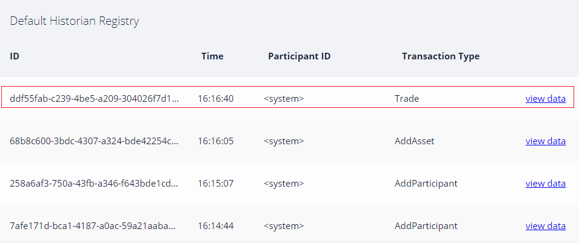
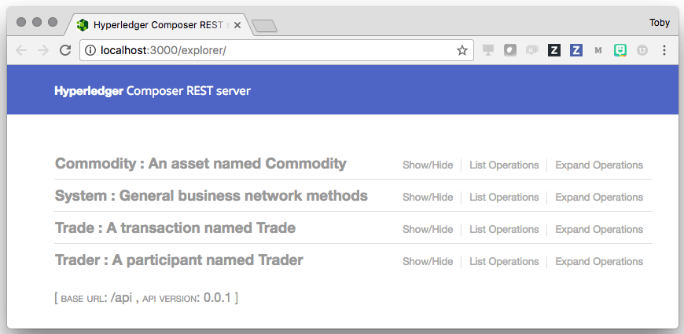

# Developer Tutorial for creating a {{site.data.conrefs.composer_full}} solution

*Note:* this tutorial was written against the latest {{site.data.conrefs.composer_full}} build on Ubuntu Linux running with {{site.data.conrefs.hlf_full}} v1.0 where referenced below and also tested for a Mac environment.

This tutorial will walk you through the steps required to build a {{site.data.conrefs.composer_full}} blockchain solution from scratch. In the space of a few hours and probably less, you will be able to go from an idea for a disruptive blockchain innovation, to executing transactions against a real {{site.data.conrefs.hlf_full}} blockchain network, and in doing so, generating/running a sample Angular 2 based application (the tutorial is around a simple Commodity Trading use case) that interacts with a blockchain network. The idea is you can easily create your own use case, once you've completed this end-to-end tutorial - furthermore, you can use the same blockchain environment to do so.

## Install {{site.data.conrefs.composer_full}}

First, make sure you have installed {{site.data.conrefs.composer_full}}. Follow this [Development Environment Install guide](../installing/development-tools.html) where it also describes the pre-requisites required ; as well as installing {{site.data.conrefs.composer_full}}, it has instructions to quickly build your {{site.data.conrefs.hlf_full}} blockchain environment (using Docker containers) which we will use later on in this guide. It includes the installation of the Yeoman application generator and some pre-requisite Angular 2 packages.

## Install an Editor (eg. VSCode - and its {{site.data.conrefs.composer_full}} Extension for Syntax Highlighting)

If you have not already installed this, install the [VSCode editor](https://code.visualstudio.com/) an Open Source code editor for your dev environment. For Linux, download the package and install using the installation manager (eg. Ubuntu use dpkg  `dpkg -i file.deb` ).

After installation, launch VSCode and select `View > Command Palette...` then type `extensions` and select the `Extensions: Install Extensions` option. In the "Search Extensions in Marketplace" text field type `Composer` and install the {{site.data.conrefs.composer_full}} extension. You may have to 'Reload' the extension (if prompted) to activate it.

<video autoplay "autoplay=autoplay" style="display:block; width:100%; height:auto;" loop="loop">
<source src="{{ site.baseurl }}/assets/img/tutorials/developer/vs_code_install.mp4" type="video/mp4" />
</video>

## Create a Business Network Definition

The key concept for Composer is the **business network definition (BND)**. It defines the data model, business (and therein transaction) logic and access control rules for your blockchain solution. It executes on {{site.data.conrefs.hlf_full}}. To create a BND,  we need to create a suitable project structure on disk.

The easiest way to get started is to clone an **existing sample business network**. Open up a command prompt and clone the Composer sample networks GitHub repository. For Linux, perform this as a non-root user.

```
git clone https://github.com/hyperledger/composer-sample-networks.git
```

Then, make a copy of this directory in your project, called 'my-network'.

```
cp -r ./composer-sample-networks/packages/basic-sample-network/  ./my-network
```

You should now have a folder called `my-network` (as the basis for our project) that we can start to modify. Using VSCode,  open the `my-network` folder using Explorer in VSCode, click OK to open the folder. You should see the file layout in the explorer pane.

<video autoplay "autoplay=autoplay" style="display:block; width:100%; height:auto;" loop="loop">
<source src="{{ site.baseurl }}/assets/img/tutorials/developer/open_my_network.mp4" type="video/mp4" />
</video>

### Update your package.json file

The metadata (name, version, description etc) for the business network definition is stored in the `package.json` file. Edit this file to change the name to `my-network`, the description to `My Commodity Trading network` and modify the `prepublish` script to change the name of the business network archive to `my-network.bna` at the end.


```json
"name": "my-network",
  "version": "0.1.6",
  "description": "My Commodity Trading network",
  "networkImage": "https://hyperledger.github.io/composer-sample-networks/packages/basic-sample-network/networkimage.svg",
  "networkImageanimated": "https://hyperledger.github.io/composer-sample-networks/packages/basic-sample-network/networkimageanimated.svg",
  "scripts": {
    "prepublish": "mkdirp ./dist ; composer archive create --sourceType dir --sourceName . -a ./dist/my-network.bna",
    "pretest": "npm run lint",
    "lint": "eslint .",
    "postlint": "npm run licchk",
    "licchk": "license-check",
    "postlicchk": "npm run doc",
    "doc": "jsdoc --pedantic --recurse -c jsdoc.json",
    "test-inner": "mocha -t 0 --recursive && cucumber-js",
    "test-cover": "nyc npm run test-inner",
    "test": "npm run test-inner"
  },
```

Save your changes to `package.json`

### Update your README.md file

Open the `README.md` file and update the markdown with a short decription of the business network.

```
# My Commodity Trading network
```

Save your changes to `README.md`

## Define your Domain Model

Open the file `models/sample.cto` and inspect the contents. This is the domain model for the business network definition. It defines the structure (schema) for the assets, transaction and participants in the business network. You can add as many model files as convenient under the `models` folder, however each model file must have a unique namespace; do note that you can import types from one namespace into other namespaces.

As an example, we're going to replace the entire contents of the file 'sample.cto' with a simplistic model (below) to track the ownership of commodities on the blockchain:

```
/**
 * My commodity trading network
 */
namespace org.acme.mynetwork
asset Commodity identified by tradingSymbol {
    o String tradingSymbol
    o String description
    o String mainExchange
    o Double quantity
    --> Trader owner
}
participant Trader identified by tradeId {
    o String tradeId
    o String firstName
    o String lastName
}
transaction Trade {
    --> Commodity commodity
    --> Trader newOwner
}
```

Save your changes to `models/sample.cto`

The domain model defines a single asset (Commodity) and single participant (Trader) and a single transaction (Trade) that is used to modify the owner of a commodity.

## Write Transaction Processor Functions

Now that the domain model has been defined, we can write the business logic for the business network definition. Composer expresses the logic for a business network using JavaScript functions. These functions are automatically executed when a transaction is submitted for processing.

Open the file `lib/sample.js` in the left-hand pane and inspect the contents (note that you can create many JavaScript files as convenient for your business network definition). If a JavaScript function has the `@transaction` annotation, it will be automatically invoked when a transaction of the type defined by the `@param` annotation is submitted.

Now replace the entire contents of `sample.js` with the function below (including the license header info)


```javascript
/*
 * Licensed under the Apache License, Version 2.0 (the "License");
 * you may not use this file except in compliance with the License.
 * You may obtain a copy of the License at
 *
 * http://www.apache.org/licenses/LICENSE-2.0
 *
 * Unless required by applicable law or agreed to in writing, software
 * distributed under the License is distributed on an "AS IS" BASIS,
 * WITHOUT WARRANTIES OR CONDITIONS OF ANY KIND, either express or implied.
 * See the License for the specific language governing permissions and
 * limitations under the License.
 */

/**
 * Track the trade of a commodity from one trader to another
 * @param {org.acme.mynetwork.Trade} trade - the trade to be processed
 * @transaction
 */
function tradeCommodity(trade) {
    trade.commodity.owner = trade.newOwner;
    return getAssetRegistry('org.acme.mynetwork.Commodity')
        .then(function (assetRegistry) {
            return assetRegistry.update(trade.commodity);
        });
}
```

This function simply changes the `owner` property on a commodity based on the `newOwner` property on an incoming `Trade` transaction. It then persists the modified `Commodity` back into the asset registry, used to store `Commodity` instances.

Save your changes to `lib/sample.js`

## Update your Access Control Rules

The file `permissions.acl` defines the access control rules for the business network definition. Replace the entire contents of `permissions.acl` with the rule below.

```bash
/**
 * Access control rules for mynetwork
 */
rule Default {
    description: "Allow all participants access to all resources"
    participant: "ANY"
    operation: ALL
    resource: "org.acme.mynetwork.*"
    action: ALLOW
}

rule SystemACL {
  description:  "System ACL to permit all access"
  participant: "org.hyperledger.composer.system.Participant"
  operation: ALL
  resource: "org.hyperledger.composer.system.**"
  action: ALLOW
}

```

Save your changes to `permissions.acl`

## Generate the Business Network Archive

To check that the structure of the files is valid, you can now generate a Business Network Archive (BNA) file for your business network definition. The BNA file is the deployable unit -- a file that can be deployed to the Composer runtime for execution.

Switch back to the terminal and type:

```bash
cd my-network
npm install
```

You should see the following output similar to the following (versions/modules change below):

```bash

  │ │ └─┬ strip-ansi@4.0.0
  │ │   └── ansi-regex@3.0.0
  │ ├── which-module@2.0.0
  │ ├── y18n@3.2.1
  │ └── yargs-parser@7.0.0
  └─┬ yargs-parser@5.0.0
    └── camelcase@3.0.0
$
```

## Write Unit Tests

All code should have unit tests - even your business network logic!

We are now going to add a simple unit test for the business network definition. The unit test will run against the **embedded** {{site.data.conrefs.hlf_short}} runtime. The embedded runtime actually stores the state of 'the blockchain' in-memory in a Node.js process. This embedded runtime is very useful for unit testing, as it allows you to focus on testing the business logic rather than configuring an entire Fabric. The latter is more suited to running a system test (which is also possible of course, but is out of scope for this guide).

From your project working directory (my-network), open the file `test/sample.js` and inspect the contents.

The test code below will replace the namespace, types and logic of the unit test pertaining to 'my-network' as shown below. For convenience, you can copy the entire script contents below and replace the current `sample.js` file contents entirely:

```javascript
/*
 * Licensed under the Apache License, Version 2.0 (the "License");
 * you may not use this file except in compliance with the License.
 * You may obtain a copy of the License at
 *
 * http://www.apache.org/licenses/LICENSE-2.0
 *
 * Unless required by applicable law or agreed to in writing, software
 * distributed under the License is distributed on an "AS IS" BASIS,
 * WITHOUT WARRANTIES OR CONDITIONS OF ANY KIND, either express or implied.
 * See the License for the specific language governing permissions and
 * limitations under the License.
 */

'use strict';

const AdminConnection = require('composer-admin').AdminConnection;
const BrowserFS = require('browserfs/dist/node/index');
const BusinessNetworkConnection = require('composer-client').BusinessNetworkConnection;
const BusinessNetworkDefinition = require('composer-common').BusinessNetworkDefinition;
const path = require('path');

require('chai').should();

const bfs_fs = BrowserFS.BFSRequire('fs');
const NS = 'org.acme.mynetwork';

describe('Commodity Trading', () => {

    // let adminConnection;
    let businessNetworkConnection;

    before(() => {
        BrowserFS.initialize(new BrowserFS.FileSystem.InMemory());
        const adminConnection = new AdminConnection({ fs: bfs_fs });
        return adminConnection.createProfile('defaultProfile', {
            type: 'embedded'
        })
            .then(() => {
                return adminConnection.connect('defaultProfile', 'admin', 'adminpw');
            })
            .then(() => {
                return BusinessNetworkDefinition.fromDirectory(path.resolve(__dirname, '..'));
            })
            .then((businessNetworkDefinition) => {
                return adminConnection.deploy(businessNetworkDefinition);
            })
            .then(() => {
                businessNetworkConnection = new BusinessNetworkConnection({ fs: bfs_fs });
                return businessNetworkConnection.connect('defaultProfile', 'my-network', 'admin', 'adminpw');
            });
    });

    describe('#tradeCommodity', () => {

        it('should be able to trade a commodity', () => {
            const factory = businessNetworkConnection.getBusinessNetwork().getFactory();

            // create the traders
            const dan = factory.newResource(NS, 'Trader', 'dan@email.com');
            dan.firstName = 'Dan';
            dan.lastName = 'Selman';

            const simon = factory.newResource(NS, 'Trader', 'simon@email.com');
            simon.firstName = 'Simon';
            simon.lastName = 'Stone';

            // create the commodity
            const commodity = factory.newResource(NS, 'Commodity', 'EMA');
            commodity.description = 'Corn';
            commodity.mainExchange = 'Euronext';
            commodity.quantity = 100;
            commodity.owner = factory.newRelationship(NS, 'Trader', dan.$identifier);

            // create the trade transaction
            const trade = factory.newTransaction(NS, 'Trade');
            trade.newOwner = factory.newRelationship(NS, 'Trader', simon.$identifier);
            trade.commodity = factory.newRelationship(NS, 'Commodity', commodity.$identifier);

            // the owner should of the commodity should be dan
            commodity.owner.$identifier.should.equal(dan.$identifier);

            // Get the asset registry.
            let commodityRegistry;
            return businessNetworkConnection.getAssetRegistry(NS + '.Commodity')
                .then((assetRegistry) => {
                    commodityRegistry = assetRegistry;
                    // add the commodity to the asset registry.
                    return commodityRegistry.add(commodity);
                })
                .then(() => {
                    return businessNetworkConnection.getParticipantRegistry(NS + '.Trader');
                })
                .then((participantRegistry) => {
                    // add the traders
                    return participantRegistry.addAll([dan, simon]);
                })
                .then(() => {
                    // submit the transaction
                    return businessNetworkConnection.submitTransaction(trade);
                })
                .then(() => {
                    // re-get the commodity
                    return commodityRegistry.get(commodity.$identifier);
                })
                .then((newCommodity) => {
                    // the owner of the commodity should now be simon
                    newCommodity.owner.$identifier.should.equal(simon.$identifier);
                });
        });
    });
});
```

Save your changes to `sample.js`

Next, open the file `features/sample.feature` in your project folder and replace the entire contents with this Cucumber test definition file:

```
#
# Licensed under the Apache License, Version 2   (the "License");
# you may not use this file except in compliance with the License.
# You may obtain a copy of the License at
#
# http://www.apache.org/licenses/LICENSE-2  
#
# Unless required by applicable law or agreed to in writing, software
# distributed under the License is distributed on an "AS IS" BASIS,
# WITHOUT WARRANTIES OR CONDITIONS OF ANY KIND, either express or implied.
# See the License for the specific language governing permissions and
# limitations under the License.
#
Feature: Sample
    Background:
        Given I have deployed the business network definition ..
        And I have added the following participants of type org.acme.mynetwork.Trader
            | tradeId         | firstName | lastName |
            | alice@email.com | Alice     | A        |
            | bob@email.com   | Bob       | B        |
        And I have added the following assets of type org.acme.mynetwork.Commodity
            | tradingSymbol | description | mainExchange | quantity | owner           |
            | 1             | One         | London       | 1          | alice@email.com |
            | 2             | Two         | Paris        | 2          | bob@email.com   |
        And I have issued the participant org.acme.mynetwork.Trader#alice@email.com with the identity alice1
        And I have issued the participant org.acme.mynetwork.Trader#bob@email.com with the identity bob1
    Scenario: Alice can read all of the assets
        When I use the identity alice1
        Then I should have the following assets of type org.acme.mynetwork.Commodity
            | tradingSymbol | description | mainExchange | quantity | owner           |
            | 1             | One         | London       | 1          | alice@email.com |
            | 2             | Two         | Paris        | 2          | bob@email.com   |
    Scenario: Bob can read all of the assets
        When I use the identity bob1
        Then I should have the following assets of type org.acme.mynetwork.Commodity
            | tradingSymbol | description | mainExchange | quantity | owner           |
            | 1             | One         | London       | 1          | alice@email.com |
            | 2             | Two         | Paris        | 2          | bob@email.com   |
    Scenario: Alice can add assets that she owns
        When I use the identity alice1
        And I add the following asset of type org.acme.mynetwork.Commodity
            | tradingSymbol | description | mainExchange | quantity | owner           |
            | 3             | Three       | New York     | 3          | alice@email.com |
        Then I should have the following assets of type org.acme.mynetwork.Commodity
            | tradingSymbol | description | mainExchange | quantity | owner           |
            | 3             | Three       | New York     | 3          | alice@email.com |
    Scenario: Bob can add assets that he owns
        When I use the identity bob1
        And I add the following asset of type org.acme.mynetwork.Commodity
            | tradingSymbol | description | mainExchange | quantity | owner           |
            | 4             | Four        | Rome         | 4          | bob@email.com   |
        Then I should have the following assets of type org.acme.mynetwork.Commodity
            | tradingSymbol | description | mainExchange | quantity | owner           |
            | 4             | Four        | Rome         | 4          | bob@email.com   |
    Scenario: Alice can update her assets
        When I use the identity alice1
        And I update the following asset of type org.acme.mynetwork.Commodity
            | tradingSymbol | description | mainExchange | quantity | owner           |
            | 1             | One         | London       | 5        | alice@email.com |
        Then I should have the following assets of type org.acme.mynetwork.Commodity
            | tradingSymbol | description | mainExchange | quantity | owner           |
            | 1             | One         | London       | 5        | alice@email.com |
    Scenario: Bob can update his assets
        When I use the identity bob1
        And I update the following asset of type org.acme.mynetwork.Commodity
            | tradingSymbol | description | mainExchange | quantity | owner           |
            | 2             | Two         | Paris        | 6        | bob@email.com   |
        Then I should have the following assets of type org.acme.mynetwork.Commodity
            | tradingSymbol | description | mainExchange | quantity | owner           |
            | 2             | Two         | Paris        | 6        | bob@email.com   |
    Scenario: Alice can remove her assets
        When I use the identity alice1
        And I remove the following asset of type org.acme.mynetwork.Commodity
            | tradingSymbol |
            | 1             |
        Then I should not have the following assets of type org.acme.mynetwork.Commodity
            | tradingSymbol |
            | 1             |
    Scenario: Bob can remove his assets
        When I use the identity bob1
        And I remove the following asset of type org.acme.mynetwork.Commodity
            | tradingSymbol |
            | 2             |
        Then I should not have the following assets of type org.acme.mynetwork.Commodity
            | tradingSymbol |
            | 2             |
    Scenario: Alice can submit a transaction for her assets
        When I use the identity alice1
        And I submit the following transaction of type org.acme.mynetwork.Trade
            | commodity | newOwner      |
            | 1         | bob@email.com |
        Then I should have the following assets of type org.acme.mynetwork.Commodity
            | tradingSymbol | description | mainExchange | quantity | owner           |
            | 1             | One         | London       | 1          | bob@email.com |
    Scenario: Bob can submit a transaction for his assets
        When I use the identity bob1
        And I submit the following transaction of type org.acme.mynetwork.Trade
            | commodity | newOwner        |
            | 2         | alice@email.com |
        Then I should have the following assets of type org.acme.mynetwork.Commodity
            | tradingSymbol | description | mainExchange | quantity   | owner           |
            | 2             | Two         | Paris        | 2          | alice@email.com   |

```

Check that the unit tests pass by switching back to the terminal and typing:

```
npm test
```

You should see output similar to the following:

```
~user@ubuntu $ npm test

> my-network@0.1.6 pretest /home/ibm/my-network
> npm run lint


> my-network@0.1.6 lint /home/ibm/my-network
> eslint .


> my-network@0.1.6 postlint /home/ibm/my-network
> npm run licchk


> my-network@0.1.6 licchk /home/ibm/my-network
> license-check


> my-network@0.1.6 postlicchk /home/ibm/my-network
> npm run doc


> my-network@0.1.6 doc /home/ibm/my-network
> jsdoc --pedantic --recurse -c jsdoc.json


> my-network@0.1.6 test /home/ibm/my-network
> npm run test-inner


> my-network@0.1.6 test-inner /home/ibm/my-network
> mocha -t 0 --recursive && cucumber-js


Commodity Trading
#tradeCommodity
✓ should be able to trade a commodity (62ms)


1 passing (556ms)


Feature: Sample

```

And the cucumber tests defined in the file `features/sample.feature` will produce the following output:


## Import into Playground and Test

Ensure you are at the toplevel project folder (my-network). Generate the BNA file using the following command:

```
mkdir dist
composer archive create -a dist/my-network.bna --sourceType dir --sourceName .
```

Note: the command `npm run prepublish` achieves the same thing (ie a command defined in our `package.json` file), but we wanted to show you the command sequence at this point in the tutorial and for your own projects, in time.

The output of the archive command will look similar to this:

```bash

Creating Business Network Archive

Looking for package.json of Business Network Definition in /home/user/my-network

Found:
Description: My Commodity Trading network
Name:my-network
Identifier:my-network@0.0.1

Written Business Network Definition Archive file to ./dist/my-network.bna
Command completed successfully.

Command succeeded
```

The `composer archive create` command has created a file called `my-network.bna` in the `dist` folder.

Next, in a browser, navigate to the online Bluemix Composer Playground <a href="https://composer-playground.mybluemix.net" target="blank">http://<span></span>composer-playground.mybluemix.net</a> and import the newly-generated BNA file into the Playground using the "Import/Replace" button at the bottom left of the screen. Locate the `dist/my-network.bna` file under your 'my-network' folder and upload it. This automatically deploys the new business network.

<video autoplay "autoplay=autoplay" style="display:block; width:100%; height:auto;" loop="loop">
<source src="{{ site.baseurl }}/assets/img/tutorials/developer/import_replace.mp4" type="video/mp4" />
</video>

You can browse the structure of the Trade Commodity business network by pressing the link on the left, check the contents of the model, script files and access control.

Next, navigate to the "Test" tab at the top and create two 'Trader' participants (TRADER1 and TRADER2) by clicking the Trader registry on the left and then the "Create New Participant" button.

```javascript
{
  "$class": "org.acme.mynetwork.Trader",
  "tradeId": "TRADER1",
  "firstName": "Jenny",
  "lastName": "Jones"
}
```

```
{
  "$class": "org.acme.mynetwork.Trader",
  "tradeId": "TRADER2",
  "firstName": "Amy",
  "lastName": "Williams"
}
```

The Participant registry with the two entries should look like this:


Create a new instance of a Commodity (asset) by navigating to the Commodity registry on the left and then click the "Create New Asset" button. Create the commodity and assign the owner to be 'TRADER1'.

```
{
  "$class": "org.acme.mynetwork.Commodity",
  "tradingSymbol": "ABC",
  "description": "Test commodity",
  "mainExchange": "Euronext",
  "quantity": 72.297,
  "owner": "resource:org.acme.mynetwork.Trader#TRADER1"
}
```

The Asset registry should look like this:


Next, submit a `Trade` transaction by clicking the "Submit Transaction" button, bottom left, to move the commodity from TRADER1 to TRADER2.

```
{
  "$class": "org.acme.mynetwork.Trade",
  "commodity": "resource:org.acme.mynetwork.Commodity#ABC",
  "newOwner": "resource:org.acme.mynetwork.Trader#TRADER2"
}
```

After processing, you should now see the transaction in the transaction registry.



As a result, the owner of the commodity ABC should now be owned TRADER2.


## Deploy to the running {{site.data.conrefs.hlf_full}}

So far, we've created our business network definition, written a unit test and interactively tested the solution in the Playground.

Now it is time to deploy to a **real** blockchain! We are going to deploy the BNA (suffix .bna) file to {{site.data.conrefs.hlf_full}} v1.0; this blockchain environment was set up earlier in this guide.

Switch to the terminal, change directory to the `dist` folder containing the `my-network.bna` file and type:

```
cd dist
composer network deploy -a my-network.bna -p hlfv1 -i PeerAdmin -s randomString
```


_Note: The flag '-p' specifies the type of connection profile to use to connect to the runtime {{site.data.conrefs.hlf_full}} ._

After approximately 30 seconds or so, the business network should have been deployed to your local {{site.data.conrefs.hlf_full}}. You should see output as follows:

```
user@ubuntu $ composer network deploy -a my-network.bna -p hlfv1 -i PeerAdmin -s randomString

Deploying business network from archive: my-network.bna
Business network definition:
	Identifier: my-network@0.1.3
	Description: My Commodity Trading network

✔ Deploying business network definition. This may take a minute...


Command succeeded
```

You can verify that the network has been deployed by typing:

```
composer network ping -n my-network -p hlfv1 -i admin -s adminpw
```

Which should give the following output:

```
user@ubuntu $ composer network ping -n my-network -p hlfv1 -i admin -s adminpw

The connection to the network was successfully tested: my-network
	version: 0.12.0
	participant: <no participant found>

Command succeeded
```

## Generate REST API

To integrate with the deployed business network (creating assets/participants and submitting transactions) we can either use the Composer Node SDK or we can generate a REST API.

If you are creating a web application (or running in a non Node.js environment) the REST API provides a useful layer of language-neutral abstraction.

To create the REST API we need to launch the `composer-rest-server` and tell it how to connect to our deployed business network. The `composer-rest-server` was installed when you installed the development environment.

Note that the module composer-rest-server would have been installed when you installed the Development environment.

Now launch the server by changing directory to the `my-network` folder and type:

```
cd ..
composer-rest-server
```

Answer the questions posed at startup as shown in the diagram below. These allow the composer-rest-server to connect to {{site.data.conrefs.hlf_full}} and configure how the REST API is generated.


## Test REST API

If the composer-rest-server started successfully you should see these two lines are output:

```
Web server listening at: http://localhost:3000
Browse your REST API at http://localhost:3000/explorer
```

Open a web browser and navigate to <a href="http://localhost:3000/explorer" target="blank">http://<span></span>localhost:3000/explorer</a>

You should see the LoopBack API Explorer, allowing you to inspect and test the generated REST API.



First, use the `POST` method on Trader to create a new instance of a Trader - first select 'List Operations' alongside the Trader to see the operations available.

```
{
  "$class": "org.acme.mynetwork.Trader",
  "tradeId": "TRADER1",
  "firstName": "Jenny",
  "lastName": "Jones"
}
```

Enter the values and then press the "Try it Out" button to submit. You should see an HTTP 200 response indicating that the Trader was successfully created and stored on the blockchain.


Use the `GET` operation/method on `Trader` (leave the filter parameter blank) and press the "Try it Out" button. You should see your Trader returned.


Similarly you can create/read/update/delete Commodities by using the appropriate HTTP request methods. You can submit a `Trade` transaction using an HTTP POST method on the `/Trade` API endpoint.

## Generate your Skeleton Web Application

You are now ready to create a skeleton Angular web application to interact with your business network.

Shut the `composer-rest-server` process down by pressing CTRL-C in the terminal window.

Run the {{site.data.conrefs.composer_full}} generator, selecting the options below to generate an Angular application and to also generate a new REST API when prompted:

```
yo hyperledger-composer
```


You should see that the generator has created Angular components for the asset types:

```
create src/app/Commodity/Commodity.component.ts
create src/app/Commodity/Commodity.service.ts
create src/app/Commodity/Commodity.component.spec.ts
create src/app/Commodity/Commodity.component.html
create src/app/Commodity/Commodity.component.css
```

Wait a couple of minutes for the install of the application dependencies to complete.

Next, change directory to your new Angular application directory (eg. my-app) - _this may be located in your home directory (eg. /home/joe):_

Then start the application using `npm start` eg.

```
cd my-app
npm start
```

Your application is running. You should see the `composer-rest-server` start, and then Angular webpacks the web application - it serves the content at URL: <a href="http://localhost:4200" target="blank">http://<span></span>localhost:4200</a>

If you navigate to this URL and press the "Assets" drop down (at the top-right of the page) you can see any existing instances of Commodity stored on the {{site.data.conrefs.hlf_full}} in the table (we have not stored them on blockchain yet!). You can create new instances using the "Add Asset" button. Note that the Angular skeleton does not yet allow you to create Participants, so you would need to create a test Trader instance to act as the owner of the Commodity (being added here), using the Loopback Swagger UI ( (ie using Playground) before you can create a Commodity.

<video autoplay "autoplay=autoplay" style="display:block; width:100%; height:auto;" loop="loop">
<source src="{{ site.baseurl }}/assets/img/tutorials/developer/my_app.mp4" type="video/mp4" />
</video>

# Congratulations!

Well done, you've now completed this tutorial and we hope you now have a much better idea how the capabilities fit together. You can start hacking on the skeleton Angular application to create the next industry defining blockchain-based application!


## Related Links

- [Business Network Definition](../business-network/businessnetworkdefinition.html)
- [Deploying a business network](../business-network/bnd-deploy.html)
- [Network deploy command](../reference/composer.network.deploy.html)
