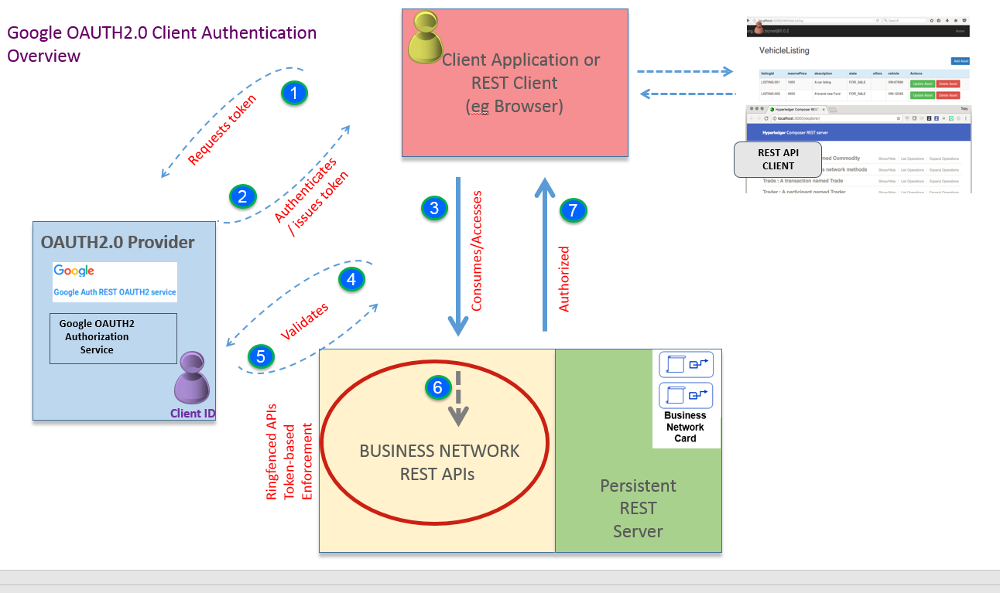
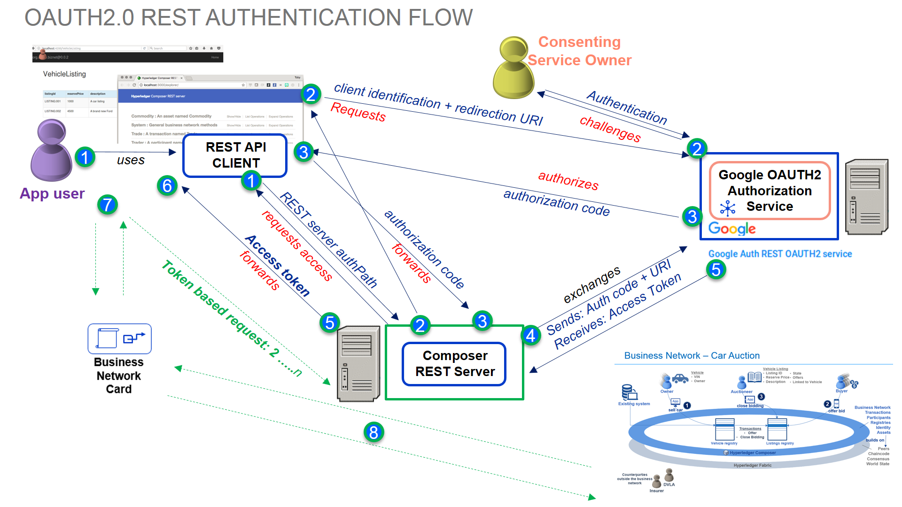

# Using Google OAUTH2.0 with a {{site.data.conrefs.full}} REST server

This tutorial provides an insight into configuring the OAUTH2.0 authentication strategy  (eg. for Google, Facebook, Twitter authentication providers etc) to authorize access to resources in a configured REST Server instance - and allow end users of a blockchain network to interact with a deployed smart contract/business network. An overview diagram is shown below, and a more detailed diagram showing the authentication flow is shown further down. You will run the REST server in [multi user mode](../integrating/enabling-multiuser.html) and test interacting with the sample Trade network as different blockchain identities, accessing resources through the REST APIs. You will need to set up your own Google account / authorization scheme to do this (see appendix on the steps to do this - doesn't take long), or minimally, use the ID/metadata provided in this tutorial. Suffice to say, it uses {{site.data.conrefs.composer_full}} as the underlying blockchain network.




Note: we have set up the standard 'Development Fabric' network as instructed in Step 3 'Setting up your IDE' described [here](../installing/development-tools.html)

There are many Passport strategies one can choose from. In a business organisational sense, enterprise strategies such as SAML, JSON Web Tokens (JWT) or LDAP are more appropriate obviously - eg an organisational Active Directory server. We use/enable Google+ APIs as the authentication provider for this tutorial, as its easy for anyone to setup a Google account (see Appendix on how to achieve this) and configure the service / do the tutorial without worrying about middleware prereqs to be installed.

OAUTH2.0 is really an 'authorization protocol' but can be used as a 'delegated authentication scheme' - authentication normally means identifying a user by his or her own credentials, whereas the OAUTH2.0 authentication, as used here, is used as a 'delegate' authentication scheme. There are a number of 'roles' to expand on here by way of background. The Composer REST server's role is to provide access to business network resources, which are protected by the Google+ API OAuth2.0 scheme. The resource owner is the Google+ API user account we set up (described in the appendix) its role is to grant consent (or otherwise) to the client application. The Google+ authorization server requests consent of the resource owner and issues access tokens to REST clients (eg web client apps)  to enable them to access the protected resources.  Smaller API providers may use the same application and URL space in Google+ for both the authorization server and resource server. The idea is that, when a web application user (consuming REST APIs to access a business network) comes along,  he/she doesn't have to pre-register anything ;  the application user is granted consent by virtue of the configured client application (although that does depend on the OAUTH2.0 flow set up). In our tutorial, we are using a browser to consume the REST APIs and see how this authentication flow actually works.




An access key is granted following consent ; the token allows a client to access the APIs protected by OAuth2.0. In OAuth 2.0, these access tokens are called “bearer tokens”, and can be used alone, with no signature or cryptography, to access the information. Furthermore, the access token is stored in a cookie in the local storage of the user's web browser. When the user makes a subsequent request, the access token is retrieved from the cookie, and the access token is validated, instead of reauthenticating the user.

The REST Server itself is configured to persist the business network cards (required to connect to the network) using the MongoDB store. Typically an organisation would run multiple instances of the REST server Docker image described below and configure a highly available instance of the persistent data store, for example a MongoDB replica set. Configuring the components for high availability allows an administrator to stop, restart, or remove REST server instances without the application users losing access to the deployed business network over REST.

You should carry out this tutorial as a non-privileged user (sudo or elevated privileges are not required).


<h2 class='everybody'> Step 1: Set up the Persistent DB Credentials Data Store using MongoDB </h2>

As mentioned, we will store credentials in a persistent data store once the appropriate business network cards are imported to the REST Wallet.

#### Start the MongoDB Instance

1. Open a terminal window and enter the following command:

```
docker run -d --name mongo --network composer_default -p 27017:27017 mongo
```

 It should output that a docker image has been downloaded and provide a SHA256 message. An instance of the MongoDB docker container has been started. It is important to use the `--network composer_default` here, to enable simple network connectivity with the REST server.

 <h2 class='everybody'> Step 2: Build the REST Server Docker Image with OAUTH2.0 module </h2>

 1. In your $HOME directory, create a temporary directory called `dockertmp` and cd into it:

```
cd $HOME ; mkdir dockertmp
cd dockertmp
```

 2. In the temporary directory, create a docker file called `Dockerfile` in an editor and paste into the following sequence (including special backslash `\` characters below needed after the `RUN` and `npm` lines below  - ie the continuation character ):

```
FROM hyperledger/composer-rest-server
RUN npm install --production loopback-connector-mongodb passport-google-oauth2 && \
npm cache clean --force && \
ln -s node_modules .node_modules
 ```

This Docker file will pull the Docker image located at /hyperledger/composer-rest-server and additionally install two more npm modules:

•	**loopback-connector-mongodb** – This module provides a MongoDB connector for the LoopBack framework and allows our REST server to use MongoDB as a data source. For more information: https://www.npmjs.com/package/loopback-connector-mongodb

•	**passport-google-oauth2** – This module lets us authenticate using a Google+ account with our REST server. For more information: https://www.npmjs.com/package/passport-google-oauth-2

3. From the same directory where the `Dockerfile` resides, build the custom Docker REST Server image:

```
docker build -t myorg/composer-rest-server .
```

The parameter given the –t flag is the name you want to give to this Docker image, this can be up to you to name - but for this guide the image will be called ‘myorg/composer-rest-server’.

You should see output similar to the following with the bottom 2 lines indicating it was 'Successfully built':

```
docker build -t myorg/composer-rest-server .
Sending build context to Docker daemon  4.203GB
Step 1/2 : FROM hyperledger/composer-rest-server
 ---> e682b4374837
Step 2/2 : RUN npm install --production loopback-connector-mongodb passport-google-oauth2 &&     npm cache clean  --force &&     ln -s node_modules .node_modules
 ---> Running in 7a116240be21
npm WARN saveError ENOENT: no such file or directory, open '/home/composer/package.json'
npm WARN enoent ENOENT: no such file or directory, open '/home/composer/package.json'
npm WARN composer No description
npm WARN composer No repository field.
npm WARN composer No README data
npm WARN composer No license field.

+ passport-google-oauth2@0.1.6
+ loopback-connector-mongodb@3.4.1
added 114 packages in 7.574s
npm WARN using --force I sure hope you know what you are doing.
 ---> a16cdea42dac
Removing intermediate container 7a116240be21
Successfully built a16cdea42dac
Successfully tagged myorg/composer-rest-server:latest
```

INFO: Don’t worry about seeing the 'npm warn messages' as shown on the console as per above. This can be ignored.

4. Lastly, for this section, go back up one level in your directory structure:

```
cd ..
```

<h2 class='everybody'> Step 3: Define Environment variables for REST Server instance configuration </h2>

1. Create a file called `envvars.txt` in your $HOME directory and paste in the following configuration settings - note that you will need to **replace the client ID and clientSecret** shown below, with your **own** Google API + client information below  (as shown in the Appendix)

```
COMPOSER_CARD=restadmin@trade-network
COMPOSER_NAMESPACES=never
COMPOSER_AUTHENTICATION=true
COMPOSER_MULTIUSER=true
COMPOSER_PROVIDERS='{
    "google": {
        "provider": "google",
        "module": "passport-google-oauth2",
        "clientID": "312039026929-t6i81ijh35ti35jdinhcodl80e87htni.apps.googleusercontent.com",
        "clientSecret": "Q4i_CqpqChCzbE-u3Wsd_tF0",
        "authPath": "/auth/google",
        "callbackURL": "/auth/google/callback",
        "scope": "https://www.googleapis.com/auth/plus.login",
        "successRedirect": "/",
        "failureRedirect": "/"
    }
}'
COMPOSER_DATASOURCES='{
    "db": {
        "name": "db",
        "connector": "mongodb",
        "host": "mongo"
    }
}'
```

The environment variables defined here will indicate that we want a multi user server with authentication using Google OAuth2 along with MongoDB as the persistent data source.

The first line indicates the name of the business network card we will start the network with - a specific REST Administrator against a defined business network. You will also see that in this configuration we also define the data source the REST server will use and the authentication provider we are using. These can be seen with the COMPOSER_DATASOURCES and COMPOSER_PROVIDERS variables respectively.

<h2 class='everybody'> Step 4: Load environment variables in current terminal and launch the persistent REST Server instance </h2>

1. From the same directory as the `envvars.txt` file you created containing the environment variables, run the following command:

```
source envvars.txt
```

INFO	No output from command? - this is expected. If you did have a syntax error in your `envvars.txt` file then this will be indicated by an error, after running this command.

2. Let’s now confirm that environment variables are indeed set by checking a couple of them using “echo” command as shown below

```
echo $COMPOSER_CARD
echo $COMPOSER_PROVIDERS
```

<h2 class='everybody'> Step 5: Deploy the sample Commodities Trading Business network to query from REST client </h2>

1. If you've not already done so - download the `trade-network.bna` for the Trade-network from https://composer-playground.mybluemix.net/. **Ensure you note down the version number displayed above the About page.**

2. In Playground, connect to the network as `admin` and export the trade-network.bna  and copy it to your **home directory**.


3. To deploy the business network, first you need to install the business network onto the peers

```
composer network install --card PeerAdmin@hlfv1 --archiveFile trade-network.bna
```

make a note of the version that is output after running the above command. This is the version of the business network which you will provide to the next command that you use to start the business network.

run the following commands, replacing `<business_network_version>` with the version number output from the previous install command. 

```
composer network start --card PeerAdmin@hlfv1 --networkName trade-network --networkVersion <business_network_version> --networkAdmin admin --networkAdminEnrollSecret adminpw --file networkadmin.card
```


You should get confirmation that the Commodities Trading Business Network has been started and an 'admin' networkadmin.card file has been created.

4. Next, import the business network card, and connect with the card to download the certs to the wallet:

```
composer card import -f networkadmin.card
composer network ping -c admin@trade-network
```

You should get confirmation that the connectivity was successfully tested. We're now ready to work with the deployed business network.


<h2 class='everybody'> Step 6:  Create the REST server Administrator for the Composer REST server instance  </h2>


1. Create a REST Administrator identity called `restadmin` and an associated business network card (used to launch the REST server later).

```
composer participant add -c admin@trade-network -d '{"$class":"org.hyperledger.composer.system.NetworkAdmin", "participantId":"restadmin"}'
composer identity issue -c admin@trade-network -f restadmin.card -u restadmin -a "resource:org.hyperledger.composer.system.NetworkAdmin#restadmin"
```

2. Import and test the card:

```
composer card import -f  restadmin.card
composer network ping -c restadmin@trade-network
```

3. Because we are hosting our REST server in another location with its own specific network IP information, we need to update the connection.json - so that the docker hostnames (from within the persistent REST server instance) can resolve each other's IP addresses.

The one-liner below will substitute the 'localhost' addresses with docker hostnames and create a new `connection.json` - which goes into the card of our REST administrator. We will also use this custom connection.json file for our 'test' authenticated user later on in the OAUTH2.0 REST authentication sequence, nearer the end of this tutorial. To quickly change the hostnames - copy-and-paste then run this one-liner (below) in the command line from the $HOME directory.

```
sed -e 's/localhost:7051/peer0.org1.example.com:7051/' -e 's/localhost:7053/peer0.org1.example.com:7053/' -e 's/localhost:7054/ca.org1.example.com:7054/'  -e 's/localhost:7050/orderer.example.com:7050/'  < $HOME/.composer/cards/restadmin@trade-network/connection.json  > /tmp/connection.json && cp -p /tmp/connection.json $HOME/.composer/cards/restadmin@trade-network/ 
```

<h2 class='everybody'> Step 7:  Launch the persistent REST server instance   </h2>

1. Run the following docker command to launch a REST server instance (with the `restadmin` business network card)    

```
docker run \
-d \
-e COMPOSER_CARD=${COMPOSER_CARD} \
-e COMPOSER_NAMESPACES=${COMPOSER_NAMESPACES} \
-e COMPOSER_AUTHENTICATION=${COMPOSER_AUTHENTICATION} \
-e COMPOSER_MULTIUSER=${COMPOSER_MULTIUSER} \
-e COMPOSER_PROVIDERS="${COMPOSER_PROVIDERS}" \
-e COMPOSER_DATASOURCES="${COMPOSER_DATASOURCES}" \
-v ~/.composer:/home/composer/.composer \
--name rest \
--network composer_default \
-p 3000:3000 \
myorg/composer-rest-server
```

This will output the ID of the Docker container eg . `690f2a5f10776c15c11d9def917fc64f2a98160855a1697d53bd46985caf7934` and confirm that the REST server has been indeed started.

2. Check that all is ok with our container - you can see that it is running using the following commands:

```
docker ps |grep rest
docker logs rest
```

Look for " Browse your REST API at http://localhost:3000/explorer " at the end of the log - and retrace steps (above) if not there.

<h2 class='everybody'> Step 8:  Test the REST APIs are protected and require authorization   </h2>


1. Open a browser window and launch the REST API explorer by going to http://localhost:3000/explorer to view and use the available APIs.

INFO	Admin identity `restadmin` is used as an initial default - The REST server uses `restadmin` identity until a specific identity e.g. `jdoe` is set as a default identity in the REST client wallet.


2. Go to the “System: general business network methods” section


3. Go to the “/system/historian” API and click on “Try it out!” button as shown below:


You should get an Authorized error and that is because we have configured a Google+ passport OAUTH2.0 authentication strategy to protect access to the REST server. Once authentication via the OAUTH2.0 authentication pa has been achieved, the REST APIs in the browser can interact with the Trade Commodity business network (ie. once a business card has been imported).

<h2 class='everybody'> Step 9: Create some Participants and Identities for testing OAUTH2.0 authentication  </h2>

1. You need to create a set participant and identities for testing you can interact with the business network. This is because the REST server can handle multiple REST clients in multi-user mode. We will be using the composer CLI commands to add participants and identities as follows - first name is **Jo Doe**:

```
composer participant add -c admin@trade-network -d '{"$class":"org.example.trading.Trader","tradeId":"trader1", "firstName":"Jo","lastName":"Doe"}'
composer identity issue -c admin@trade-network -f jdoe.card -u jdoe -a "resource:org.example.trading.Trader#trader1"
composer card import -f jdoe.card
```

2. Once again, because we will use this identity to test inside the persistent REST docker container - we will need to change the hostnames to represent the docker resolvable hostnames - once again run this one-liner to carry out those changes quickly:

```
sed -e 's/localhost:7051/peer0.org1.example.com:7051/' -e 's/localhost:7053/peer0.org1.example.com:7053/' -e 's/localhost:7054/ca.org1.example.com:7054/'  -e 's/localhost:7050/orderer.example.com:7050/'  < $HOME/.composer/cards/jdoe@trade-network/connection.json  > /tmp/connection.json && cp -p /tmp/connection.json $HOME/.composer/cards/jdoe@trade-network/ 
```

3. We need to export the card to a file - to use for importing elsewhere  - ie the card that we will use to import to the wallet in our browser client - and therefore at this point, we can discard the initial business network card file for `jdoe`.

```
composer card export -f jdoe_exp.card -c jdoe@trade-network ; rm jdoe.card
```

4. Repeat the above steps for participant **Ken Coe** (`kcoe`) - creating a `trader2` participant and issuing the identity `kcoe` - the sequence of commands are:

```
composer participant add -c admin@trade-network -d '{"$class":"org.example.trading.Trader","tradeId":"trader2", "firstName":"Ken","lastName":"Coe"}'
composer identity issue -c admin@trade-network -f kcoe.card -u kcoe -a "resource:org.example.trading.Trader#trader2"
composer card import -f kcoe.card

sed -e 's/localhost:7051/peer0.org1.example.com:7051/' -e 's/localhost:7053/peer0.org1.example.com:7053/' -e 's/localhost:7054/ca.org1.example.com:7054/'  -e 's/localhost:7050/orderer.example.com:7050/'  < $HOME/.composer/cards/kcoe@trade-network/connection.json  > /tmp/connection.json && cp -p /tmp/connection.json $HOME/.composer/cards/kcoe@trade-network/ 

composer card export -f kcoe_exp.card -c kcoe@trade-network ; rm kcoe.card
```

These cards can now be imported, then used into the REST client (ie the browser) in the next section.

<h2 class='everybody'> Step 10:   Authenticating from the REST API Explorer and testing using specific identities   </h2>

1. Go to http://localhost:3000/auth/google - this will direct you to the Google Authentication consent screen.


2. Login using the following credentials: (example shown below - as advised, you should set up your own per the instructions in the appendix section of this tutorial):

- Email: composeruser01@gmail.com
- Password: <password>

3. You will be authenticated by Google and be redirected back to the REST server (http://localhost:3000/explorer) which shows the access token message in the top left-hand corner - click on 'Show' to view the token.


While our REST server has authenticated to Google+ OAUTH2.0 service (defined by its project/client scope, and using the client credentials set up in the Appendix for our OAUTH2.0 service), we have not actually done anything yet, in terms of blockchain identity or using business network cards to interact with our Trade Commodity business network - we will do that next,  using the `jdoe` identity we created earlier.

<h2 class='everybody'> Step 11:  Check the Default Wallet and Import the card and set a default Identity  </h2>


1. Firstly, go to the REST endpoint under Wallets and do a GET operation (and 'Try it Out') to get the contents of the Wallet - check that the wallet does not contain any business network cards - it should show as empty `[ ]`:

    GET /wallets

2. You need to add an identity to the REST client wallet and then set this identity as the default one to use for making API calls. Go to the POST system operation under /Wallets - its called the `/Wallets/Import` endpoint

3. Choose to import the file `jdoe_exp.card`  - and provide the name of the card as jdoe@trade-network  and click 'Try it Out'


4. Scroll down - you should you should get an HTTP Status code 204 (request was successful)

5. Next, go back to

    GET /wallets

You should see that `jdoe@trade-network` is imported into the wallet. Note also that the value of the `default property` is true, which means that this business network card will be used by default when interacting with the Commodity Trading business network (until such time as you change it to use another).


<h2 class='everybody'> Step 12:  Test interaction with the Business Network as the default ID jdoe </h2>

1. Go to System REST API  Methods section and expand the /GET System/Historian section


2. Click on 'Try It Out' - you should now see results from the Historian Registry, as the blockchain identity 'jdoe' and a set of transactions


3. Go to the `Trader` methods and expand the /GET `Trader` endpoint then click 'Try it Out'

It should confirm that we are able to interact with the REST Server as `jdoe` in our authenticated session.


You should now be able to see all Trader participants currently created. If any ACLs have been set then restrictions on what he can see may apply (they haven't been applied for this current sample network, but examples of ACL rules can be seen in the [ACL tutorial](./acl-trading.html) FYI). Suffice to say that REST APIs accessing a business network are subject to access control - like any other interaction with the business network (such as Playground, JS APIs, CLI etc).

4.  Next, return to the `POST /wallet/import` operation and import the card file `kcoe_exp.card` with the card name set to `kcoe@trade-network` and click on '`Try it Out`to import it - it should return a successful (204) response.


5. However, to use this card, we need to set it as the default card name in our Wallet - go to the `POST /wallet/name/setDefault/` method and choose `kcoe@trade-network` as the default card name and click on `Try it Out`. This is now the default card.


6. Return to the `Trader` methods and expand the /GET `Trader` endpoint then click 'Try it Out' . It should confirm that we are now using a different card name and still be able to interact with the REST Server as we are still authenticated.


<h2 class='everybody'>Conclusion </h2>

This concludes the tutorial section - you've seen how to configure a client-based Google OAUTH2.0 authentication service that can be used to authorize client applications and provide consent to interact with a protected resource server (namely an REST Server instance) without the need to authenticate on every request. Furthermore, the REST Server is running in multi-user mode and so,  allows multiple blockchain identities to interact with the deployed Commodity Trading business network from the same REST client session, subject to token expiration times etc etc.

The appendix below describes how the Google Authentication scheme in this tutorial was set up, in advance of this tutorial.


## Appendix - Google+  Authentication Configuration & Setup

The appendix below describes how to create an OAUTH2.0 authentication service for authenticating client applications. These steps at a high-level overview consist of:

1. Create Google API+ Project
2. Create Credentials Service Account
3. Create OAuth2.0 Consent
4. Create OAuth2.0 Client ID credentials for the Credentials Service Account


<h2 class='everybody'>Step A1:  Create Google API+ Project </h2>

1. Login to your Google account - if you don't have one - create one at google.com and **sign in to Google**

2. Link for the page https://console.developers.google.com/apis/

You should see the following page on arrival. Search for ‘Google+’ in the search bar and select the **Google+** APIs icon when presented.


3. Once selected - click to Enable the Google+ APIs - it is important that you do this.

4. As you don’t have a 'project' yet, you will be prompted to create a project as it is needed to enable the APIs. Click ‘Create Project’

5. You will be prompted to give it a name - call it 'GoogleAuth' and **take a note of the Project ID** in our case it is shown as `proven-caster-195417` - this will be used later on.

6. After creating the project, you will be redirected to the Google+ API page again. You should now see the project name selected and the option to ‘Enable’ the service. Click ‘Enable’.

<h2 class='everybody'>Step A2:  Create Credentials Service Account  </h2>

1. Once you have enabled the service you will be prompted to create Service Account Credentials so that you can use the service.  Click ‘Create Credentials’.

2. You will be asked a series of questions to determine what kind of credentials you will need. Give the answers shown in the screenshot below. Choose 'Google+ API'  for the API, Web Server (e.g. Node js, Tomcat) and Application data and 'No' for the Engine question at the bottom.

3. Click on `What credentials do I need`  and hit Continue


4. Next, setup a Credentials service account - with the name 'GoogleAuthService' - select 'Project' in the dropdown and select a role of `Owner` and a type of JSON and

5. Click on 'Get your Credentials' - it should download (or prompt to download) the service credentials in JSON format - save these to a safe location.


6. Save a JSON file with the application credentials. After downloading the credentials, the site will take you back to the credentials homepage and you will see a new service account key.


<h2 class='everybody'>Step A3:  Create OAUTH2.0 Consent </h2>

7. Go to the ‘OAuth consent screen' tab = you will need to give a 'product name'  like 'Google Auth REST OAUTH2 service' - a banner that is shown when consent to authorize a request is requested  (ie when we test it on the REST client in the main tutorial) and an email address, click ‘Save’.

The OAuth consent screen is what the user (in the tutorial) will see when they are authenticating themselves against the Google Auth REST Service


<h2 class='everybody'>Step A4:  Create OAuth2.0 Client ID credentials for the Credentials Service Account </h2>

1. Go back to the ‘Credentials’ tab and click the ‘Create Credentials’ dropdown and select ‘OAuth Client ID’.

2. Choose 'Web Application' and give it a simple name like 'Web Client 1'


3. Under the 'Authorised Javascript Origins' section add a line with the following URI - this is the client application (the REST Server):


    http://localhost:3000

4. We will need to add 'Authorized Redirect URIs' at the bottom - this is where the authenticated session is redirected back to after getting consent from the Google+ OAUTH2.0 authentication service. The callback will match what we will configure in our Composer REST Server environment variables (specifically the variable `COMPOSER_PROVIDERS`, in the `envvars.txt` when performing this instruction in the main tutorial).


Under 'Authorized Redirect URIs' add the following URIs as authorised URIs. Note: it is best to copy/paste each URI below, then hit ENTER in the browser after each line entry- as the URI line editor can sometimes truncate your entry whilst typing .e.g. if you happen to pause when typing the URI.

    http://localhost:3000/auth/google
    http://localhost:3000/auth/google/callback

Then click on the 'Create' button at the bottom.


You will be prompted to save the Client ID and Client Secret - copy these two and save these for later.


You're all set - you can now return to the main tutorial to set up your REST Server Authentication using Google's OAUTH2.0 client authentication service.

### A word on Google Authentication OAUTH2.0 setup and scope of Authentication

When an application uses OAuth 2.0 for authorization, it acts on a user's behalf to request an OAuth 2.0 access token for access to a resource, which it identifies by one or more scope strings. Normally, of course - the user itself is asked to approve the access.

When a user (eg. an admin) grants access to the app for a particular scope, in Google at least, a project-level consent 'branding'is setup in the Google+ API Console to challenge for the initial consent. Thereafter, once consented,  Google considers that user (through the Google account he/she has set up) has granted access to a particular scope to any configured client IDs in a API+ project ; the grant indicates the trust in the whole application - for the scope as defined in the Google+ API configuration.

The effect is that the application provider is not be prompted to approve access to any resource more than once for the same logical client application.

Fortunately, the Google authorization infrastructure can use information about user approvals for a client ID within a given project set up in Google+ API console,  when evaluating whether to authorize others in the same project. It also requires you to set up the authorized URIs that can be granted consent (such as the application call back URL after successful authentication).

The Google Authorization module will observe that the calling application and the web client ID are in the same project, and without user approval, return an ID token to the application, signed by Google. The ID token will contain several data fields, of which the following are particularly relevant:

    iss: always accounts.google.com

    aud: the client ID and secret of the web component of the project

    email: the email that identifies the user requesting the token

This ID token is designed to be transmitted over HTTPS. Before using it, the web component must do the following:

Validate the cryptographic signature. Because the token takes the form of a JSON web token or JWT and there are libraries to validate JWTs available in most popular programming languages, this is straightforward and efficient.

Ensure that the value of the `aud` field is identical to its own client ID.

Once this is accomplished, the REST server can have a high degree of certainty that - the token was issued by Google.
