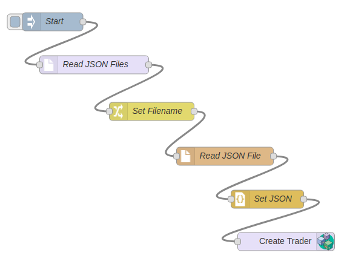

# Node-RED Tutorial for Integrating a {{site.data.conrefs.composer_full}} Business Network

This tutorial demonstrates how to integrate an existing system of record data source into the blockchain ledger.  In this guide, we will build on the [Developer Tutorial](./developer-tutorial.html), extending it to bulk load records from a JSON text file data source to populate Participant and Asset registries in the sample 'Commodity Trading' business network.  

[Node-RED](http://nodered.org) is a lightweight Open Source integration technology, written in JavaScript. It uses a graphical flow to integrate different _nodes_, where nodes can receive data, transform data and output data.

Node-RED is commonly used to rapidly prototype Internet of Things style applications, or to wire existing Internet services together.

You can use the {{site.data.conrefs.composer_full}} Node-RED contribution to:

- Submit transactions
- Read and update assets and participants
- Subscribe to events
- Delete assets and participants
- Perform a bulk load (eg. loading test data)

This tutorial gives an overview of the techniques and resources available to apply to your own use case.

This tutorial uses the `tutorial-network` business network developed and deployed in the [Developer Tutorial](./developer-tutorial.html).

## Prerequisites

Before beginning this tutorial:

 - Complete the [development environment installation](../installing/development-tools.html).
 - Complete the [developer tutorial](./developer-tutorial.html).

This tutorial assumes the reader has some familiarity with Node-RED.  The [Node-RED](http://nodered.org) website has an introductory video and a getting started link.


## Step One: Install and Start Node-RED

Node-RED is a Node.js application and should be installed on a {{site.data.conrefs.composer}} development environment with the following command `npm install -g node-red` 

Use the following command to start Node-RED `node-red`

The command output will show that Node-Red server is now running at http://127.0.0.1:1880/ - open this link in a Browser to see the Node-RED UI.


## Step Two: Install Composer Nodes

The Composer Nodes for Node-RED are described here https://www.npmjs.com/package/node-red-contrib-composer and can be installed into Node-RED through the UI.


1. On the Node-RED UI Menu, click **Manage palette**, the click on the **Install** tab.  In the **search modules** field type _node-red-contrib-composer_, then click the **Install** button and on the confirmation dialog click the red **Install** button. 


    The nodes take a few moments to install, and a message will be shown in the UI and in the terminal window where Node-RED was started.


2. Verify that the nodes are installed by scrolling to the end of the Palette on the left of the UI - a new category called **Hyperledger** should be at the bottom with the three nodes.


## Step Three: Install fs Node

This tutorial uses JSON data from text files and needs additional nodes _node-red-contrib-fs_

1. On the Node-RED UI Menu, click **Manage palette**, the click on the **Install** tab.  In the **search modules** field type _node-red-contrib-fs_, then click the **Install** button and on the confirmation dialog click the red **Install** button.

2. Verify that the **fs file lister** node has been added to the Storage category on the Palette.


## Step Four: Build Flow

The image below shows what the completed flow will look like.


**Drag** the nodes from the palette on the left onto the Flow.

**Double click** on a node to edit the properties.

The types and properties of the six nodes are described below:

##### 1. **inject** node (from input category) - _Start_

Set the properties for this node:

 -  **Payload** - _timestamp_

 -  **Topic** - _\<empty\>_
 
 -  **Repeat** - _none_

 -  **Inject once at start?** - _\<unchecked\>_

 -  **Name** - _Start_

In this flow the inject node is being used primarily to initiate the flow, rather than to inject data.  In this flow the data will come from JSON files on disk.

##### 2. **fs file lister** node (from storage category) - _Read JSON Files_

Set the properties for this node:

 -  **Start Folder** - _/home/\<username\>/tutorial-network/testdata/traders/_

 -  **File Pattern** - _\*.json_

 -  **Include full path in output?** - _\<checked\>_
 -  **Output single message (array)?** - _\<unchecked\>_

 -  **Max, search depth** - _0_

 -  **Return file details?** - _\<unchecked\>_

 -  **Name** - _Read JSON Files_


For the **Start Folder**, on Ubuntu Linux substitute \<username\> for the logged in user.  On Mac adjust the Foldername to reflect your system.  In the next step of the tutorial test data will be created in this folder.  Use the full path of the folder - using the \~/ notation to indicate the user's home folder will cause an error.

##### 3. **change** node (from function category) - _Set Filename_

Set the properties for this node:

 -  **Name** - _Set Filename_

 -  **Rules**

    -  **Set** - _msg.filename_

    -  **to** - _msg.payload_  (Be sure to change the dropdown to _msg_ )


This node sets the filename variable for the next node in the flow.

##### 4. **file in** node (from storage category) - _Read JSON File_

Set the properties for this node:

 -  **Filename** - _\<empty\>_

 -  **Repeat** - _a single utf8 string_

 -  **Send message on error (legacy mode)** - _\<checked\>_

 -  **Name** - _Read JSON File_


This node reads the JSON test data file into a String variable.

##### 5. **json** node (from function category) - _Set JSON_

Set the properties for this node:

 -  **Name** - _Set JSON_

 -  **Format JSON string** - _\<checked\>_


This node converts the JSON string into a JavaScript object for the next node in the flow.

##### 6. **composer** out node (from Hyperledger category) - _Create Trader_

Set the properties for this node:

 -  **Name** - _Create Trader_

 -  **Action Type** - _Create_


**Click** the pencil icon to add a new Composer Card.

 -  **Card Name** - _admin@tutorial-network_
This is the Hyperledger Composer node that will connect to the Business Network on the Fabric and submit the Transaction.

After you have set the properties on all the nodes, **Wire the nodes together** as shown in the diagram above.
Remember to click the red **Deploy** button to save the flow.


## Step Five: Create Test Data
#### Create JSON text files for new Participants
Using a text editor such as vi or gedit , create a text file called **/home/_\<username\>_/tutorial-network/testdata/traders/trader4.json** with the following contents

```
{
  "$class": "org.acme.biznet.Trader",
  "tradeId": "TRADER4",
  "firstName": "John",
  "lastName": "Smith"
}
```

Create two more JSON text files for **trader5** and **trader6** with the following data

```
{
  "$class": "org.acme.biznet.Trader",
  "tradeId": "TRADER5",
  "firstName": "Simon",
  "lastName": "Jenkins"
}
```

```
{
  "$class": "org.acme.biznet.Trader",
  "tradeId": "TRADER6",
  "firstName": "Susan",
  "lastName": "Stone"
}
```

#### Create JSON text files for new Commodities
Create a text file called **/home/_\<username\>_/tutorial-network/testdata/commodities/diamond.json** with the following contents

```
{
  "$class": "org.acme.biznet.Commodity",
  "tradingSymbol": "DIA",
  "description": "Diamond commodity",
  "mainExchange": "Jewel",
  "quantity": 1.45,
  "owner": "resource:org.acme.biznet.Trader#TRADER6"
}
```

Create two more JSON text files for **apple** and **oil** with the following data

```
{
  "$class": "org.acme.biznet.Commodity",
  "tradingSymbol": "APP",
  "description": "Apple commodity",
  "mainExchange": "Food",
  "quantity": 234500,
  "owner": "resource:org.acme.biznet.Trader#TRADER4"
}
```

```
{
 "$class": "org.acme.biznet.Commodity",
 "tradingSymbol": "CL",
 "description": "Crude Oil",
 "mainExchange": "NYMEX",
 "quantity": 35,
 "owner": "resource:org.acme.biznet.Trader#TRADER5"
}
```


## Step Six: Test Flow

1. **Click** on the left edge of the **Start** node to test the flow. 

2. Use the Playground, REST server or the following command to validate that the test data has been added `composer network list -c admin@tutorial-network`


## Step Seven: Add Commodities
In the previous step the flow has been run and the participants (Traders) have been added.  Test data has been created for new Assets (Commodities) and a small re-configuration is required to add them.

1. **Double Click** the **Read JSON Files** node and modify the property **Start Folder** to reference your commodities test data folder.

2. **Click** the **Deploy** buton the save and deploy the change.

3. **Start** the flow and validate that the Commodity test data has been added.


## Possible errors
Any Errors will be dislayed on the debug tab in the UI, and on the terminal window where Node-RED was started.

**\[error\] \[fs-file-lister:Read JSON Files\] Error processing folder listing**  --  
Incorrectly specified folder name in **Read JSON Files** Node.

**\[error\] \[hyperledger-composer-out:Create Trader\] Error: creating resource error Namespace is not defined for type org.acme.biznetttt.Commodity**  --
Errors in the test data - namespace errors or formatting errors in the JSON files.

**\[error\] \[hyperledger-composer-out:Create Trader\] Error trying to query business network. Error: Connect FailedFabric**  --
Containers not started - use `docker ps` to check.

**\[error] \[hyperledger-composer-out:Create Trader\] Error: creating resource error Card not found: admin@exampleyz-networkWrong Business Network Card specified**  -- 
verify card name by using `composer card list` on command line.

<!--  
Do we add another flow for the events ?
-->
