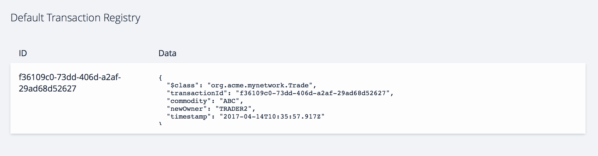
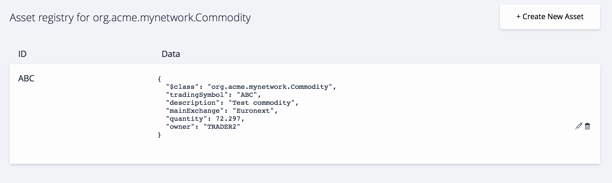

# Playground Tutorial

---

In this step by step tutorial we are going to walk-through setting up a business network definition, testing that business network definition by creating a couple of participants, an asset and submitting a transaction to transfer that asset to a different participant.

## Step 1: Open the {{site.data.conrefs.composer_full}} Playground


Open <a href="http://composer-playground.mybluemix.net" target="blank">{{site.data.conrefs.composer_short}} Playground</a>, by default the Basic Sample Network is imported.

If you have previously used Playground, be sure to clear your browser local storage by running `localStorage.clear()` in your browser Console.

## Step 2: Define your Domain Model

Open the file **Model File** from the left hand side navigation in Playground. This is the domain model for the business network definition. It defines the structure (schema) for the assets, transaction and participants in the business network.

As an example, we're going to replace the entire contents of the **Model File** with a simplistic model below to track the ownership of commodities on the blockchain.

This will create errors with other files, don't worry as we'll fix that!

```
/**
 * My commodity trading network
 */
namespace org.acme.mynetwork
asset Commodity identified by tradingSymbol {
    o String tradingSymbol
    o String description
    o String mainExchange
    o Double quantity
    --> Trader owner
}
participant Trader identified by tradeId {
    o String tradeId
    o String firstName
    o String lastName
}
transaction Trade identified by transactionId {
    o String transactionId
    --> Commodity commodity
    --> Trader newOwner
}
```

This domain model defines a single asset `Commodity` and single participant `Trader` and a single transaction `Trade` that is used to modify the owner of a commodity.

_Note: You can add as many model files as convenient under the `models` folder, however each model file must have a unique namespace and you can import types from one namespace into other namespaces._

## Step 3: Define Transaction Processor Functions

Now that the domain model has been defined, we can define the business logic for the business network. Composer expresses the logic for a business network using JavaScript functions. These functions are automatically executed when a transaction is submitted for processing.

Open the file **Script File** from the left-hand side navigation and replace the entire contents of this with the function below.

```
/**
 * Track the trade of a commodity from one trader to another
 * @param {org.acme.mynetwork.Trade} trade - the trade to be processed
 * @transaction
 */
function tradeCommodity(trade) {
    trade.commodity.owner = trade.newOwner;
    return getAssetRegistry('org.acme.mynetwork.Commodity')
        .then(function (assetRegistry) {
            return assetRegistry.update(trade.commodity);
        });
}
```

This function simply changes the `owner` property on a commodity based on the `newOwner` property on an incoming `Trade` transaction. It then persists the modified `Commodity` back into the asset registry, used to store `Commodity` instances.

_Note: You can create as many JavaScript files as convenient for your business network definition. If a JavaScript function has the `@transaction` annotation, it will be automatically invoked when a transaction of the type defined by the `@param` annotation is submitted._

## Step 4: Define your Access Control Rules

Open the **Access Control** file that defines the access control rules for the business network definition and replace the entire contents with the rule below.

```
/**
 * Access control rules for mynetwork
 */
rule Default {
    description: "Allow all participants access to all resources"
    participant: "ANY"
    operation: ALL
    resource: "org.acme.mynetwork"
    action: ALLOW
}
```

This access control simply allows all participants access to all resources.

## Step 5: Deploy changes

Using the **Deploy** button in the left hand navigation we need to deploy our changes to the web browser.

<video autoplay "autoplay=autoplay" style="display:block; width:100%; height:auto;" loop="loop">
<source src="{{ site.baseurl }}/assets/img/tutorials/playground/deploy_updates_render.mp4" type="video/mp4" />
</video>

## Step 6: Testing our Business Network Definition

Navigate to the **Test** tab at the top to test our Business Network Definition

<video autoplay "autoplay=autoplay" style="display:block; width:100%; height:auto;" loop="loop">
<source src="{{ site.baseurl }}/assets/img/tutorials/playground/test_tab_render.mp4" type="video/mp4" />
</video>

## Step 7: Creating two Traders

Create two 'Trader' participants (TRADER1 and TRADER2) by clicking the Trader registry on the left and then the **Create New Participant** button.

```
{
  "$class": "org.acme.mynetwork.Trader",
  "tradeId": "TRADER1",
  "firstName": "Jenny",
  "lastName": "Jones"
}
```

```
{
  "$class": "org.acme.mynetwork.Trader",
  "tradeId": "TRADER2",
  "firstName": "Amy",
  "lastName": "Williams"
}
```

<video autoplay "autoplay=autoplay" style="display:block; width:100%; height:auto;" loop="loop">
<source src="{{ site.baseurl }}/assets/img/tutorials/playground/create_new_participant_render.mp4" type="video/mp4" />
</video>

After creating these two participants, you should now see them in the participant registry.

## Step 8: Creating a commodity

Create a new instance of a Commodity by navigating to the Commodity registry on the left and then click the **Create New Asset** button.

```
{
  "$class": "org.acme.mynetwork.Commodity",
  "tradingSymbol": "ABC",
  "description": "Test commodity",
  "mainExchange": "Euronext",
  "quantity": 72.297,
  "owner": "resource:org.acme.mynetwork.Trader#TRADER1"
}
```

<video autoplay "autoplay=autoplay" style="display:block; width:100%; height:auto;" loop="loop">
<source src="{{ site.baseurl }}/assets/img/tutorials/playground/create_new_asset_render.mp4" type="video/mp4" />
</video>

After creating this asset, you should now see them in the asset registry.

## Step 9: Transferring that commodity between the traders

Next, submit a `Trade` transaction by clicking the **Submit Transaction** button, bottom left of the left hand navigation panel, to move the commodity from TRADER1 to TRADER2.

```
{
  "$class": "org.acme.mynetwork.Trade",
  "commodity": "resource:org.acme.mynetwork.Commodity#ABC",
  "newOwner": "resource:org.acme.mynetwork.Trader#TRADER2"
}
```

<video autoplay "autoplay=autoplay" style="display:block; width:100%; height:auto;" loop="loop">
<source src="{{ site.baseurl }}/assets/img/tutorials/playground/submit_transaction_render.mp4" type="video/mp4" />
</video>

After submitting this transaction, you should now see the transaction in the transaction registry.



As a result, the owner of the commodity ABC should now be owned TRADER2 in the Asset Registry.



<!-- ## Recap!

We defined the business network definition in the **Model File**, **Script File**, **Access Controls**, tested that business network definition by creating a couple of participants `TRADER1` `TRADER2`, an asset `ABC` and submitting a transaction  `Trade` to transfer that asset to a different participant. -->

##Congratulations you've completed the Playground tutorial!

Next, you might want to try the [**Developer Tutorial**](../tutorials/developer-guide.html), to get your local development environment setup, generate a REST API and a skeleton web application.

---
