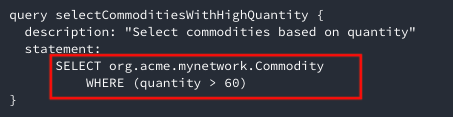
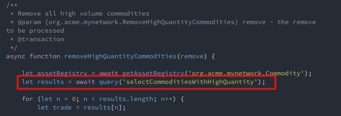

# Queries Tutorial using the Composer Query language and REST APIs

In this tutorial, we will build on the [developer tutorial](./developer-tutorial.html), extending it to demonstrate {{site.data.conrefs.composer}} queries. The native {{site.data.conrefs.composer}} query language can filter results returned using criteria and can be invoked in transactions to perform operations, such as updating or removing assets on result sets.

Queries are defined in a query file (`.qry`) in the parent directory of the business network definition. Queries contain a WHERE clause, which defines the criteria by which assets or participants are selected.

This tutorial uses the `tutorial-network` business network developed and deployed in the [Developer-Tutorial](developer-tutorial.html).

## Prerequisites

Before beginning this tutorial:

 - Complete the [development environment installation](../installing/development-tools.html).
 - Complete the [developer tutorial](./developer-tutorial.html).

## Step One: Updating the business network

The business network created in the developer tutorial must be updated. The updated business network contains two events and an additional transactions.

#### Update the model file

The model file must be updated to contain events and a new transaction.

1. Open the model (`.cto`) file for the `tutorial-network`.

2. Add the following events and transaction to the model:

        event TradeNotification {
            --> Commodity commodity
        }

        transaction RemoveHighQuantityCommodities {
        }

        event RemoveNotification {
            --> Commodity commodity
        }

3. Save the changes to your model.

#### Update transaction logic to use queries and events

Now that the domain model has been updated, we can write the additional business logic that gets executed when a transaction is submitted for processing. In this tutorial we have added events and queries to the business logic below.

1. Open the transaction processor function file `lib/logic.js`.

2. Replace the transaction logic with the following JavaScript:

        /**
         * Track the trade of a commodity from one trader to another
         * @param {org.acme.biznet.Trade} trade - the trade to be processed
         * @transaction
         */
        function tradeCommodity(trade) {

            // set the new owner of the commodity
            trade.commodity.owner = trade.newOwner;
            return getAssetRegistry('org.acme.biznet.Commodity')
                .then(function (assetRegistry) {

                    // emit a notification that a trade has occurred
                    var tradeNotification = getFactory().newEvent('org.acme.biznet', 'TradeNotification');
                    tradeNotification.commodity = trade.commodity;
                    emit(tradeNotification);

                    // persist the state of the commodity
                    return assetRegistry.update(trade.commodity);
                });
        }

        /**
         * Remove all high volume commodities
         * @param {org.acme.biznet.RemoveHighQuantityCommodities} remove - the remove to be processed
         * @transaction
         */
        function removeHighQuantityCommodities(remove) {

            return getAssetRegistry('org.acme.biznet.Commodity')
                .then(function (assetRegistry) {
                    return query('selectCommoditiesWithHighQuantity')
                            .then(function (results) {

                                var promises = [];

                                for (var n = 0; n < results.length; n++) {
                                    var trade = results[n];

                                    // emit a notification that a trade was removed
                                    var removeNotification = getFactory().newEvent('org.acme.biznet', 'RemoveNotification');
                                    removeNotification.commodity = trade;
                                    emit(removeNotification);

                                    // remove the commodity
                                    promises.push(assetRegistry.remove(trade));
                                }

                                // we have to return all the promises
                                return Promise.all(promises);
                            });
                });
        }

3. Save your changes to `logic.js`.

The first function `tradeCommodity` will change the owner property on a commodity (with a new owner Participant) on an incoming Trade transaction and emit a Notification event to that effect. It then persists the modified Commodity back into the asset registry which is used to store Commodity instances.

The second function calls a named query 'selectCommoditiesWithHighQuantity' (defined in `queries.qry`) which will return all Commodity asset records that have a quantity > 60 ; emit an event ; and remove the Commodity from the AssetRegistry.

## Step Two: Create a query definition file

The queries used by the Transaction Processor logic are defined in a file which must be called `queries.qry`. Each query entry defines the resources and criteria against which the query is executed.

1. In the `tutorial-network` directory, create a new file called `queries.qry`.

2. Copy and paste the following code into `queries.qry`:

        /** Sample queries for Commodity Trading business network
        */

        query selectCommodities {
          description: "Select all commodities"
          statement:
              SELECT org.acme.biznet.Commodity
        }

        query selectCommoditiesByExchange {
          description: "Select all commodities based on their main exchange"
          statement:
              SELECT org.acme.biznet.Commodity
                  WHERE (mainExchange==_$exchange)
        }

        query selectCommoditiesByOwner {
          description: "Select all commodities based on their owner"
          statement:
              SELECT org.acme.biznet.Commodity
                  WHERE (owner == _$owner)
        }

        query selectCommoditiesWithHighQuantity {
          description: "Select commodities based on quantity"
          statement:
              SELECT org.acme.biznet.Commodity
                  WHERE (quantity > 60)
        }

3. Save your changes to `queries.qry`.


## Step Three: Regenerate your business network archive

After changing the files in a business network, the business network must be repackaged as a business network archive (`.bna`) and redeployed to the {{site.data.conrefs.hlf_full}} instance.


1. Using the command line, navigate to the `tutorial-network` directory.

2. Run the following command:

        composer archive create --sourceType dir --sourceName . -a tutorial-network@0.0.1.bna


## Step Four: Deploy the updated business network definition

We need to deploy the modified network to become the latest edition on the blockchain! We are using the newly created archive business network archive file to update the existing deployed business network; this is the same business network name, that we used during the Developer Tutorial.

1. Switch to the terminal, change directory to the folder containing the `tutorial-network.bna`.

2. Run the following command to update the business network:

        composer network update -a tutorial-network@0.0.1.bna -c admin@tutorial-network

3. Run the following command to test that the network is deployed:

        composer network ping -c admin@tutorial-network

## Step Five: Regenerate the REST APIs for the updated Business Network

We will now integrate the newly updated business network with queries added, and expose the REST APIs for this business network.

1. Using the command line, navigate to the `tutorial-network` directory.

2. Use the following command to launch the REST server:

        composer-rest-server

3. Enter `admin@tutorial-network` as the card name.

4. Select **never use namespaces** when asked whether to use namespaces in the generated API.

5. Select **No** when asked whether to secure the generated API.

6. Select **Yes** when asked whether to enable event publication.

7. Select **No** when asked whether to enable TSL security.

## Step Six: Test the REST APIs and create some data

Open a web browser and navigate to <a href="http://localhost:3000/explorer" target="blank">http://<span></span>localhost:3000/explorer</a> . You should see the LoopBack API Explorer, allowing you to inspect and test the generated REST API.

We should be able to see that the REST Endpoint called 'Query' has been added and, upon expanding, reveals the list of REST Query operations defined in the business network `tutorial-network`


Before we proceed, we need to create some data, to demonstrate queries adequately. Using the sample JSON data provided, create 3 Traders (Participants)and some more Commodities (Assets) using the REST APIs.

1. First, click on 'Trader' in the REST Explorer, then click on the 'POST' method on /Trader, then scroll down to the Parameter section - create the following Trader instances, in turn:

        {
          "$class": "org.acme.biznet.Trader",
          "tradeId": "TRADER1",
          "firstName": "Jenny",
          "lastName": "Jones"
        }

2. Click 'Try it out' to create the Participant. The 'Response Code' (scroll down) should be 200 (SUCCESS)

3. Create another trader by copying the following JSON:

        {
          "$class": "org.acme.biznet.Trader",
          "tradeId": "TRADER2",
          "firstName": "Jack",
          "lastName": "Sock"
        }

4. Create a third trader by coping the following JSON:

        {
          "$class": "org.acme.biznet.Trader",
          "tradeId": "TRADER3",
          "firstName": "Rainer",
          "lastName": "Valens"
        }

5. Now scroll up to the top and click on 'Commodity' object in the REST Explorer.

6. Click on the POST operation and scroll down to the Parameters section: In the same way as above, create two Commodity Asset records (see below) for owners TRADER1 and TRADER2:

```
{
  "$class": "org.acme.biznet.Commodity",
  "tradingSymbol": "EMA",
  "description": "Corn",
  "mainExchange": "EURONEXT",
  "quantity": 10,
  "owner": "resource:org.acme.biznet.Trader#TRADER1"
}
```

```
{
  "$class": "org.acme.biznet.Commodity",
  "tradingSymbol": "CC",
  "description": "Cocoa",
  "mainExchange": "ICE",
  "quantity": 80,
  "owner": "resource:org.acme.biznet.Trader#TRADER2"
}
```

## Step Seven: Perform queries using the commodity trading REST API explorer

Now that we have some Assets and Participants, we can test out some queries using the generated Query REST operations.

#### Perform a simple REST query

Now that we have assets and participants, we can try out some queries.

The simplest REST query we can try out first is our named query `selectCommodities`.

Expand the 'Query' REST Endpoint and you will see the named queries we defined in our model.

These queries are now exposed as REST queries and for which a /GET operation is generated, Note that the description of the query (that we defined in our model definition) is shown on the right hand side.


1. Expand the `selectCommodities` query.

2. Click the 'Try it Out' button.


It will return all existing Commodities - there should be 2 assets returned.


### Perform Filtered REST Queries

Let's select all Commodities by their Exchange - for example 'EURONEXT' main exchange.

1. Expand query Endpoint 'selectCommoditiesByExchange' and scroll to the 'Parameters' section.

2. Enter 'EURONEXT' in the 'Exchange' parameter.

3. Click 'Try it Out'.


The results reveal that only those Commodities with an Exchange of 'EURONEXT' are shown in the response body


### Perform Transaction update using results from named Query

Finally, you will recall we had defined a simple query that filters Commodities with a Quantity greater than 60 in our query file. Queries are very powerful, when used in transaction functions, as using queries allows transaction logic to set up the set of assets or participants to perform updates on, or for creating remove actions for example.



We use the `selectCommoditiesWithHighQuantity` query in the `removeHighQuantityCommodities` transaction. If you execute this /GET operation in the REST Explorer, you'll see it selects only those assets greater than 60 in quantity.



Now let's use the query to perform a removal of high quantity Commodities.

First check for yourself how many Commodities are present (use the 'Commodity' /GET operation) and you should see at least two Commodities, one of which (Cocoa) has a quantity > 60.


Let's check out the actual query, by clicking on the REST Endpoint `/selectCommoditiesWithHighQuantity` and click /GET then scroll down to 'Try it Out' - there should be one Commodity that meets the criteria.


OK. Now let's execute a REST transaction, that uses our 'High Quantity' query definition to decide which Commodities to remove.

Click on the RemoveHighQuantityCommodities REST Endpoint to reveal the /POST operation for same.


Click on POST, scroll down to the Parameter section and click 'Try it Out' - note: you do *not* have to enter any data in the 'data' section.

Scroll down and you should see a transactionId which represents the 'remove' invocation (itself a blockchain transaction) inside of the transaction processor function and which will update the world state - the Response Code should be 200


Finally, let's verify our Commodities status. Return to the 'Commodity' REST Operations and once again perform a /GET operation....'Try it Out'.

The results should show that the Commodity asset 'Cocoa' has now gone, ie only those Commodity assets with a quantity <= 60 still remain, ie asset 'Corn' in our example. The named query fed the transaction update (to remove high quantity Commodities) and which was executed in business logic.


# Congratulations!

Well done, you've now completed this tutorial and we hope you now have a much better idea of the power of queries in Composer. You can start creating/building your own queries (or modifying the existing queries and adding associated data to this business network - note: you would need to re-deploy any query changes) to try out!


## Related Links

- [Developer-Tutorial](developer-tutorial.html)
- [Deploying a business network](../business-network/bnd-deploy.html)
- [Network deploy command](../reference/composer.network.deploy.html)
