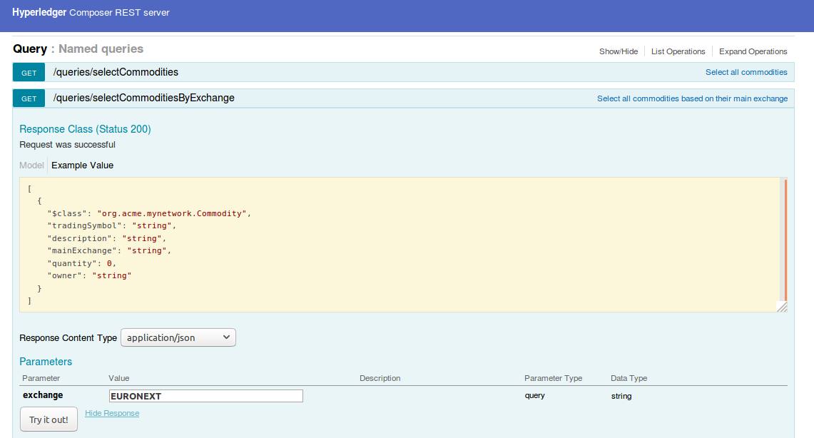

# Queries Tutorial using the Composer Query language and REST APIs

In this tutorial, we will build on the 'Commodity Trading' developer tutorial, extending it to show the use of queries in Composer. This tutorial demonstrates the power of the native Composer query language, as a means to filter results returned using criteria - and furthermore, to perform certain actions or operations on result sets, such as updating or removing assets using a transaction function that uses queries. Once you've done the tutorial, feel free to try out your own queries!

Queries are defined in  a query file (suffix .qry) in the parent directory of the business network definition. They are used to select assets or participants that meet certain criteria or conditions you define in the WHERE clause of a query. For the purposes of this tutorial, we will use the simple, defined sample queries in `queries.qry` from the `trade-network` sample network to get going - they are described in the file itself. In the main 'Commodity Trading' [Developer-Tutorial](developer-guide.html), we cloned the Composer `sample-networks` git repository, and created a new network 'my-network' from `basic-sample-network` in the samples directory - this tutorial uses that network to get going.

It is recommended to do the [Developer-Tutorial](developer-guide.html) first, where the business network `my-network` has first been deployed and setup steps are performed. Alternatively, you can  if you wish, do this tutorial from 'scratch' but observe these following 3 steps:

1. Build a new 'my-network' VSCode project (as shown in the Developer tutorial where its based on the `basic-sample-network` project)
2. Edit your package.json, once again changing the 'name' field to `my-network`, the 'description' to 'My Commodity Trading network' and modify the 'prepublish' script (at the end) to change the filename of the business network archive (.bna) - ie to 'my-network.bna'
3. Finally, you must use the `composer network deploy` command later on here (i.e. not 'composer network update') to deploy the BNA file as a new network (ie that step is referred to later on in this tutorial).

## Re-open your Commodities Trading 'my-network' project

In your project folder (in VSCode) open the folder `my-network` which is still the basis for our sample Trade project.

Using VSCode, open the my-network folder using Explorer in VSCode, click OK to open the folder. You should see the file layout in the explorer pane.

<video autoplay "autoplay=autoplay" style="display:block; width:100%; height:auto;" loop="loop">
<source src="{{ site.baseurl }}/assets/img/tutorials/developer/open_my_network.mp4" type="video/mp4" />
</video>


## Update your 'Commodities Trade' Model File

Replace your `sample.cto` file contents, with the contents of the updated model shown below. This effectively enhances our Commodities Trade Network to add new transaction processor 'RemoveHighQuantityCommodities' (that will use queries from `queries.qry` defined later) and events (used in our business transaction logic file `lib/logic.js` to notify of significant events).


```
/**
 * Commodity trading network
 */
namespace org.acme.mynetwork

asset Commodity identified by tradingSymbol {
    o String tradingSymbol
    o String description
    o String mainExchange
    o Double quantity
    --> Trader owner
}

participant Trader identified by tradeId {
    o String tradeId
    o String firstName
    o String lastName
}

transaction Trade {
    --> Commodity commodity
    --> Trader newOwner
}

event TradeNotification {
    --> Commodity commodity
}

transaction RemoveHighQuantityCommodities {
}

event RemoveNotification {
    --> Commodity commodity
}
```

Save your changes to `models/sample.cto`


## Update Transaction logic to use Queries & Events

Now that the domain model has been updated, we can write the additional business logic that gets executed when a transaction is submitted for processing. In this tutorial we have added events and queries to the business logic below.

Open the file `lib/sample.js` in the left-hand pane and inspect the current logic.

Now select all the contents and delete it - replacing it with the entire code sample shown below:

```
/*
 * Licensed under the Apache License, Version 2.0 (the "License");
 * you may not use this file except in compliance with the License.
 * You may obtain a copy of the License at
 *
 * http://www.apache.org/licenses/LICENSE-2.0
 *
 * Unless required by applicable law or agreed to in writing, software
 * distributed under the License is distributed on an "AS IS" BASIS,
 * WITHOUT WARRANTIES OR CONDITIONS OF ANY KIND, either express or implied.
 * See the License for the specific language governing permissions and
 * limitations under the License.
 */

/**
 * Track the trade of a commodity from one trader to another
 * @param {org.acme.mynetwork.Trade} trade - the trade to be processed
 * @transaction
 */
function tradeCommodity(trade) {

    // set the new owner of the commodity
    trade.commodity.owner = trade.newOwner;
    return getAssetRegistry('org.acme.mynetwork.Commodity')
        .then(function (assetRegistry) {

            // emit a notification that a trade has occurred
            var tradeNotification = getFactory().newEvent('org.acme.mynetwork', 'TradeNotification');
            tradeNotification.commodity = trade.commodity;
            emit(tradeNotification);

            // persist the state of the commodity
            return assetRegistry.update(trade.commodity);
        });
}

/**
 * Remove all high volume commodities
 * @param {org.acme.mynetwork.RemoveHighQuantityCommodities} remove - the remove to be processed
 * @transaction
 */
function removeHighQuantityCommodities(remove) {

    return getAssetRegistry('org.acme.mynetwork.Commodity')
        .then(function (assetRegistry) {
            return query('selectCommoditiesWithHighQuantity')
                    .then(function (results) {

                        var promises = [];

                        for (var n = 0; n < results.length; n++) {
                            var trade = results[n];

                            // emit a notification that a trade was removed
                            var removeNotification = getFactory().newEvent('org.acme.mynetwork', 'RemoveNotification');
                            removeNotification.commodity = trade;
                            emit(removeNotification);

                            // remove the commodity
                            promises.push(assetRegistry.remove(trade));
                        }

                        // we have to return all the promises
                        return Promise.all(promises);
                    });
        });
}

```

The first function `tradeCommodity` will change the owner property on a commodity (with a new owner Participant) on an incoming Trade transaction and emit a Notification event to that effect. It then persists the modified Commodity back into the asset registry which is used to store Commodity instances.

The second function calls a named query 'selectCommoditiesWithHighQuantity' (defined in `queries.qry`) which will return all Commodity asset records that have a quantity > 60 ; emit an event ; and remove the Commodity from the AssetRegistry.

Save your changes to `lib/sample.js`

## Create your Query Definition File for your Business Network

The queries used by the Transaction Processor logic are defined in a file called `queries.qry`. Each query entry defines the resources and criteria against which the query is executed.

In your project view, create a new file under `my-network` top level directory called `queries.qry` and paste the contents of these defined queries into the editor - there is a description provided for each query definition ; the parameters passed into the query (by the TP function) are distinguished by a leading `_$` below to signify the parameter supplied to the query at runtime.

```
/** Sample queries for Commodity Trading business network
*/

query selectCommodities {
  description: "Select all commodities"
  statement:
      SELECT org.acme.mynetwork.Commodity
}

query selectCommoditiesByExchange {
  description: "Select all commodities based on their main exchange"
  statement:
      SELECT org.acme.mynetwork.Commodity
          WHERE (mainExchange==_$exchange)
}

query selectCommoditiesByOwner {
  description: "Select all commodities based on their owner"
  statement:
      SELECT org.acme.mynetwork.Commodity
          WHERE (owner == _$owner)
}

query selectCommoditiesWithHighQuantity {
  description: "Select commodities based on quantity"
  statement:
      SELECT org.acme.mynetwork.Commodity
          WHERE (quantity > 60)
}

```

### Update your Access Control Rules (ACLs)

The file `permissions.acl` defines the access control rules for the business network definition. Replace the entire contents of `permissions.acl` with the rules below.

```
/**
 * Access control rules for mynetwork
 */
rule Default {
    description: "Allow all participants access to all resources"
    participant: "ANY"
    operation: ALL
    resource: "org.acme.mynetwork.*"
    action: ALLOW
}

rule SystemACL {
  description:  "System ACL to permit all access"
  participant: "ANY"
  operation: ALL
  resource: "org.hyperledger.composer.system.**"
  action: ALLOW
}
```

Save your changes to `permissions.acl`


### Re-generate your Business Network archive (BNA)

Due to the changes in our business network,  we need to re-generate the Business Network Archive (BNA) file for your newly updated business network definition. This new network will later be updated to the Composer runtime, and become the latest deployed network. From the previous tutorial, we have already done an `npm install` of our business network.

Switch back to the terminal, then from the `my-network` project directory,  type:

```

composer archive create --sourceType dir --sourceName . -a ./dist/my-network.bna

```

The output should be similar to the following:

```

Creating Business Network Archive

Looking for package.json of Business Network Definition in /home/user/my-network

Found:
Description:My very first Hyperledger Composer Network
Name:my-network
Identifier:my-network@0.0.1

Written Business Network Definition Archive file to ./dist/my-network.bna
Command completed successfully.

Command succeeded


The `composer archive create` command has updated the file called `my-network.bna` in the `dist` folder.

```


## Write and Perform Unit Tests, to include Queries

All code should have unit tests - even your business network logic (why, of course!)

We are now going to add a simple unit test for the business network definition, testing the logic of our queries as well as the rudimentary asset, participant and transaction tests. The unit test will run against the embedded runtime. The embedded runtime actually stores the state of 'the blockchain' in-memory in a Node.js process.


From your project working directory (my-network), open the file `test/sample.js` and inspect the contents.

The test code below will replace the namespace, types and logic of the unit test pertaining to `my-network` as shown below. For convenience, you can copy the entire script contents below and replace the current sample.js file contents entirely:


```
/*
 * Licensed under the Apache License, Version 2.0 (the "License");
 * you may not use this file except in compliance with the License.
 * You may obtain a copy of the License at
 *
 * http://www.apache.org/licenses/LICENSE-2.0
 *
 * Unless required by applicable law or agreed to in writing, software
 * distributed under the License is distributed on an "AS IS" BASIS,
 * WITHOUT WARRANTIES OR CONDITIONS OF ANY KIND, either express or implied.
 * See the License for the specific language governing permissions and
 * limitations under the License.
 */

'use strict';

const AdminConnection = require('composer-admin').AdminConnection;
const BrowserFS = require('browserfs/dist/node/index');
const BusinessNetworkConnection = require('composer-client').BusinessNetworkConnection;
const BusinessNetworkDefinition = require('composer-common').BusinessNetworkDefinition;
const path = require('path');

require('chai').should();

const bfs_fs = BrowserFS.BFSRequire('fs');
const NS = 'org.acme.mynetwork';

describe('Commodity Trading', () => {

    // let adminConnection;
    let businessNetworkConnection;

    before(() => {
        BrowserFS.initialize(new BrowserFS.FileSystem.InMemory());
        const adminConnection = new AdminConnection({ fs: bfs_fs });
        return adminConnection.createProfile('defaultProfile', {
            type: 'embedded'
        })
            .then(() => {
                return adminConnection.connect('defaultProfile', 'admin', 'adminpw');
            })
            .then(() => {
                return BusinessNetworkDefinition.fromDirectory(path.resolve(__dirname, '..'));
            })
            .then((businessNetworkDefinition) => {
                return adminConnection.deploy(businessNetworkDefinition);
            })
            .then(() => {
                businessNetworkConnection = new BusinessNetworkConnection({ fs: bfs_fs });
                return businessNetworkConnection.connect('defaultProfile', 'my-network', 'admin', 'adminpw');
            });
    });

    describe('#tradeCommodity', () => {

        it('should be able to trade a commodity', () => {
            const factory = businessNetworkConnection.getBusinessNetwork().getFactory();

            // create the traders
            const dan = factory.newResource(NS, 'Trader', 'dan@email.com');
            dan.firstName = 'Dan';
            dan.lastName = 'Selman';

            const simon = factory.newResource(NS, 'Trader', 'simon@email.com');
            simon.firstName = 'Simon';
            simon.lastName = 'Stone';

            // create the commodity
            const commodity = factory.newResource(NS, 'Commodity', 'EMA');
            commodity.description = 'Corn';
            commodity.mainExchange = 'Euronext';
            commodity.quantity = 100;
            commodity.owner = factory.newRelationship(NS, 'Trader', dan.$identifier);

            // create the trade transaction
            const trade = factory.newTransaction(NS, 'Trade');
            trade.newOwner = factory.newRelationship(NS, 'Trader', simon.$identifier);
            trade.commodity = factory.newRelationship(NS, 'Commodity', commodity.$identifier);

            // the owner should of the commodity should be dan
            commodity.owner.$identifier.should.equal(dan.$identifier);

            // create the second commodity
            const commodity2 = factory.newResource(NS, 'Commodity', 'XYZ');
            commodity2.description = 'Soya';
            commodity2.mainExchange = 'Chicago';
            commodity2.quantity = 50;
            commodity2.owner = factory.newRelationship(NS, 'Trader', dan.$identifier);

            // register for events from the business network
            businessNetworkConnection.on('event', (event) => {
                console.log( 'Received event: ' + event.getFullyQualifiedIdentifier() + ' for commodity ' + event.commodity.getIdentifier() );
            });

            // Get the asset registry.
            return businessNetworkConnection.getAssetRegistry(NS + '.Commodity')
                .then((assetRegistry) => {

                    // add the commodities to the asset registry.
                    return assetRegistry.addAll([commodity,commodity2])
                        .then(() => {
                            return businessNetworkConnection.getParticipantRegistry(NS + '.Trader');
                        })
                        .then((participantRegistry) => {
                            // add the traders
                            return participantRegistry.addAll([dan, simon]);
                        })
                        .then(() => {
                            // submit the transaction
                            return businessNetworkConnection.submitTransaction(trade);
                        })
                        .then(() => {
                            return businessNetworkConnection.getAssetRegistry(NS + '.Commodity');
                        })
                        .then((assetRegistry) => {
                            // re-get the commodity
                            return assetRegistry.get(commodity.$identifier);
                        })
                        .then((newCommodity) => {
                            // the owner of the commodity should now be simon
                            newCommodity.owner.$identifier.should.equal(simon.$identifier);
                        })
                        .then(() => {
                            // use a query
                            return businessNetworkConnection.query('selectCommoditiesByExchange', {exchange : 'Euronext'});
                        })
                        .then((results) => {
                            // check results
                            results.length.should.equal(1);
                            results[0].getIdentifier().should.equal('EMA');
                        })
                        .then(() => {
                            // use another query
                            return businessNetworkConnection.query('selectCommoditiesByOwner', {owner : 'resource:' + simon.getFullyQualifiedIdentifier()});
                        })
                        .then((results) => {
                            //  check results
                            results.length.should.equal(1);
                            results[0].getIdentifier().should.equal('EMA');
                        })
                        .then(() => {
                            // submit the remove transaction
                            const remove = factory.newTransaction(NS, 'RemoveHighQuantityCommodities');
                            return businessNetworkConnection.submitTransaction(remove);
                        })
                        .then(() => {
                            // use a query
                            return businessNetworkConnection.query('selectCommodities');
                        })
                        .then((results) => {
                            // check results, should only have 1 commodity left
                            results.length.should.equal(1);
                            results[0].getIdentifier().should.equal('XYZ');
                        });
                });
        });
    });
});

```


Save your changes to `test/sample.js`

Next, open the file `features/sample.feature` in your project folder and replace the entire contents with this Cucumber test definition file:

```
#
# Licensed under the Apache License, Version 2   (the "License");
# you may not use this file except in compliance with the License.
# You may obtain a copy of the License at
#
# http://www.apache.org/licenses/LICENSE-2  
#
# Unless required by applicable law or agreed to in writing, software
# distributed under the License is distributed on an "AS IS" BASIS,
# WITHOUT WARRANTIES OR CONDITIONS OF ANY KIND, either express or implied.
# See the License for the specific language governing permissions and
# limitations under the License.
#
Feature: Sample
    Background:
        Given I have deployed the business network definition ..
        And I have added the following participants of type org.acme.mynetwork.Trader
            | tradeId         | firstName | lastName |
            | alice@email.com | Alice     | A        |
            | bob@email.com   | Bob       | B        |
        And I have added the following assets of type org.acme.mynetwork.Commodity
            | tradingSymbol | description | mainExchange | quantity | owner           |
            | 1             | One         | London       | 1          | alice@email.com |
            | 2             | Two         | Paris        | 2          | bob@email.com   |
        And I have issued the participant org.acme.mynetwork.Trader#alice@email.com with the identity alice1
        And I have issued the participant org.acme.mynetwork.Trader#bob@email.com with the identity bob1
    Scenario: Alice can read all of the assets
        When I use the identity alice1
        Then I should have the following assets of type org.acme.mynetwork.Commodity
            | tradingSymbol | description | mainExchange | quantity | owner           |
            | 1             | One         | London       | 1          | alice@email.com |
            | 2             | Two         | Paris        | 2          | bob@email.com   |
    Scenario: Bob can read all of the assets
        When I use the identity alice1
        Then I should have the following assets of type org.acme.mynetwork.Commodity
            | tradingSymbol | description | mainExchange | quantity | owner           |
            | 1             | One         | London       | 1          | alice@email.com |
            | 2             | Two         | Paris        | 2          | bob@email.com   |
    Scenario: Alice can add assets that she owns
        When I use the identity alice1
        And I add the following asset of type org.acme.mynetwork.Commodity
            | tradingSymbol | description | mainExchange | quantity | owner           |
            | 3             | Three       | New York     | 3          | alice@email.com |
        Then I should have the following assets of type org.acme.mynetwork.Commodity
            | tradingSymbol | description | mainExchange | quantity | owner           |
            | 3             | Three       | New York     | 3          | alice@email.com |
    Scenario: Bob can add assets that he owns
        When I use the identity bob1
        And I add the following asset of type org.acme.mynetwork.Commodity
            | tradingSymbol | description | mainExchange | quantity | owner           |
            | 4             | Four        | Rome         | 4          | bob@email.com   |
        Then I should have the following assets of type org.acme.mynetwork.Commodity
            | tradingSymbol | description | mainExchange | quantity | owner           |
            | 4             | Four        | Rome         | 4          | bob@email.com   |
    Scenario: Alice can update her assets
        When I use the identity alice1
        And I update the following asset of type org.acme.mynetwork.Commodity
            | tradingSymbol | description | mainExchange | quantity | owner           |
            | 1             | One         | London       | 5        | alice@email.com |
        Then I should have the following assets of type org.acme.mynetwork.Commodity
            | tradingSymbol | description | mainExchange | quantity | owner           |
            | 1             | One         | London       | 5        | alice@email.com |
    Scenario: Bob can update his assets
        When I use the identity bob1
        And I update the following asset of type org.acme.mynetwork.Commodity
            | tradingSymbol | description | mainExchange | quantity | owner           |
            | 2             | Two         | Paris        | 6        | bob@email.com   |
        Then I should have the following assets of type org.acme.mynetwork.Commodity
            | tradingSymbol | description | mainExchange | quantity | owner           |
            | 2             | Two         | Paris        | 6        | bob@email.com   |
    Scenario: Alice can remove her assets
        When I use the identity alice1
        And I remove the following asset of type org.acme.mynetwork.Commodity
            | tradingSymbol |
            | 1             |
        Then I should not have the following assets of type org.acme.mynetwork.Commodity
            | tradingSymbol |
            | 1             |
    Scenario: Bob can remove his assets
        When I use the identity bob1
        And I remove the following asset of type org.acme.mynetwork.Commodity
            | tradingSymbol |
            | 2             |
        Then I should not have the following assets of type org.acme.mynetwork.Commodity
            | tradingSymbol |
            | 2             |
    Scenario: Alice can submit a transaction for her assets
        When I use the identity alice1
        And I submit the following transaction of type org.acme.mynetwork.Trade
            | commodity | newOwner      |
            | 1         | bob@email.com |
        Then I should have the following assets of type org.acme.mynetwork.Commodity
            | tradingSymbol | description | mainExchange | quantity | owner           |
            | 1             | One         | London       | 1          | bob@email.com |
    Scenario: Bob can submit a transaction for his assets
        When I use the identity bob1
        And I submit the following transaction of type org.acme.mynetwork.Trade
            | commodity | newOwner        |
            | 2         | alice@email.com |
        Then I should have the following assets of type org.acme.mynetwork.Commodity
            | tradingSymbol | description | mainExchange | quantity   | owner           |
            | 2             | Two         | Paris        | 2          | alice@email.com   |

```

Check that the unit tests pass by switching back to the terminal and typing:

```
npm test
```

You should see output similar to the following:

```
~user@ubuntu $ npm test

> my-network@0.1.6 pretest /home/ibm/my-network
> npm run lint


> my-network@0.1.6 lint /home/ibm/my-network
> eslint .


> my-network@0.1.6 postlint /home/ibm/my-network
> npm run licchk


> my-network@0.1.6 licchk /home/ibm/my-network
> license-check


> my-network@0.1.6 postlicchk /home/ibm/my-network
> npm run doc


> my-network@0.1.6 doc /home/ibm/my-network
> jsdoc --pedantic --recurse -c jsdoc.json


> my-network@0.1.6 test /home/ibm/my-network
> npm run test-inner


> my-network@0.1.6 test-inner /home/ibm/my-network
> mocha -t 0 --recursive && cucumber-js


Commodity Trading

#tradeCommodity
Received event: org.acme.mynetwork.TradeNotification#8452bb3a-ea1d-4433-bf17-a1268c94456f#0 for commodity EMA
Received event: org.acme.mynetwork.RemoveNotification#81252aa3b-ea2c-3143-be2b-a1234c91266c#0 for commodity EMA
✓ should be able to trade a commodity (62ms)

1 passing (556ms)


Feature: Sample

```

And the cucumber tests defined in the file `features/sample.feature` will produce the following output (redacted):


Next, in a browser, navigate to the online Bluemix Composer Playground http://composer-playground.mybluemix.net and import the newly-generated BNA file into the Playground using the "Import/Replace" button at the bottom left of the screen. Locate the `dist/my-network.bna` file under your `my-network` folder and upload it, then press the "Deploy" button. Confirm to replace the current network definition in Playground.

<video autoplay "autoplay=autoplay" style="display:block; width:100%; height:auto;" loop="loop">
<source src="{{ site.baseurl }}/assets/img/tutorials/query/import_query.mp4" type="video/mp4" />
</video>

You can browse the structure of the updated Trade Commodity business network by pressing the link on the left, check out the contents of the model, script files, query files and access control.


## Deploy the updated Business Network Definition to the runtime Fabric

We need to deploy our modified network (my-network) to become the latest edition on the blockchain! We are using the newly created archive business network archive file (suffix .bna) file to update the existing business network on the runtime Hyperledger Fabric; this is the same business network name, that we used during the Developer Tutorial guide. (Remember: if you did not complete the Developer tutorial before this tutorial, use the command  `composer network deploy` and not `composer network update` )

Switch to the terminal, change directory to the dist folder containing the `my-network.bna` file:

```
cd dist

composer network update -a my-network.bna -p hlfv1 -i admin -s randomString

```

You should get output similar to below:

```

Deploying business network from archive: my-network.bna
Business network definition:
	Identifier: my-network@0.0.1
	Description: My very first Hyperledger Composer Network

✔ Updating business network definition. This may take a few seconds...


Command succeeded


```

You can test that it deployed OK:

```
composer network ping -n my-network -p hlfv1 -i admin -s adminpw
```

## Regenerate the REST APIs for the updated Business Network

We will now integrate the newly updated business network with queries added, and expose the REST APIs for this sample business network.

Launch the Composer REST server by changing directory to the 'my-network' folder as shown below:

```
cd ..
composer-rest-server
```

Answer the questions posed at startup as shown. These allow the composer-rest-server to connect to Hyperledger Fabric and configure how the REST API is generated.


## Test the Trading REST APIs and create some data

If the composer-rest-server started successfully you should see these two lines are output:

```
Web server listening at: http://localhost:3000
Browse your REST API at http://localhost:3000/explorer
```

Open a web browser and navigate to <a href="http://localhost:3000/explorer" target="blank">http://<span></span>localhost:3000/explorer</a> . You should see the LoopBack API Explorer, allowing you to inspect and test the generated REST API.

We should be able to see that the REST Endpoint called 'Query' has been added and, upon expanding, reveals the list of REST Query operations defined in the business network `my-network`


Before we proceed, we need to create some data, to demonstrate queries adequately. Using the sample JSON data provided, create 3 Traders (Participants)and some more Commodities (Assets) using the REST APIs.

First, click on 'Trader' in the REST Explorer, then click on the 'POST' method on /Trader, then scroll down to the Parameter section - create the following Trader instances, in turn:

```

{
  "$class": "org.acme.mynetwork.Trader",
  "tradeId": "TRADER1",
  "firstName": "Jenny",
  "lastName": "Jones"
}

```

then click 'Try it out' to create the Participant. The 'Response Code' (scroll down) should be 200 (SUCCESS)

Once again, copy the JSON data below -  click 'Try it out' and check the code again is 200

```
{
  "$class": "org.acme.mynetwork.Trader",
  "tradeId": "TRADER2",
  "firstName": "Jack",
  "lastName": "Sock"
}
```


Once again, copy the JSON data below -  click 'Try it out' and check the code again is 200.


```
{
  "$class": "org.acme.mynetwork.Trader",
  "tradeId": "TRADER3",
  "firstName": "Rainer",
  "lastName": "Valens"
}

```


Now scroll up to the top and click on 'Commodity' object in the REST Explorer. Click on the POST operation and scroll down to the Parameters section: In the same way as above, create two Commodity Asset records (see below) for owners TRADER1 and TRADER2:

```
{
  "$class": "org.acme.mynetwork.Commodity",
  "tradingSymbol": "EMA",
  "description": "Corn",
  "mainExchange": "EURONEXT",
  "quantity": 10,
  "owner": "resource:org.acme.mynetwork.Trader#TRADER1"
}
```

and

```
{
  "$class": "org.acme.mynetwork.Commodity",
  "tradingSymbol": "CC",
  "description": "Cocoa",
  "mainExchange": "ICE",
  "quantity": 80,
  "owner": "resource:org.acme.mynetwork.Trader#TRADER2"
}
```


## Perform Queries using the Commodity Trading REST API Explorer

Now that we have some Assets and Participants, we can test out some queries using the generated Query REST operations.

### Perform Simple REST Query

Now that we have 'data', we can try out some queries.

The simplest REST query we can try out first is our named query 'selectCommodities'.

Expand the 'Queries' (REST Endpoint) and you will see the named queries we defined in our model.

These queries are now exposed as REST queries and for which a /GET operation is generated, Note that the description of the query (that we defined in our model definition) is shown on the right hand side.


Expand 'selectCommodities' and click the 'Try it Out' button.


It will return all existing Commodities - there should be at least 2 Commodities.


### Perform Filtered REST Queries

Let's select all Commodities by their main Exchange - for example 'EURONEXT' main exchange.

Expand query Endpoint 'selectCommoditiesByExchange' and scroll to the 'Parameters' section. Enter 'EURONEXT' in the 'Exchange' parameter, and click 'Try it Out'.



The results reveal that only those Commodities with an Exchange of 'EURONEXT' are shown in the response body


### Perform Transaction update using results from named Query

Finally, you will recall we had defined a simple query that filters Commodities with a Quantity greater than 60 in our query file. Queries are very powerful, when used in transaction functions, as using queries allows transaction logic to set up the set of assets or participants to perform updates on, or for creating remove actions for example.


We use the query 'removeHighQuantityCommodities' in the Transaction Processor logic written in the `lib/sample.js` script file. If you execute this /GET operation in the REST Explorer, you'll see it selects only those assets greater than 60 in quantity.


Now let's use the query to perform a removal of high quantity commodites.

First check for yourself how many Commodities are present (use the 'Commodity' /GET operation) and you should see at least two Commodities, one of which (Cocoa) has a quantity > 60.


Let's check out the actual query, by clicking on the REST Endpoint `/selectCommoditiesWithHighQuantity` and click /GET then scroll down to 'Try it Out' - there should be one Commodity that meets the criteria.


OK. Now let's execute a REST transaction, that uses our 'High Quantity' query definition to decide which Commodities to remove.

Click on the RemoveHighQuantityCommodities REST Endpoint to reveal the /POST operation for same.


Click on POST, scroll down to the Parameter section and click 'Try it Out' - note: you do *not* have to enter any data in the 'data' section.

Scroll down and you should see a transactionId which represents the 'remove' invocation (itself a blockchain transaction) inside of the transaction processor function and which will update the world state - the Response Code should be 200


Finally, let's verify our Commodities status. Return to the 'Commodity' REST Operations and once again perform a /GET operation....'Try it Out'.

The results should show that the Commodity asset 'Cocoa' has now gone, ie only those Commodity assets with a quantity <= 60 still remain, ie asset 'Corn' in our example. The named query fed the transaction update (to remove high quantity Commodities) and which was executed in business logic.


# Congratulations!

Well done, you've now completed this tutorial and we hope you now have a much better idea of the power of queries in Composer. You can start creating/building your own queries (or modifying the existing queries and adding associated data to this business network - note: you would need to re-deploy any query changes) to try out!


## Related Links

- [Developer-Tutorial](developer-guide.html)
- [Deploying a business network](../business-network/bnd-deploy.html)
- [Network deploy command](../reference/composer.network.deploy.html)
